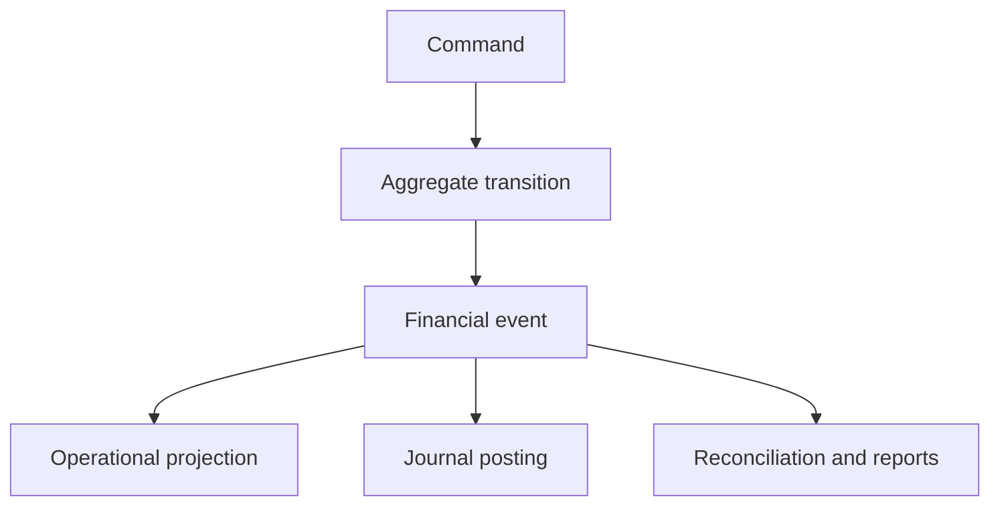

# XBOS Track B-FIN — B2 Canonical Financial Event Catalog, Posting Semantics and Migration-Slice Plan

**Record type:** Financial-event, posting and migration architecture decision record
**Workstream:** Track B-FIN — Neutral Financial Spine
**Phase:** B2 — Canonical Financial Vocabulary and Target Model
**Status:** Approved architecture decision
**Date:** 5 August 2026
**Authority baseline:** `a73a474` — Canonical Financial Authority Map
**Vocabulary baseline:** `7d00249` — Canonical Financial Vocabulary and State Machines
**Logical-model baseline:** `922593c` — Logical Financial Entity Model, Relationships and Invariants
**Physical-schema baseline:** `77f6168` — Physical Target Schema, Constraint and Index Blueprint
**WND discovery/scenario reference:** `track-b-b1-characterization-20260804` at `56e3b19` — evidence, not a compatibility contract
**Track A reconciliation reference:** `wnd-reconciliation-r2-live-20260805`
**Branch:** `track-b/b2-canonical-financial-model`

---

## 1. Purpose

This record completes the B2 design set by defining:

- the initial versioned catalog of canonical financial events;
- the exact economic meaning of each event;
- which records are financial events and which are only workflow or audit events;
- the operational-account and formal-ledger effects of each event;
- the separation of recognition, settlement, allocation, refund and transfer;
- event amount, currency, direction, time, actor and idempotency semantics;
- reversal and correction rules;
- taxonomy and industry-pack extension rules;
- the clean refactor boundary between the current WND implementation and the neutral kernel;
- reconciliation effects under the approved R2 model;
- formal journal posting templates expressed through account roles;
- migration slices, verification gates and rollback boundaries;
- the recommended first implementation slice after B2 approval.

This is an architecture record. It does not create migrations, change runtime code, transform historical data, post journals or alter reconciliation behavior.

---

## 2. Executive decision

XBOS will treat a canonical financial event as:

> An immutable, versioned statement that a financially material fact occurred for one tenant, organization unit, business date, currency and source record.

The following rules are approved together or rejected together:

1. A financial event records a fact; it is not a mutable balance.
2. A financial event is not itself a journal entry.
3. Formal journals are deterministic postings derived from approved event versions and posting-rule versions.
4. Recognition, settlement, allocation and refund are distinct facts.
5. A payment attempt succeeding is not sufficient to prove settled value.
6. A settlement does not require a sale or obligation at settlement time.
7. Applying settled value to an obligation requires an allocation.
8. A receivable being opened is a control fact, not a second revenue posting.
9. A receivable repayment is represented by an inbound settlement and an allocation, not by two cash-receipt events.
10. Current WND names do not become kernel contracts; WND is refactored to use the canonical vocabulary.
11. Reversal is append-only and linked to the original event.
12. Event meaning is immutable within a version.
13. Taxonomy classifies events and resolves accounts; it does not change event identity.
14. Industry packs may register classifications and posting profiles, but may not redefine kernel event meaning.
15. Reconciliation reads operational movement effects, not debit/credit labels.

### 2.1 Superseding transition decision

The project owner has clarified the target transition model:

> WND will be refactored into neutral XBOS as the first Restaurant tenant and industry-pack implementation. The neutral kernel is not constrained to preserve WND-era APIs, tables, field names, event names, duplicated writers or financial state machines.

This decision supersedes any earlier B2 wording that required:

- legacy API compatibility;
- compatibility projections as a permanent or transitional product contract;
- dual writes between current and canonical financial authorities;
- side-by-side v2 entities solely to preserve old table contracts;
- rollback to old financial writers after canonical cutover;
- retention of duplicated financial columns for old consumers.

The current WND code, database and B1 tests remain useful only as:

- discovery evidence;
- examples of real Restaurant operations;
- a source for historical data transformation;
- regression evidence for business outcomes worth preserving;
- proof of known defects that must not reappear.

They are not architecture constraints. When this record conflicts with compatibility language in the four earlier B2 records, this superseding decision governs. A later editorial consolidation may remove the superseded passages from those records without reopening the approved canonical authority, vocabulary, logical model or physical invariants.

### 2.2 Consequential corrections to the earlier B2 records

| Earlier decision area | Superseding canonical-only decision |
|---|---|
| “Legacy disposition” and deprecation schedules | Retained only as source-system analysis; not a kernel requirement |
| Compatibility state mappings | Replaced by canonical state machines; WND code is rewritten to use them |
| Compatibility projections and duplicated cached fields | Removed unless a field is a deliberate canonical read-model cache |
| Dual-write phases | Removed |
| Side-by-side `payment_intents_v2` / `payment_attempts_v2` names | Use final canonical `payment_intents` / `payment_attempts` names in the neutral target |
| Legacy-to-canonical runtime mapping tables | Removed from the permanent kernel schema |
| `canonical_backfill_*` naming | Replace with `historical_transformation_runs` and `historical_transformation_exceptions` |
| Existing `branch_id` as a compatibility field | Use canonical `organization_unit_id`; a branch is an organization-unit type |
| Old API response preservation | Removed; frontend and WND modules move to typed canonical APIs |
| Rollback by re-enabling old writers | Removed after authority cutover; correct canonical facts forward |

Historical transformation may use temporary staging and provenance tables. Those are migration infrastructure, not a second operational model and not a permanent compatibility contract.

---

## 3. Why this record is required

The live WND iteration has useful treasury events, but the same names currently mix several concerns:

- `PAYMENT_RECEIVED` means retained collection in some paths;
- `DEBT_REPAYMENT` represents both A/R reduction and payment-channel movement;
- `DEBT_CREATED` is needed for commercial settlement reporting but must not double-post receivables;
- `EXPENSE_POSTED` describes both recognition and payment;
- `TIP_REVENUE` presumes a tip is always revenue;
- `STORE_CREDIT_CREATED` does not fully distinguish value receipt from liability recognition;
- `CASH_MOVE` is correctly transfer-like but is named for only one asset family;
- `REFUND_PAID` exists as a dormant emitter without an end-to-end refund aggregate;
- an idempotent replay can currently merge metadata into the existing treasury row;
- journal-posting semantics are not formally versioned.

Those behaviors were valuable while stabilizing WND. They are evidence for the refactor, not contracts the neutral kernel must preserve.

---

## 4. Scope

### 4.1 In scope

- commercial revenue and adjustment events;
- taxes, tips and cost recognition extension points;
- operational expenses;
- obligations, receivables, payables and customer credits;
- payment settlements and allocations;
- refunds, reversals and write-offs;
- transfers between financial accounts;
- provider fees and settlement reversals;
- formal posting templates;
- reconciliation mapping;
- WND-to-neutral refactor and historical-data transformation boundaries;
- migration sequencing.

### 4.2 Out of scope

- final country-specific chart of accounts;
- final tax calculation engine;
- final payroll event catalog;
- fixed-asset depreciation schedules;
- consolidated group accounting;
- complete FX revaluation policy;
- a full procurement or supplier-invoice design;
- production migration execution;
- a production refund API implementation;
- provider credential management;
- frontend modernization.

These are additive capabilities. They must use the event and posting extension contracts defined here.

---

## 5. Financial fact layers

XBOS separates six layers that the current WND implementation sometimes combines.

| Layer | Question answered | Authority |
|---|---|---|
| Command | What did the caller request? | Command handler and idempotency record |
| Workflow | What stage is the operation in? | Aggregate state machine |
| Financial fact | What financially material fact occurred? | Immutable financial event |
| Operational balance | Where is value now and what remains allocable? | Settlements, value sources, allocations and obligations |
| Accounting posting | Which accounts are debited and credited? | Versioned posting rule and journal |
| Reporting projection | How should a consumer view the facts? | Versioned read model |

No layer may silently substitute for another.



---

## 6. Event versus non-event decisions

### 6.1 Canonical financial events

A record belongs in `financial_events` only when it changes or explains at least one of:

- recognized income, expense, tax, allowance, return or cost;
- an asset, liability or equity position;
- settled value held in an operational financial account;
- allocation of settled value to an obligation;
- value available for refund, transfer or customer credit;
- an accounting-relevant correction or reversal;
- a reconciliation-relevant operational movement.

### 6.2 Workflow events, not financial events

These may appear in an aggregate audit stream or transactional outbox but are not financial events by themselves:

- order opened, accepted, prepared or fulfilled;
- sale drafted;
- payment intent created;
- payment attempt initiated;
- provider callback received;
- payment attempt failed;
- refund requested or approved;
- reconciliation draft saved;
- reconciliation window closed, reopened or approved;
- journal draft created or journal approved;
- receipt viewed, printed or emailed;
- taxonomy classification edited.

### 6.3 Why exclusion matters

If workflow notifications enter the financial-event table, consumers cannot distinguish economic movement from operational progress. If financial facts remain only in workflow rows, they cannot be independently audited, posted or reconciled.

---

## 7. Event identity and versioning

### 7.1 Identity

Each event is uniquely identified by:

```text
(tenant_id, idempotency_scope, idempotency_key)
```

It also has a stable public UUID and a database identity key.

### 7.2 Versioning

Event meaning is identified by:

```text
(event_type_code, event_version)
```

A new event version is required if any of these change materially:

- economic definition;
- amount interpretation;
- required operational-account roles;
- required source record;
- default reconciliation effect;
- posting eligibility;
- reversal requirements;
- required classification fields.

A wording improvement that does not change meaning may update documentation, but not an approved catalog row.

### 7.3 Replay

An exact replay returns the existing event.

An idempotency collision with different canonical content fails.

Canonical content includes:

- event type and version;
- amount and currency;
- source and target accounts;
- source record;
- original-event link;
- occurred time and business date;
- classification snapshot;
- posting context;
- evidence hash.

Metadata on an existing event is never merged or overwritten during replay.

---

## 8. Universal event semantics

### 8.1 Amount

- Stored as `NUMERIC(24,8)`.
- Positive by default.
- Direction is expressed by event type and source/target roles, not negative money.
- Correction events are explicit; callers do not negate an original event.
- Zero is rejected except for a specifically approved informational event version.

### 8.2 Currency or asset

- Every event has exactly one event currency/asset code.
- The code must be enabled for the tenant and organization unit.
- A cross-currency conversion cannot pretend that one amount represents both legs.
- FX conversion requires a compound posting context or two linked value-leg events under a future approved FX catalog.

### 8.3 Time

| Field | Meaning |
|---|---|
| `occurred_at` | When the financial fact economically occurred |
| `recorded_at` | When XBOS durably recorded it |
| `business_date` | Tenant-policy business date derived at event creation |
| `calendar_policy_version` | Exact business-calendar policy used |

These fields are immutable.

### 8.4 Organization

Every event belongs to one tenant and one organization unit. Cross-unit transfers are represented by linked legs or a transfer aggregate whose effects remain explicit for each unit.

### 8.5 Actor

At least one is required:

- authenticated user actor; or
- named service actor.

Provider callbacks use a service actor plus the verified provider-event source record.

### 8.6 Correlation and causation

- `correlation_id` groups facts from one business command or provider sequence.
- `causation_id` points to the command/event that caused this fact.
- Neither replaces idempotency.

### 8.7 Source record

Every event links through the validated source-record registry to its authoritative aggregate or evidence record. Loose free-text type and integer pairs are not permitted in the target.

---

## 9. Economic roles

The catalog uses these initial economic roles:

| Role | Meaning |
|---|---|
| `recognition` | Creates income, expense, tax, cost or allowance |
| `settlement_in` | Confirms value entering an operational account |
| `settlement_out` | Confirms value leaving an operational account |
| `allocation` | Applies value to an obligation or designated purpose |
| `deallocation` | Reverses an earlier allocation |
| `transfer` | Moves value between operational accounts without income/expense |
| `liability_recognition` | Recognizes customer credit or another liability |
| `control` | Records an operational financial condition without posting value twice |
| `correction` | Reverses or corrects a prior financial fact |

The event catalog sets a default. The stored role may only use values allowed by that event version.

---

## 10. Operational-account effects

Formal debit/credit is not used to build operational reconciliation rows.

Canonical effects are:

| Effect | Reconciliation interpretation |
|---|---|
| `target_inflow` | Increase target operational-account expected balance |
| `source_outflow` | Decrease source operational-account expected balance |
| `movement` | Source outflow plus target inflow; net zero across both |
| `control_increase` | Increase a non-treasury control balance such as A/R |
| `control_decrease` | Decrease a non-treasury control balance |
| `commercial` | Commercial summary only; no treasury movement |
| `none` | No direct reconciliation effect |

This prevents debit/credit terminology from being misread as cash direction.

---

## 11. Formal posting principles

### 11.1 Financial event is not journal entry

An event can exist before the formal ledger module is enabled. When posting is enabled, an approved posting-rule version resolves account roles into tenant ledger accounts and produces balanced journal lines.

### 11.2 Account roles, not hard-coded account IDs

Posting templates name roles such as:

- trade receivable;
- trade payable;
- commercial revenue;
- tax payable;
- cash or provider settlement asset;
- unapplied receipts clearing;
- disbursement clearing;
- customer credit liability;
- discount contra-revenue;
- promotional expense;
- sales returns;
- inventory asset;
- cost of goods sold;
- write-off expense;
- provider-fee expense;
- tip payable or tip income.

Tenant, country and industry-pack classification resolves those roles to accounts.

### 11.3 Posting rule selection

A posting rule is selected by:

```text
event type/version
+ tenant or pack scope
+ legal entity
+ business date/effective interval
+ classification predicates
+ currency policy
```

Ambiguity is an error. No match is a posting exception. Multiple equally ranked matches are a posting exception.

### 11.4 Posted entries

- Posted journal entries are immutable.
- Corrections create reversal and replacement entries.
- Closed accounting periods reject ordinary posting.
- A controlled reopen or next-period adjustment is required.
- Every journal entry links to one or more source financial events.

---

## 12. Initial canonical catalog at a glance

The initial kernel catalog contains twenty event types.

| Family | Canonical type | Posting | Primary purpose |
|---|---|---:|---|
| Commercial | `COMMERCIAL_REVENUE_RECOGNIZED` | Yes | Recognize consideration-exclusive revenue |
| Commercial | `TAX_LIABILITY_RECOGNIZED` | Yes | Recognize separately stated tax |
| Commercial | `DISCOUNT_GRANTED` | Yes | Reduce consideration through discount |
| Commercial | `COMPLIMENTARY_GRANTED` | Yes | Recognize complimentary allowance |
| Commercial | `TIP_RECOGNIZED` | Yes | Separate tip from commercial revenue |
| Commercial | `COMMERCIAL_RETURN_RECOGNIZED` | Yes | Reduce recognized charge for return/cancellation |
| Cost | `COST_OF_FULFILLMENT_RECOGNIZED` | Yes | Recognize COGS/direct fulfillment cost |
| Expense | `EXPENSE_RECOGNIZED` | Yes | Recognize operational expense/accrual |
| Obligation | `OBLIGATION_OPENED` | No | Record an obligation control condition |
| Obligation | `OBLIGATION_WRITTEN_OFF` | Yes | Remove uncollectible/forgiven balance |
| Settlement | `PAYMENT_SETTLED` | Yes | Confirm inbound or outbound settled value |
| Settlement | `PAYMENT_SETTLEMENT_REVERSED` | Yes | Reverse previously confirmed settlement |
| Allocation | `PAYMENT_ALLOCATED` | Yes | Apply settled value to obligation/purpose |
| Allocation | `PAYMENT_ALLOCATION_REVERSED` | Yes | Restore a prior allocation |
| Liability | `CUSTOMER_CREDIT_RECOGNIZED` | Yes | Convert unapplied value into customer liability |
| Refund | `REFUND_SETTLED` | Yes | Confirm value returned to customer |
| Transfer | `VALUE_TRANSFERRED` | Yes | Move value between operational accounts |
| Provider | `PROVIDER_FEE_RECOGNIZED` | Yes | Recognize fee withheld/charged by provider |
| Provider | `PROVIDER_SETTLEMENT_ADJUSTED` | Yes | Record provider variance/chargeback adjustment |
| Correction | `FINANCIAL_FACT_REVERSED` | Yes/derived | Exact inverse where no specialized reversal exists |

All are version `1` unless an implementation record states otherwise.

---

## 13. Commercial revenue recognized

### 13.1 Definition

`COMMERCIAL_REVENUE_RECOGNIZED:v1` records earned commercial consideration excluding separately stated tax, tips and allowances.

It is industry-neutral. Classification distinguishes:

- goods;
- food and beverage;
- accommodation;
- professional service;
- admission;
- subscription;
- rental;
- healthcare service;
- other configured revenue.

### 13.2 Source

Confirmed commercial transaction or recognized transaction line.

### 13.3 Amount

Positive recognized revenue in event currency, before discount/complimentary/return events but excluding separately stated tax and tip.

### 13.4 Posting template

| Debit role | Credit role |
|---|---|
| Trade/contract receivable | Classified revenue |

Immediate payment still uses a receivable/contract-clearing role so recognition and settlement remain separate and auditable.

### 13.5 Reconciliation

- Treasury: none.
- Control account: increase recognized receivable basis.
- Commercial summary: increase gross recognized revenue.

---

## 14. Tax liability recognized

### 14.1 Definition

`TAX_LIABILITY_RECOGNIZED:v1` records separately stated output tax collected or receivable on behalf of a tax authority.

### 14.2 Posting template

| Debit role | Credit role |
|---|---|
| Trade/contract receivable | Tax payable by jurisdiction and tax code |

### 14.3 Requirements

- tax jurisdiction;
- tax code and version;
- taxable basis;
- rate or fixed-rule reference;
- inclusive/exclusive indicator;
- tax authority classification.

### 14.4 Reconciliation

Commercial/control only. Settlement of the customer’s total later clears both revenue and tax portions through allocations.

---

## 15. Discount granted

### 15.1 Definition

`DISCOUNT_GRANTED:v1` records a reduction in customer consideration caused by a discount policy or authorized discretionary discount.

### 15.2 Posting template

| Debit role | Credit role |
|---|---|
| Sales discount contra-revenue | Trade/contract receivable |

### 15.3 Classification

Required classification includes reason, authorization class and taxonomy snapshot. Industry packs may add promotion, loyalty, negotiated rate or staff-discount dimensions.

### 15.4 Reconciliation

- Treasury: none.
- Commercial summary: allowance increase.
- Obligation effect: reduce amount due.

---

## 16. Complimentary granted

### 16.1 Definition

`COMPLIMENTARY_GRANTED:v1` records consideration waived because a good, service or experience is complimentary.

### 16.2 Posting template

The debit role is policy-resolved:

| Policy | Debit role | Credit role |
|---|---|---|
| Contra-revenue policy | Complimentary contra-revenue | Trade/contract receivable |
| Promotional-expense policy | Marketing/promotional expense | Trade/contract receivable |
| Service-recovery policy | Service-recovery expense | Trade/contract receivable |

The selected policy and account-role resolution are frozen in the posting context.

### 16.3 Reconciliation

- Treasury: none.
- Commercial summary: complimentary allowance.
- Obligation effect: reduce amount due.

---

## 17. Tip recognized

### 17.1 Definition

`TIP_RECOGNIZED:v1` records a separately identified tip, gratuity or service reward.

The name intentionally avoids assuming it is revenue.

### 17.2 Posting template

| Tenant/legal policy | Debit role | Credit role |
|---|---|---|
| Staff-beneficiary policy | Trade/contract receivable | Tip payable |
| Tenant-income policy | Trade/contract receivable | Tip/service-charge income |

### 17.3 Reconciliation

- Treasury: none at recognition.
- Commercial summary: separate tips from applied-to-sales value.
- Later payout to staff uses outbound settlement and allocation to the tip payable.

---

## 18. Commercial return recognized

### 18.1 Definition

`COMMERCIAL_RETURN_RECOGNIZED:v1` records an approved reduction of previously recognized commercial consideration because of return, cancellation, price correction or service failure.

### 18.2 Requirements

- link to original recognition event;
- return/credit reason;
- affected transaction lines or obligation components;
- approval evidence when policy requires it.

### 18.3 Posting template

| Debit role | Credit role |
|---|---|
| Sales return/allowance | Trade/contract receivable |

If the customer has already paid, this creates or contributes to a refund/customer-credit obligation. It does not itself move cash.

### 18.4 Reconciliation

Commercial/control effect only. A separate `REFUND_SETTLED` event records cash or provider value leaving.

---

## 19. Cost of fulfillment recognized

### 19.1 Definition

`COST_OF_FULFILLMENT_RECOGNIZED:v1` records inventory or other directly attributable cost consumed by fulfillment.

### 19.2 Posting template

| Debit role | Credit role |
|---|---|
| Cost of goods/fulfillment | Inventory or deferred-cost asset |

### 19.3 Source

An authoritative inventory/fulfillment cost snapshot. The event must not recalculate historical cost from current inventory prices.

### 19.4 Reconciliation

No treasury effect. It feeds gross-margin and inventory/accounting projections.

---

## 20. Expense recognized

### 20.1 Definition

`EXPENSE_RECOGNIZED:v1` records an expense when recognized, independently of when it is paid.

### 20.2 Posting template

| Debit role | Credit role |
|---|---|
| Classified expense | Trade payable, accrued payable or approved clearing role |

### 20.3 Cash-paid expense

A cash-paid expense requires:

1. `EXPENSE_RECOGNIZED`; and
2. outbound `PAYMENT_SETTLED`; and
3. `PAYMENT_ALLOCATED` to the payable/expense-clearing obligation.

These facts may be created atomically by one command but remain distinct.

---

## 21. Obligation opened

### 21.1 Definition

`OBLIGATION_OPENED:v1` records that an obligation control account is now open and identifies its role, counterparty, due terms and source.

### 21.2 Posting eligibility

No. It is a control event.

Revenue, tax, expense or adjustment events created the economic posting. Posting `OBLIGATION_OPENED` again would double the asset or liability.

### 21.3 Reconciliation

- Receivable obligation: control-account increase.
- Payable obligation: control-account increase on the payable axis.
- Treasury: none.

---

## 22. Obligation written off

### 22.1 Definition

`OBLIGATION_WRITTEN_OFF:v1` records an authorized permanent removal of a collectible or payable balance without settlement.

### 22.2 Posting template for receivable

| Debit role | Credit role |
|---|---|
| Bad-debt/write-off expense or allowance reserve | Trade receivable |

Payable forgiveness uses a separately classified gain/adjustment role.

### 22.3 Requirements

- obligation and component;
- pre-write-off balance;
- reason taxonomy;
- approval evidence;
- policy authority;
- actor;
- correlation to any earlier impairment event.

### 22.4 Reconciliation

Control decrease, no treasury movement.

---

## 23. Payment settled

### 23.1 Definition

`PAYMENT_SETTLED:v1` records confirmed value entering or leaving an operational financial account.

It is created from `payment_settlements`, not directly from a payment attempt.

### 23.2 Direction

`economic_role` is one of:

- `settlement_in`; or
- `settlement_out`.

### 23.3 Inbound posting

| Debit role | Credit role |
|---|---|
| Cash/bank/provider settlement asset | Unapplied receipts clearing |

### 23.4 Outbound posting

| Debit role | Credit role |
|---|---|
| Disbursement clearing | Cash/bank/provider settlement asset |

### 23.5 Why clearing is used

Clearing preserves standalone payments, deposits and delayed allocation. It also prevents settlement from assuming a sale, order or receivable.

### 23.6 Reconciliation

- Inbound: target operational-account inflow.
- Outbound: source operational-account outflow.
- A/R and A/P are not treasury accounts.

### 23.7 Same-moment cash change

Cash tender and immediate change produce one retained inbound settlement amount. No expense, payable or `CHANGE_RETURNED` event is created for the immediate change.

---

## 24. Payment settlement reversed

### 24.1 Definition

`PAYMENT_SETTLEMENT_REVERSED:v1` records that a previously confirmed settlement was reversed, charged back or invalidated by authoritative evidence.

### 24.2 Requirements

- original settlement and original event;
- reason and evidence;
- provider event identity where applicable;
- exact reversed amount;
- allocation impact resolution.

### 24.3 Posting

Exact inverse of the original settlement journal unless a chargeback policy requires an interim receivable/loss account. The selected rule is explicit and versioned.

### 24.4 Allocation rule

If the original value was allocated, the command must also create `PAYMENT_ALLOCATION_REVERSED` or a policy-authorized loss/write-off. A settlement reversal cannot silently leave an obligation settled.

---

## 25. Payment allocated

### 25.1 Definition

`PAYMENT_ALLOCATED:v1` records settled value being applied to an obligation component, customer-credit conversion, deposit purpose or another approved target.

### 25.2 Receivable allocation posting

| Debit role | Credit role |
|---|---|
| Unapplied receipts clearing | Trade receivable |

### 25.3 Payable allocation posting

| Debit role | Credit role |
|---|---|
| Trade payable | Disbursement clearing |

### 25.4 Reconciliation

- Treasury: none.
- A/R receipt allocation: control decrease.
- A/P disbursement allocation: control decrease.

### 25.5 A/R repayment

An A/R repayment creates:

1. inbound `PAYMENT_SETTLED`; and
2. `PAYMENT_ALLOCATED` to the receivable obligation.

No additional cash-receipt event is emitted for the allocation.

---

## 26. Payment allocation reversed

### 26.1 Definition

`PAYMENT_ALLOCATION_REVERSED:v1` restores all or part of a prior allocation.

### 26.2 Posting

Exact inverse of `PAYMENT_ALLOCATED`.

### 26.3 Capacity

The reversal restores source-value capacity only when no terminal refund consumption or other reservation prevents reuse.

### 26.4 Reconciliation

Control effect only. It may reopen an obligation but does not itself move money.

---

## 27. Customer credit recognized

### 27.1 Definition

`CUSTOMER_CREDIT_RECOGNIZED:v1` converts settled, unapplied value into a customer-credit liability available under tenant policy.

### 27.2 Posting template

| Debit role | Credit role |
|---|---|
| Unapplied receipts clearing | Customer credit liability |

### 27.3 Reconciliation

- Treasury: none; cash already moved at settlement.
- A/P/customer-liability control: increase.

---

## 28. Refund settled

### 28.1 Definition

`REFUND_SETTLED:v1` records confirmed value returned to a customer through an operational financial account.

### 28.2 Prerequisites

- approved refund aggregate;
- refundable source capacity reserved;
- original allocation/settlement trace;
- outbound settlement confirmed;
- any required commercial return and allocation reversal linked;
- provider or cashier evidence.

### 28.3 Posting template

| Debit role | Credit role |
|---|---|
| Refund payable or unapplied-receipts clearing | Cash/bank/provider settlement asset |

### 28.4 Reconciliation

Source operational-account outflow and commercial refund summary.

---

## 29. Value transferred

### 29.1 Definition

`VALUE_TRANSFERRED:v1` records confirmed movement between two operational financial accounts owned or controlled by the same tenant context.

Examples:

- cash drawer to safe;
- safe to bank;
- provider wallet to bank;
- bank to petty cash;
- branch treasury to central treasury where organization policy permits.

### 29.2 Posting template

| Debit role | Credit role |
|---|---|
| Target operational asset | Source operational asset |

### 29.3 Reconciliation

Source outflow plus target inflow. Net zero across the transfer boundary.

---

## 30. Provider fee recognized

### 30.1 Definition

`PROVIDER_FEE_RECOGNIZED:v1` records a fee charged or withheld by a payment provider.

### 30.2 Posting template

| Debit role | Credit role |
|---|---|
| Provider-fee expense | Provider settlement receivable/payable |

### 30.3 Reconciliation

If withheld from a provider payout, the event reduces expected provider-account value and is linked to the gross settlement. If separately debited from a bank account, it accompanies outbound settlement.

### 30.4 Evidence

Provider statement line, callback, invoice or settlement batch identity is required.

---

## 31. Provider settlement adjusted

### 31.1 Definition

`PROVIDER_SETTLEMENT_ADJUSTED:v1` records a provider-side variance such as chargeback, reserve hold, release or settlement correction that is not an ordinary fee.

### 31.2 Posting

Posting roles depend on a required adjustment class:

- provider reserve asset;
- chargeback receivable;
- settlement loss;
- provider clearing;
- operational cash/bank asset.

### 31.3 Reconciliation

Operational effect follows the source/target account evidence. A classification without an actual account movement does not invent treasury movement.

---

## 32. Generic financial fact reversed

### 32.1 Definition

`FINANCIAL_FACT_REVERSED:v1` is an exact linked inverse for a posting-eligible event that has no more specific reversal type.

### 32.2 Restrictions

- original event is required;
- full or partial amount is explicit;
- cumulative reversal cannot exceed original amount;
- currency must match;
- original classification and posting rule are inherited unless the correction record explicitly replaces them;
- it is not used when `PAYMENT_SETTLEMENT_REVERSED`, `PAYMENT_ALLOCATION_REVERSED` or `COMMERCIAL_RETURN_RECOGNIZED` expresses the business fact more accurately.

### 32.3 Posting

Exact inverse of the linked original journal lines, preserving accounting-period policy.

---

## 33. Catalog exclusions and future reservations

The following are deliberately not initial event types:

| Candidate | Decision |
|---|---|
| `SALE_PAID` | Derived state, not a fact distinct from settlement/allocation |
| `ORDER_PAID` | Workflow projection |
| `PAYMENT_ATTEMPT_SUCCEEDED` | Provider/workflow fact, not necessarily settled value |
| `DEBT_CREATED` | Replaced by obligation state plus recognition facts; not a canonical type |
| `DEBT_REPAYMENT` | Replaced by settlement plus allocation; not a canonical type |
| `CHANGE_RETURNED` | Same-moment change is netted from retained settlement |
| `JOURNAL_POSTED` | Journal audit/outbox event, not input to its own posting |
| `RECONCILIATION_CLOSED` | Reconciliation audit event |
| `RECEIPT_CREATED` | Document/audit event |
| `REFUND_REQUESTED` | Refund workflow event |
| `REFUND_APPROVED` | Refund workflow event |
| `INVENTORY_MOVED` | Inventory-domain event unless cost recognition occurs |

Future catalog reservations may include:

- payroll expense and statutory liabilities;
- depreciation and impairment;
- foreign-exchange conversion and revaluation;
- intercompany charge and elimination;
- borrowing, interest and loan repayment;
- equity contribution and distribution;
- insurance claim recognition;
- subscription deferral and release.

They require separate approved definitions and versions.

---

## 34. WND refactor boundary

The current WND financial vocabulary is not carried into the neutral kernel.

The refactor replaces whole concepts:

| Current WND concept | Neutral-kernel replacement |
|---|---|
| Sale-specific revenue row | Classified commercial recognition event |
| Service/other-income special event names | Revenue taxonomy on commercial recognition |
| Debt-created treasury event | Financial obligation plus non-posting control event |
| Debt-repayment combined movement | Inbound settlement plus receivable allocation |
| Store-credit side effect | Customer-credit liability plus value source |
| Expense recognition/payment combined | Expense recognition plus settlement plus allocation |
| Cash-only move | Value transfer between operational accounts |
| Same-moment change event | Retained settlement amount; no separate financial event |
| Dormant refund emitter | Full refund aggregate, capacity, settlement and linked events |

### 34.1 Application refactor rule

WND controllers, services, screens, receipts and reports must call or read canonical kernel contracts. The kernel will not emit old event shapes for them. Restaurant terminology belongs in the Restaurant pack and WND tenant configuration.

### 34.2 Historical data rule

If historical WND data is brought forward, it is transformed once into canonical records with provenance. Source rows are not maintained as an alternate live authority. Unsupported interpretations enter a transformation exception queue rather than forcing canonical semantics to mimic the source schema.

---

## 35. Canonical posting matrix

| Event | Debit account role | Credit account role | Treasury effect |
|---|---|---|---|
| Commercial revenue | Trade receivable | Classified revenue | None |
| Tax liability | Trade receivable | Tax payable | None |
| Discount | Discount contra-revenue | Trade receivable | None |
| Complimentary | Policy-selected allowance/expense | Trade receivable | None |
| Tip | Trade receivable | Tip payable/income | None |
| Commercial return | Sales returns/allowance | Trade receivable | None |
| Fulfillment cost | COGS/direct cost | Inventory/deferred cost | None |
| Expense | Classified expense | Trade/accrued payable | None |
| Obligation opened | No posting | No posting | None |
| Receivable write-off | Write-off expense/reserve | Trade receivable | None |
| Settlement in | Cash/provider asset | Unapplied receipts | Target inflow |
| Settlement out | Disbursement clearing | Cash/provider asset | Source outflow |
| Settlement reversal | Inverse original or chargeback policy | Inverse original | Evidence-driven |
| Receivable allocation | Unapplied receipts | Trade receivable | Control decrease |
| Payable allocation | Trade payable | Disbursement clearing | Control decrease |
| Allocation reversal | Exact inverse | Exact inverse | Control reversal |
| Customer credit | Unapplied receipts | Customer credit liability | Liability increase |
| Refund | Refund payable/unapplied receipts | Cash/provider asset | Source outflow |
| Value transfer | Target operational asset | Source operational asset | Movement |
| Provider fee | Provider-fee expense | Provider clearing/receivable | Account adjustment |
| Provider adjustment | Classification-selected | Classification-selected | Evidence-driven |
| Generic reversal | Inverse original credit lines | Inverse original debit lines | Inverse original |

---

## 36. Complete transaction examples

### 36.1 Fully paid sale

```text
Commercial revenue recognized
Tax/tip recognized when applicable
Discount/complimentary recognized when applicable
Inbound payment settled
Payment allocated to receivable components
Obligation condition becomes settled
Receipt projection becomes paid
```

No `SALE_PAID` financial event is required.

### 36.2 Partial payment and receivable

```text
Commercial facts create net receivable
Inbound payment settled for amount received
Payment allocated for amount received
OBLIGATION_OPENED control event records remaining receivable condition
Derived balance remains open/partial
```

The open obligation event does not post another debit to receivables.

### 36.3 Later A/R repayment

```text
Inbound payment settled
Payment allocated to remaining receivable
Derived obligation condition changes partial -> settled
Receivable and account read models are refreshed
```

### 36.4 Fully complimentary transaction

```text
Commercial revenue recognized gross
Complimentary allowance recognized for full amount
Net obligation is zero
No payment settlement exists
No cash inflow exists
```

### 36.5 Overpayment retained as customer credit

```text
Inbound payment settled for tender retained
Required amount allocated to receivable
Excess converted from unapplied receipts to customer credit liability
Customer credit value source becomes available
```

### 36.6 Immediate cash change

```text
Tender observed by cashier workflow
Immediate change calculated and returned
Inbound settlement records retained cash only
No change expense, payable or refund event
```

### 36.7 Paid commercial refund

```text
Commercial return/adjustment reduces original charge
Original payment allocation reversed as required
Refund source capacity reserved and consumed
Outbound refund settlement confirmed
REFUND_SETTLED event emitted
Obligation and receipt projections recomputed
```

### 36.8 Cash-paid expense

```text
Expense recognized
Outbound payment settled
Payment allocated to payable/expense-clearing obligation
```

### 36.9 Cash drawer to bank

```text
Transfer aggregate confirmed
VALUE_TRANSFERRED event records source drawer and target bank
Drawer reconciliation decreases
Bank reconciliation increases
No income or expense
```

---

## 37. Allocation component order

An allocation must target explicit obligation components. Default order is tenant-policy driven but frozen per allocation command.

An example policy is:

1. tax;
2. tip/service-charge liability;
3. principal commercial consideration;
4. approved fees;
5. interest or penalties.

No universal priority is hard-coded because legal and industry requirements differ. The policy version and component allocations are stored.

---

## 38. Reversal and correction policy

### 38.1 Never mutate history

Incorrect financial events remain visible. A linked reversal neutralizes them and, when appropriate, a replacement event records corrected truth.

### 38.2 Full reversal

```text
original amount = cumulative linked reversal amount
```

### 38.3 Partial reversal

```text
0 < cumulative linked reversal amount < original amount
```

### 38.4 Constraints

- same tenant;
- same currency unless an approved FX correction workflow exists;
- cumulative reversal cannot exceed original;
- reversal source record and actor required;
- reason taxonomy required;
- reversal cannot target another reversal except through approved chain rules;
- posted journal correction obeys accounting-period policy.

### 38.5 State changes

Aggregate conditions are re-derived after reversal. Code must not set an order, sale, intent or obligation state independently of the corrected financial facts.

---

## 39. Classification and taxonomy contract

### 39.1 Many-to-many classification

One event may be classified simultaneously by:

- revenue/expense nature;
- department or cost center;
- product/service family;
- campaign or discount reason;
- tax jurisdiction;
- customer segment;
- project/grant/fund;
- industry-pack concept;
- regulatory reporting category.

### 39.2 Snapshot

Historical event and journal classification uses the snapshot recorded at occurrence/posting time. Later taxonomy edits do not rewrite history.

### 39.3 Kernel/pack boundary

Industry packs may:

- provide taxonomy nodes and mappings;
- declare required classification roles;
- supply posting-rule templates;
- add validation predicates;
- provide UI terminology;
- build reports from canonical events.

Industry packs may not:

- redefine a kernel event’s economic meaning;
- mutate approved catalog versions;
- bypass tenant or organization scope;
- create unbalanced postings;
- treat workflow state as settled value;
- emit a second event for the same economic fact under a pack-specific name.

---

## 40. Reconciliation mapping

### 40.1 R2 formula

For a treasury operational account:

```text
expected = opening + inflows - outflows + approved_adjustments
variance = actual - expected
```

### 40.2 Event effects

| Event | Treasury | A/R control | A/P/customer liability | Commercial summary |
|---|---:|---:|---:|---:|
| Revenue recognized | — | Increase basis | — | Gross revenue |
| Tax recognized | — | Increase basis | Increase tax payable | Tax |
| Discount | — | Reduce | — | Discount |
| Complimentary | — | Reduce | — | Complimentary |
| Tip | — | Increase basis | Tip payable if applicable | Tip |
| Commercial return | — | Reduce | Refund payable if paid | Return |
| Expense recognized | — | — | Increase payable | Expense |
| Obligation opened | — | Control only | Control only | — |
| Settlement in | Inflow | — | — | Collection |
| Settlement out | Outflow | — | — | Disbursement |
| Allocation to A/R | — | Decrease | — | Applied collection |
| Allocation to A/P | — | — | Decrease | Applied disbursement |
| Customer credit | — | — | Increase | Credit created |
| Refund settled | Outflow | — | Reduce refund liability | Refund |
| Value transfer | Out + in | — | — | Net zero |
| Provider fee | Adjustment/outflow | — | — | Fee expense |
| Write-off | — | Decrease | Policy-specific | Write-off |

### 40.3 Parent and child accounts

Reconciliation uses either:

- one parent account total; or
- its child operational accounts.

It never sums both.

### 40.4 Control accounts

A/R, A/P, customer credit and tax payable are control accounts. They are not treasury cash channels.

---

## 41. Journal posting lifecycle

### 41.1 Eligibility

An event is eligible when:

- its catalog version is approved and posting eligible;
- required classifications are present;
- a single approved posting rule resolves;
- the accounting period is open;
- legal entity and currency policy resolve;
- the event is not already fully posted.

### 41.2 Draft to posted

```text
financial event
-> posting-rule resolution
-> draft journal entry/lines
-> deterministic validation
-> approval if required
-> posted entry
```

### 41.3 Determinism

Given the same:

- event type/version;
- event canonical payload;
- posting-rule version;
- account mapping versions;
- business date and currency policy;

the engine must produce the same journal content hash.

### 41.4 Batching

Events may be posted individually at first. Later batching is allowed only when event-to-entry links preserve complete traceability and all events share compatible posting context.

---

## 42. Posting exceptions

Posting exceptions are explicit records, not log messages alone.

Initial classes:

- no posting rule;
- ambiguous posting rules;
- missing account-role mapping;
- missing classification;
- disabled ledger account;
- closed period;
- currency policy violation;
- unbalanced generated journal;
- source event already fully posted;
- reversal exceeds original;
- cross-entity mismatch.

An exception does not mutate the source event. Resolution records actor, time, reason and configuration version.

---

## 43. Provider callback implications

The canonical model requires provider callbacks to:

1. authenticate independently of ordinary user JWT middleware;
2. resolve the configured provider account without guessing tenant;
3. persist the raw provider-event identity and evidence hash;
4. enforce provider-scoped idempotency;
5. update attempt/settlement state under one transaction;
6. emit `PAYMENT_SETTLED` only when finality policy is satisfied;
7. create outbox records in the same transaction;
8. return a safe provider response without exposing internal failure detail.

The B1 XafPay contract gap remains intentionally visible until an implementation slice explicitly addresses it.

---

## 44. Event emission transaction boundary

For a financial command, one database transaction must contain all applicable operations:

```text
validate command and idempotency
lock authoritative aggregates
apply aggregate transition
create settlement/value/allocation/refund records
emit canonical financial events
refresh canonical read models and documents
create outbox messages
update only allowed cached projections
commit
```

If any invariant fails, none of these facts commit.

Formal journal posting may occur in the same transaction later, but the recommended initial model posts asynchronously from the durable event/outbox while preserving exact-once business identity.

---

## 45. Event payload requirements

### 45.1 Required on every event

- public ID;
- tenant and organization unit;
- event type/version;
- amount and currency;
- economic role;
- authoritative source record;
- occurred/recorded times;
- business date and calendar-policy version;
- actor;
- idempotency scope/key;
- correlation ID;
- classification snapshot;
- posting context object;
- metadata object.

### 45.2 Conditionally required

- source operational account for outflow/transfer;
- target operational account for inflow/transfer;
- original event for reversal/correction;
- counterparty classification for obligation/refund/provider facts;
- evidence hash for provider/import/manual evidence policies;
- approval evidence for refunds, write-offs and sensitive allowances.

### 45.3 Forbidden in metadata

- authoritative amount or currency aliases;
- unencrypted credentials;
- full card/mobile-money secrets;
- mutable balance truth;
- executable code, SQL or expressions;
- objects that duplicate source/target account authority.

---

## 46. Canonical read and application strategy

All refactored XBOS modules read canonical resources:

```text
canonical aggregates and events
-> canonical read models
-> typed kernel APIs
-> pack-configured frontend modules and documents
```

WND is changed to consume those contracts. No old financial DTO or table shape is a required intermediate product contract.

Required readiness metrics are:

- canonical record coverage;
- missing authoritative source count;
- amount and state invariant failures;
- duplicate event/settlement/allocation count;
- unclassified event count;
- unresolved transformation exceptions;
- typed API contract-test coverage;
- canonical consumer adoption by module.

---

## 47. Historical data-transformation principles

### 47.1 Evidence hierarchy

Use evidence in this order:

1. authoritative immutable provider/receipt/settlement evidence;
2. successful payment attempts and correlated treasury rows;
3. canonical sale/order snapshots characterized by B1;
4. A/R repayment and obligation records;
5. reconciliation evidence;
6. metadata aliases only when corroborated;
7. manual resolution.

### 47.2 No guessing

Transformation may mark:

- `confirmed`;
- `derived_with_rule`;
- `ambiguous`;
- `requires_manual_resolution`;
- `excluded_with_reason`.

It may not silently infer a party, payment channel, refund, settlement finality or allocation from an unsupported default.

### 47.3 Historical events

Transformed events preserve:

- original economic occurrence time where known;
- migration record time;
- transformation run and rule version;
- source row identities;
- evidence hash;
- confidence/provenance classification.

---

## 48. Migration strategy

The neutral kernel is built and verified independently, then WND is cut over as a refactored application and Restaurant pack. There is no dual financial authority and no product-level compatibility period.

### 48.1 Global gates

Every slice requires:

- clean branch and reviewed migration plan;
- neutral-kernel invariant suite green;
- schema-conformance tests green where applicable;
- tenant isolation tests;
- idempotency and concurrency tests;
- historical-data transformation rehearsal where history is retained;
- rollback/runbook review;
- observability dashboards before write activation;
- explicit project-owner authorization.

### 48.2 Rollback meaning

Before canonical cutover, an incomplete build can be abandoned without affecting the live WND deployment.

At cutover, writes to the source WND financial model stop, the final data delta is transformed, and canonical XBOS becomes the only authority. After canonical writes begin, financial correction is forward-only. The old financial writers are not a rollback target.

---

## 49. Migration Slice M0 — Executable neutral-kernel contracts

### Objective

Convert the approved B2 invariants into executable tests before creating the new schema or refactoring WND.

### Changes

- extract useful business scenarios from B1 without preserving old APIs or schemas;
- add event-catalog schema tests;
- add posting-template golden tests;
- add invariant fixtures for paid, partial, unpaid, complimentary, change, A/R repayment, refund and transfer;
- define historical-transformation control totals and exception taxonomy;
- define cutover checkpoints and forward-correction runbooks.

### Verification gate

```text
neutral scenario suite green
catalog definitions hash-stable
posting golden files deterministic
no live WND runtime changed
```

### Rollback

Revert test-only changes. No data impact.

---

## 50. Migration Slice M1 — Empty structural foundation

### Objective

Install the shared canonical foundation in the neutral-kernel schema/model.

### Changes

- currency and organization registries/bridges;
- source-record registry;
- operational financial accounts;
- scoped idempotency records;
- outbox table;
- event-type catalog table;
- empty immutable event table;
- tenant-safe constraints and indexes;
- transformation run/exception tables.

### Explicit non-changes

- no canonical event writes;
- no WND integration;
- no historical transformation;
- no production cutover;
- no journal posting.

### Verification gate

- schema matches approved blueprint;
- composite tenant FKs reject cross-tenant links;
- immutable trigger rejects updates/deletes;
- catalog version constraints pass;
- empty-table performance and migration lock review pass.

### Rollback

Additive empty objects can be dropped through a reviewed down migration before use.

---

## 51. Migration Slice M2 — Catalog seed and canonical event engine

### Objective

Seed approved v1 definitions and implement the event engine against neutral-kernel aggregates and test fixtures.

### Changes

- seed definition-hashed event catalog;
- implement typed event builders;
- implement immutable emission and content-hash validation;
- implement source/account/classification validation;
- implement reversal-capacity validation;
- run the engine only in the new neutral-kernel test environment.

### Verification gate

- same command produces byte-stable canonical payload hash;
- repeated calculation is deterministic;
- paid/partial/unpaid/split/discount/complimentary/A-R cases balance;
- cross-tenant candidates are rejected;
- replay is immutable;
- altered replay fails.

### Rollback

Revert the unintegrated engine/schema changes. No production data impact.

---

## 52. Migration Slice M3 — Canonical financial authority

### Objective

Implement the neutral-kernel aggregates that become the only financial authority when WND is later cut over.

### Changes

- financial obligations/components/adjustments;
- canonical payment intents and explicit intent targets;
- payment settlements and reversals;
- value sources and consumptions;
- allocations and allocation reversals;
- derived balance views;
- canonical read models;
- same-transaction event and outbox integration.

### Implementation order

1. standalone inbound manual payment with no allocation;
2. fully paid one-method sale;
3. split payment;
4. partial payment/receivable;
5. A/R repayment;
6. retained customer credit.

### Verification gate

- settlement totals equal value-source creation;
- allocations never exceed source or obligation capacity;
- derived intent/obligation states satisfy the approved state machines;
- A/R repayment creates one inbound settlement and one allocation;
- immediate cash change records retained settlement only;
- concurrency tests prevent double allocation;
- canonical typed APIs pass contract tests.

### Rollback

Before cutover, revert or correct the isolated neutral-kernel implementation. After cutover, preserve financial facts and correct forward; do not restore old financial writers.

---

## 53. Migration Slice M4 — Persisted canonical events and outbox

### Objective

Persist immutable events for all M3 financial flows and publish them through the transactional outbox.

### Changes

- write canonical events in the aggregate transaction;
- write outbox message from canonical event;
- prohibit metadata enrichment on replay;
- build canonical event/read projections;
- add event coverage, exception and outbox dashboards.

### Verification gate

- one event per scoped idempotency identity;
- replay returns byte-identical row;
- altered replay fails;
- no duplicate economic facts;
- event-to-source trace complete;
- reconciliation scenario result matches independently calculated controls;
- all committed events have outbox rows.

### Rollback

Before WND cutover, the isolated module can be corrected without production impact. After cutover, preserve emitted events and remediate forward.

---

## 54. Migration Slice M5 — Commercial recognition and adjustment normalization

### Objective

Normalize revenue, tax, discount, complimentary, tip and cost facts.

### Changes

- canonical commercial transaction/line/adjustment writes;
- event emitters for recognition and allowances;
- taxonomy snapshots;
- obligation components derived from recognized facts;
- canonical receipt and commercial read models.

### Verification gate

- gross - discount - complimentary + tax + tip equals obligation components under the chosen policy;
- fully complimentary transaction has zero collection;
- discounts/comps never create cash movement;
- revenue classifications are pack-neutral;
- receipt totals match the approved component formulas and scenario fixtures;
- event amounts reconcile by currency.

### Rollback

Before cutover, revert the isolated module. After cutover, preserve canonical facts and correct forward.

---

## 55. Migration Slice M6 — Canonical refund workflow

### Objective

Deliver the first complete refund lifecycle.

### Changes

- refund request/approval aggregate;
- refundable-capacity query;
- reservation and terminal source consumption;
- allocation reversal;
- commercial return/obligation adjustment;
- outbound settlement;
- `REFUND_SETTLED` event;
- RBAC, idempotency and provider/cash evidence;
- receipt and account projections.

### Verification gate

- no refund exceeds refundable capacity;
- concurrent refund commands cannot double spend;
- replay returns original result;
- failed payout releases reservation under explicit policy;
- confirmed payout, consumption and allocation reversal commit together;
- refund is treasury outflow, not ordinary expense;
- original sale/payment trace remains complete.

### Rollback

Disable creation of new refunds. In-flight refunds follow an approved drain/cancel runbook. Confirmed refunds remain immutable.

---

## 56. Migration Slice M7 — Canonical reconciliation

### Objective

Implement reconciliation directly on canonical operational-account effects while retaining the sound R2 formulas, provenance, hierarchy and continuity decisions.

### Changes

- reconciliation account hierarchy;
- series and revisioned windows;
- lines, evidence and audit events;
- actual-value provenance;
- continuity rules;
- correction cascade preserving later actual observations;
- parent/child exclusivity;
- canonical event and operational-account queries.

### Verification gate

- `expected = opening + inflows - outflows + adjustments`;
- `variance = actual - expected`;
- default actual is final expected with `system_prefilled` provenance;
- A/R/A/P excluded from treasury;
- parent or child account counted, never both;
- no skipped required windows;
- prior correction cascades forward and preserves later actuals;
- canonical scenario windows reproduce independently calculated control totals.

### Rollback

Before cutover, correct the isolated module. After cutover, never delete closed/revised windows; remediate through revisions and forward correction.

---

## 57. Migration Slice M8 — Formal journal in shadow mode

### Objective

Generate deterministic formal journal entries without making them the production reporting authority.

### Changes

- ledger accounts and periods;
- posting rules and versions;
- account-role mappings;
- journal entries, lines and event links;
- posting exceptions;
- reversal workflow;
- journal hash and balance validation.

### Verification gate

- every eligible event resolves exactly one rule;
- every posted entry balances in base currency;
- event-to-journal coverage is complete or explicitly excepted;
- no event posts twice;
- closed-period policy works;
- reversals exactly invert original entries;
- trial balance and event control totals agree.

### Rollback

Disable shadow posting worker. Preserve journal drafts/posts as retained audit data; correct forward if needed.

---

## 58. Migration Slice M9 — WND Restaurant-pack and application refactor

### Objective

Refactor WND to become the first Restaurant tenant and industry-pack implementation on the neutral kernel.

### Changes

- Restaurant taxonomy and module configuration;
- WND tenant profile and branding;
- WND workflows rewritten against canonical commands;
- typed canonical API consumption;
- receipts and reports rebuilt from canonical read models;
- reconciliation UI bound to canonical series/windows/accounts;
- removal of WND literals and financial calculations from kernel/frontend shared code;
- end-to-end Restaurant scenario tests.

### Verification gate

- WND uses no direct source-schema financial writer;
- Restaurant terminology comes from pack/tenant configuration;
- all payment, receivable, refund and reconciliation paths use canonical services;
- a second tenant profile can be configured without kernel source changes;
- receipt-to-settlement/allocation/event trace is complete;
- end-to-end scenario and security tests pass.

### Rollback

Before production cutover, continue running the current deployment while correcting the refactored application. No dual financial writes are introduced.

---

## 59. Migration Slice M10 — Historical transformation rehearsal

### Objective

Transform retained WND history into canonical records in repeatable rehearsals before the production cutover.

### Changes

- snapshot-based source extraction;
- deterministic transformation rules;
- source-to-canonical provenance records;
- evidence hashes and control totals;
- explicit exception queue;
- restartable tenant/branch/time checkpoints;
- reconciliation continuity reconstruction;
- manual-resolution workflow for genuinely ambiguous history.

### Verification gate

- source and canonical amount/count control totals pass;
- duplicate canonical identities are zero;
- unresolved exceptions are quantified and dispositioned;
- no cross-tenant mapping exists;
- repeated rehearsal is deterministic;
- sampled historical receipt-to-event trace is complete;
- cutover duration and capacity fit the approved maintenance window.

### Rollback

Discard the rehearsal target and rerun after correcting transformation rules. The live WND deployment is unaffected because no dual-write bridge exists.

---

## 60. Migration Slice M11 — Canonical cutover and source retirement

### Objective

Move WND to neutral XBOS in one controlled authority transition and retire the superseded implementation from active use.

### Preconditions

- neutral kernel and WND pack pass all release gates;
- final transformation rehearsal is approved;
- no WND module depends on source financial tables or APIs;
- historical provenance and audit access are designed;
- retention/legal approval;
- tested source archive/export path;
- disaster recovery validated.

### Changes

- stop writes to the current WND financial implementation;
- take final consistent source snapshot;
- transform the final delta/history into canonical records;
- run control totals and invariant checks;
- start neutral XBOS/WND Restaurant pack as the only authority;
- archive the superseded code and source schema under retention policy;
- monitor canonical operations and correct forward if defects appear.

### Rollback

There is no routine rollback to the old financial model after canonical writes begin. A failed pre-write cutover can abort before authority transfer. A post-write defect is handled by incident controls, traffic pause where necessary, and forward correction of canonical facts.

---

## 61. Recommended first implementation change

After this record and the full B2 design set are approved, the recommended first implementation PR is **M0 only**:

> Add executable catalog/posting invariants, migration drift queries and feature-flag contracts without changing runtime financial authority.

Why M0 first:

- it converts architecture into enforceable tests;
- it exposes contradictions before schema work;
- it reuses proven business scenarios without preserving the old architecture;
- it gives every later migration a measurable gate;
- it carries no production financial-data risk.

The recommended first schema PR is M1 only after M0 passes and its migration plan is separately approved.

---

## 62. Required test matrix

### 62.1 Event identity

- exact replay;
- altered replay collision;
- same key in different tenant;
- same provider event in different provider account;
- concurrent duplicate command;
- immutable event update/delete rejection.

### 62.2 Recognition

- goods, service and other-income classification;
- tax-inclusive/exclusive component examples;
- discount and complimentary combinations;
- full complimentary;
- tip liability and tip-income policy;
- return before and after payment;
- historical taxonomy snapshot.

### 62.3 Settlement and allocation

- cash, bank, mobile money and provider settlement;
- standalone deposit;
- full, partial and split payment;
- cross-obligation allocation;
- allocation capacity race;
- same-moment change;
- customer credit creation and later use;
- A/R repayment.

### 62.4 Refund and reversal

- full and partial refund;
- multi-method original payment;
- refund to original and alternate approved channel;
- concurrent refunds;
- failed payout and reservation release;
- chargeback after allocation;
- partial event reversal;
- closed-period reversal.

### 62.5 Reconciliation

- source/target transfer effects;
- provider fee withholding;
- A/R/A/P exclusion from treasury;
- parent/child exclusivity;
- continuity and correction cascade;
- manual evidence provenance;
- independently calculated reconciliation control totals.

### 62.6 Journal

- deterministic rule resolution;
- missing and ambiguous rules;
- balanced entry enforcement;
- currency policy;
- duplicate-post prevention;
- reversal equality;
- event-to-journal coverage.

---

## 63. Observability and operating controls

Required measures include:

- financial commands by type/outcome;
- idempotent replays and collisions;
- event emission failures;
- event-to-outbox lag;
- outbox retries/dead letters;
- settlement without allocation age;
- unapplied value by account/currency;
- obligation and value-source invariant violations;
- canonical invariant and transformation-control drift;
- posting coverage and exception age;
- journal imbalance attempts;
- reconciliation discontinuities;
- refund reservations and in-flight age;
- provider callback authentication/idempotency failures;
- historical-transformation throughput/exceptions.

Alerts must be tenant-safe and must not expose sensitive payment data.

---

## 64. Security and authority controls

### 64.1 High-risk commands

These require explicit permissions and audit:

- refund approval and payout;
- obligation write-off;
- commercial return after fulfillment/payment;
- posting-rule approval;
- journal posting/reversal;
- accounting-period reopen;
- reconciliation reopen/correction;
- historical-transformation exception resolution;
- privileged historical-transformation override.

### 64.2 Provider security

- secrets come from secure configuration, not source literals;
- signature verification uses raw request bytes;
- replay windows and provider-event identities are enforced;
- tenant is resolved through configured provider account/intent identity;
- callbacks bypass user auth only through narrowly scoped provider middleware;
- raw payload access follows retention and privacy policy.

### 64.3 Database authority

Application roles cannot disable immutability or tenant constraints. Migration/transformation roles are separate, time-bound and audited.

---

## 65. Risks and controls

| Risk | Control |
|---|---|
| Event catalog becomes too broad | Kernel types express economic fact; taxonomy carries industry detail |
| Event catalog becomes too granular | Require independent economic/posting/reconciliation meaning |
| Recognition and settlement double count | Clearing and explicit allocation model |
| Obligation-open event double-posts A/R | Canonical obligation-open event is non-posting |
| A/R repayment double-counts cash | One settlement plus one allocation; no third event |
| WND concepts leak into kernel | Refactor WND as pack/tenant; no compatibility contract |
| Replay changes evidence | Immutable content hash; mismatched replay fails |
| Tenant packs redefine accounting truth | Versioned kernel catalog plus approved account-role resolution |
| Tips classified incorrectly | Policy-resolved payable/income posting with frozen snapshot |
| Expense cash movement hidden | Separate recognition, settlement and allocation |
| Refund overspends source | Reservation, terminal consumption and allocation reversal |
| Provider callback creates false settlement | Configured finality policy and authenticated evidence |
| Journal rules change history | Versioned rules and immutable posted entries |
| Historical transformation invents facts | Provenance hierarchy and exception queue |
| Cutover defect corrupts history | Rehearsals, final control gate and forward-only correction |
| Reconciliation mixes control and treasury | Explicit operational effects and account classes |

---

## 66. Decisions intentionally deferred

This record does not finalize:

1. Tenant-specific chart-of-accounts codes.
2. Exact posting rule JSON schema implementation.
3. Country tax engine and fiscal-document integration.
4. Full foreign-exchange event and revaluation catalog.
5. Payroll and fixed-asset event families.
6. Consolidation and intercompany rules.
7. Exact historical-transformation exception thresholds for cutover.
8. Final API route/version names.
9. Exact Alembic revision IDs.
10. Production rollout dates and tenant pilot order.
11. Whether journal posting is synchronous or asynchronous at final scale.
12. Source WND schema archival dates.

None of these deferred choices may reopen the separation of settlement, allocation, obligation, event and journal authority without a new architecture decision.

---

## 67. B2 design-set completion gate

B2 is design-complete when all five records are approved and mutually consistent:

1. Canonical Financial Authority Map.
2. Canonical Financial Vocabulary and State Machines.
3. Logical Financial Entity Model, Relationships and Invariants.
4. Physical Target Schema, Constraint and Index Blueprint.
5. Canonical Financial Event Catalog, Posting Semantics and Migration-Slice Plan.

With approval of this record, that design gate is complete.

B2 design completion does not mean implementation completion. It authorizes M0 planning and review only unless the project owner explicitly authorizes a later slice.

---

## 68. Approval basis

This record is approved on the basis that:

- canonical event types are industry-neutral and economically unambiguous;
- recognition, settlement, allocation, refund and transfer are separated;
- every event has an explicit posting and reconciliation policy;
- control events cannot double-post economic facts;
- event replay is immutable;
- corrections are append-only and linked;
- taxonomy and industry packs extend classification without redefining kernel truth;
- WND is explicitly refactored onto canonical commands and reads without constraining the kernel;
- same-moment change remains netted from retained cash settlement;
- A/R repayment cannot double-count collection;
- refund payout is distinct from commercial return and allocation reversal;
- formal posting uses versioned account roles and balanced journals;
- R2 reconciliation continuity and account hierarchy remain intact;
- ambiguous historical data is exceptioned rather than guessed;
- migration slices are independently testable and the authority cutover is forward-only;
- M0 is the first recommended implementation change;
- no migration or production change is authorized by approval alone.

---

## 69. Approval record

| Field | Value |
|---|---|
| Record | B2 Canonical Financial Event Catalog, Posting Semantics and Migration-Slice Plan |
| Version | 1.0 |
| Prepared | 5 August 2026 |
| Authority baseline | `a73a474` |
| Vocabulary baseline | `7d00249` |
| Logical-model baseline | `922593c` |
| Physical-schema baseline | `77f6168` |
| Production changes authorized | No |
| Schema changes authorized | No |
| Dual write authorized | No; dual authority is explicitly rejected |
| Historical transformation authorized | No |
| Journal posting authorized | No |
| Review status | Approved |
| Approver | XBOS project owner |
| Approval date | 5 August 2026 |
| Notes | Approval completes the B2 design set and authorizes preparation of M0 only. Every later implementation or migration slice requires a separate reviewed change plan and explicit authorization. |
