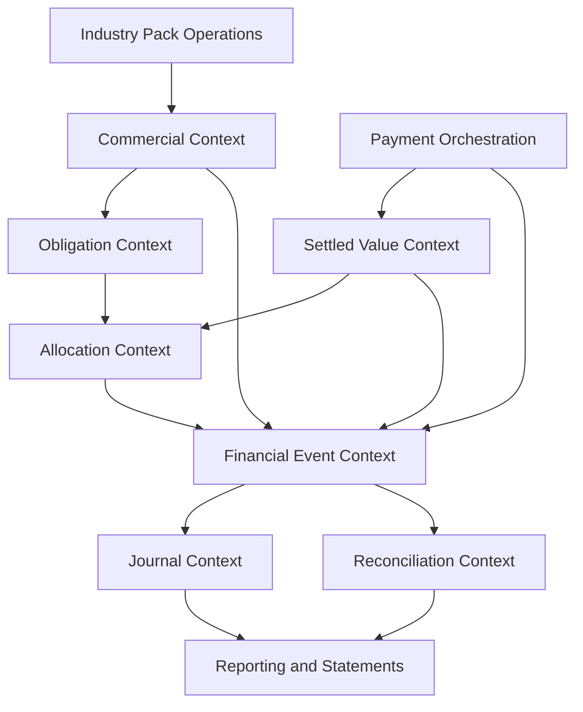
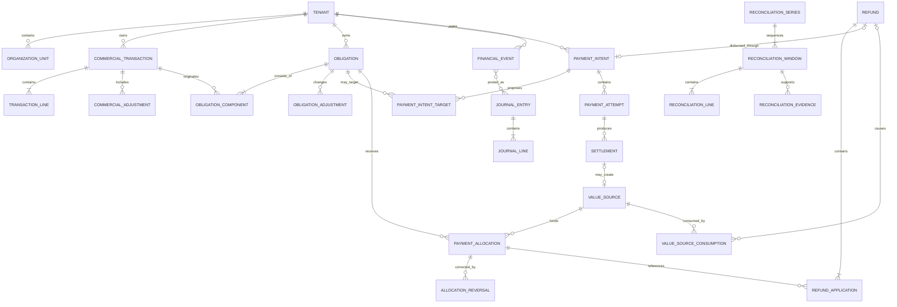

# XBOS Track B-FIN — B2 Logical Financial Entity Model, Relationships and Invariants

**Record type:** Logical architecture and invariant decision record
**Workstream:** Track B-FIN — Neutral Financial Spine
**Phase:** B2 — Canonical Financial Vocabulary and Target Model
**Status:** Approved architecture decision
**Date:** 5 August 2026
**Authority baseline:** `a73a474` — Canonical Financial Authority Map
**Vocabulary baseline:** `7d00249` — Canonical Financial Vocabulary and State Machines
**Behavior baseline:** `track-b-b1-characterization-20260804` at `56e3b19`
**Track A reconciliation reference:** `wnd-reconciliation-r2-live-20260805`
**Branch:** `track-b/b2-canonical-financial-model`

---

## 1. Purpose

This record translates the approved B2 authority and vocabulary decisions into a neutral logical entity model.

It defines:

- entities and their ownership boundaries;
- cardinalities and relationship meaning;
- authoritative versus derived values;
- cross-aggregate transaction boundaries;
- money, tenant, time and idempotency invariants;
- extension points for industry, country, accounting and provider packs;
- legacy compatibility relationships;
- the minimum logical structure required before physical schema design.

This is not a physical database specification. Names such as `Obligation`, `Settlement` and `PaymentAllocation` are logical concepts. Final table names, key types, indexes and migration order belong to the next physical-design artifact.

No runtime, database, migration or API change is authorized by this document.

---

## 2. Design principles

### 2.1 One authority per fact

```text
Domain operation owns fulfillment.
Commercial transaction owns the commercial snapshot.
Obligation owns what is owed.
Payment intent owns orchestration.
Payment attempt owns the rail/provider try.
Settlement owns confirmed value movement.
Value source owns allocatable value.
Payment allocation owns application of value to an obligation.
Financial event owns immutable economic meaning.
Journal entry owns formal accounting representation.
Reconciliation owns control evidence.
```

### 2.2 Logical separation, transactional coherence

Entities are separate because they answer different questions. Related facts that must succeed together are nevertheless written within an explicit database transaction and published through a transactional outbox.

### 2.3 Multi-tenant by construction

Every tenant-owned entity carries an explicit tenant identity. Tenant agreement is validated across every relationship. No tenant is inferred from a default, an external provider identifier or a parent row fetched without tenant scope.

### 2.4 Industry-neutral core, pack-owned operations

Restaurant orders, hotel stays, retail baskets and healthcare encounters remain pack-owned. They create commercial transactions and obligations through contracts rather than by writing financial tables.

### 2.5 Additive extensions

Country rules, tax, payroll, fixed assets, FX, stored value, provider connectors and formal accounting extend stable interfaces. Their later installation must not require reinterpreting existing financial facts.

### 2.6 Append-only corrections

Confirmed settlements, allocations, financial events and posted journal entries are corrected by linked reversals or adjustments. Original evidence remains visible.

### 2.7 Derived values are identifiable

Balances and conditions may be cached for performance, but their derivation and refresh authority are explicit. Cached values are never independently editable financial truth.

---

## 3. Bounded contexts



### 3.1 Shared platform references

Tenant, organization, Party, actor, device, Atomic Unit, taxonomy, currency, business calendar and document identity.

### 3.2 Commercial context

Commercial transactions, lines, charges, adjustments and source-domain references.

### 3.3 Obligation context

Amounts owed, obligation components, terms, due dates, adjustments, receivable/payable projections and aging.

### 3.4 Payment-orchestration context

Payment intents, intent targets/instructions, attempts, provider callbacks and authorization/capture evidence.

### 3.5 Settled-value context

Settlements, value sources, availability, provider fees, reversals, chargebacks, credits and unapplied funds.

### 3.6 Allocation context

Applications of available value to obligations and append-only allocation reversals.

### 3.7 Refund context

Refund requests, approvals, original-application links, outbound attempts/settlements and allocation effects.

### 3.8 Financial-event context

Immutable economic facts and transactional outbox messages.

### 3.9 Journal context

Posting rules, journal entries, journal lines, event linkage and accounting periods.

### 3.10 Reconciliation context

Reconciliation series, windows, lines, dependencies, evidence, revisions and audit events.

---

## 4. High-level relationship model



This diagram expresses logical cardinality. Physical many-to-many relationships require explicit link entities and relational integrity.

---

## 5. Shared platform references

### 5.1 Tenant

Purpose:

- primary data-ownership boundary;
- configuration and policy owner;
- idempotency and external-identity scope;
- retention and audit boundary.

Required logical attributes:

```text
tenant_id
tenant_status
default_currency
business_calendar_policy
configuration_version
```

No retained financial entity may be hard-deleted because a tenant or organization is removed from active operation.

### 5.2 Organization Unit

A neutral hierarchy node representing legal entity, branch, property, outlet, department, warehouse, cost center or another configured operating unit.

Required logical attributes:

```text
organization_unit_id
tenant_id
organization_unit_type
parent_organization_unit_id
code
status
timezone_or_calendar_override
```

Current `branch_id` remains a compatibility projection for the initial WND migration.

### 5.3 Party Reference

Identifies payer, payee, customer, guest, debtor, creditor, supplier, guarantor or beneficiary.

Until the shared Party module is implemented, financial entities may retain:

- nullable future `party_id`;
- typed legacy source reference;
- immutable display snapshot for documents.

Name and telephone snapshots never serve as canonical identity.

### 5.4 Actor and Device

Every material command carries or derives:

```text
actor_type
actor_id
device_id
service_identity
authorization_context
```

Provider callbacks use provider identity and signature evidence, not an invented employee actor.

### 5.5 Currency

Canonical money carries:

```text
currency_code
amount
```

Currency codes use a governed registry. Amounts use exact decimal or integer minor-unit representation under one documented policy.

An entity that owns money never relies solely on a tenant default after creation.

### 5.6 Business Time

Financial authorities distinguish:

```text
occurred_at     # when the business/economic fact occurred
recorded_at     # when XBOS persisted it
business_date   # date assigned by tenant calendar policy
effective_at    # when a rule/adjustment takes effect, where applicable
```

Stored instants are timezone-aware. Shift/cycle assignment is an explicit policy result.

---

## 6. Domain Operation Reference

### 6.1 Purpose

Links the financial kernel to an industry-pack aggregate without importing pack-specific columns into the kernel.

Examples:

```text
restaurant.order
hospitality.stay
hospitality.reservation
retail.checkout
professional_services.engagement
healthcare.encounter
```

### 6.2 Required logical attributes

```text
source_component
source_aggregate_type
source_aggregate_id
source_aggregate_version
tenant_id
organization_unit_id
```

### 6.3 Integrity rule

A source-reference registry or pack contract must validate that the referenced aggregate exists in the same tenant. A loose polymorphic string pair with no validation is insufficient.

---

## 7. Commercial Transaction

### 7.1 Purpose

Owns the confirmed commercial snapshot independently from payment condition.

### 7.2 Required logical attributes

```text
commercial_transaction_id
tenant_id
organization_unit_id
transaction_type
commercial_state
currency_code
gross_amount
tax_amount
discount_amount
complimentary_amount
fee_amount
tip_amount
net_amount
customer_party_id_or_reference
source_operation_reference
occurred_at
recorded_at
business_date
created_by
confirmed_by
correlation_id
```

### 7.3 Relationships

- One transaction contains one or more transaction lines.
- One transaction may contain zero or more commercial adjustments.
- One transaction may contribute to one or more obligations.
- Several transactions may be consolidated into one obligation through obligation components.
- One domain operation may produce several commercial transactions over time.

Examples:

- a hotel stay produces daily charges and a consolidated corporate invoice;
- a restaurant order produces one confirmed sale;
- a return creates a related negative/adjustment transaction rather than mutating the original.

### 7.4 Commercial invariants

```text
gross_amount = sum(positive line bases before allowances, under transaction policy)
net_amount = gross_amount
           + tax_amount
           + fee_amount
           + configured charge effects
           - discount_amount
           - complimentary_amount
```

The exact inclusive/exclusive tax formula is supplied by versioned tax policy, but the stored snapshot must reconcile deterministically to lines and adjustments.

`net_amount` is never changed because a payment succeeds or fails.

---

## 8. Transaction Line

### 8.1 Purpose

Owns the immutable commercial detail used by documents, obligations, reporting and pack integrations.

### 8.2 Required logical attributes

```text
transaction_line_id
commercial_transaction_id
atomic_unit_id_or_reference
name_snapshot
description_snapshot
quantity
unit_of_measure
unit_price
gross_line_amount
tax_amount
discount_amount
complimentary_amount
net_line_amount
taxonomy_or_classification_snapshot
source_line_reference
```

### 8.3 Invariants

- Quantity and amount rules are explicit by line type.
- Negative lines are allowed only for defined adjustment/return types.
- Snapshot text and classifications preserve historical truth when catalogs change.
- Transaction header totals equal the governed aggregation of lines and header adjustments.

---

## 9. Commercial Adjustment

### 9.1 Purpose

Represents commercial price effects rather than payment or accounting corrections.

Types may include:

```text
discount
complimentary
tax
service_charge
surcharge
fee
tip_designation
rounding
```

### 9.2 Required relationships

An adjustment applies to:

- one transaction;
- optionally one transaction line;
- one versioned classification/policy;
- one reason and actor where required.

### 9.3 Rule

A commercial adjustment changes the commercial net amount before obligation confirmation. A later debt write-off is an obligation adjustment, not a commercial discount.

---

## 10. Obligation

### 10.1 Purpose

Owns the amount owed by a debtor to a creditor.

### 10.2 Required logical attributes

```text
obligation_id
tenant_id
organization_unit_id
obligation_type
obligation_state
debtor_party_or_account
creditor_party_or_account
currency_code
original_amount
adjusted_amount
due_date
payment_terms_reference
collection_policy_reference
source_reference
occurred_at
recorded_at
business_date
version
correlation_id
```

### 10.3 Relationships

- One obligation contains one or more obligation components.
- A component links an obligation to one transaction, transaction line, tax/fee or other approved source.
- One obligation receives zero or more payment allocations.
- One obligation may receive zero or more adjustments.
- One obligation may appear in A/R or A/P projections according to creditor/debtor role and classification.

### 10.4 Authoritative and derived values

Authoritative:

```text
original amount
components
approved adjustments
allocations
allocation reversals
refund/reversal effects
```

Derived:

```text
paid amount
remaining balance
payment condition
aging condition
receivable/payable presentation
```

### 10.5 Balance formula

```text
effective_obligation_amount = original_amount
                            + approved_increases
                            - approved_allowances
                            - approved_write_offs

active_allocated_amount = sum(active allocation amounts)

remaining_balance = max(0, effective_obligation_amount - active_allocated_amount)
```

If refunds or reversals reduce active allocations, remaining balance may reopen. The obligation is recalculated from records; its state is not arbitrarily edited backward.

### 10.6 Invariants

- Original amount is non-negative for standard obligations; credit/return obligations use explicit types.
- Debtor and creditor are distinguishable and tenant-valid.
- One obligation has exactly one currency.
- Remaining balance does not become negative.
- `satisfied` requires zero remaining balance.
- `partially_satisfied` requires paid amount greater than zero and remaining balance greater than zero.
- Cancellation and write-off require reason, permission and financial-event consequences.

---

## 11. Obligation Component

### 11.1 Purpose

Explains why an obligation exists and permits both split and consolidated billing.

### 11.2 Relationships

```text
Commercial Transaction 1 ──< Obligation Component >── 1 Obligation
```

One transaction may contribute to several obligations, and one obligation may consolidate several transactions.

### 11.3 Required logical attributes

```text
obligation_component_id
obligation_id
source_transaction_id
source_line_or_adjustment_id_optional
component_type
amount
currency_code
effective_at
```

### 11.4 Invariant

The sum of active obligation components and obligation-level adjustments reconciles to the obligation's effective amount.

---

## 12. Obligation Adjustment

### 12.1 Purpose

Changes an already confirmed obligation through an explicit financial action.

Types may include:

```text
increase
allowance
write_off
rounding
dispute_resolution
correction
```

### 12.2 Rules

- Adjustment amount is explicit and signed through type semantics.
- Adjustment references reason, actor, approval and original obligation.
- Adjustment emits an immutable financial event.
- Adjustment never impersonates a payment allocation.
- Correction of an adjustment uses a compensating adjustment.

---

## 13. Payment Intent

### 13.1 Purpose

Owns a collection or disbursement orchestration request.

### 13.2 Required logical attributes

```text
payment_intent_id
tenant_id
organization_unit_id
direction                  # collection or disbursement
intent_state
requested_amount
currency_code
payer_party_or_account
payee_party_or_account
purpose_type
client_reference
expires_at
created_by
created_at
updated_at
correlation_id
version
```

### 13.3 Relationships

- One intent contains zero or more attempts; a newly created intent may exist before its first attempt.
- One intent may declare zero or more intended obligation targets.
- One intent may produce zero or more settlements through its attempts.
- Successful standalone intents may remain unallocated.
- An intent is not required to belong directly to a sale.

### 13.4 Payment Intent Target

An optional instruction describing where collected value is expected to be allocated.

Required attributes:

```text
payment_intent_target_id
payment_intent_id
obligation_id
requested_allocation_amount
priority_or_sequence
```

Targets guide automatic allocation but do not prove allocation. `PaymentAllocation` remains authoritative.

### 13.5 Derived intent totals

```text
confirmed_settlement_total = sum(confirmed inbound settlements)
                             - confirmed settlement reversals

intent_remaining = max(0, requested_amount - confirmed_settlement_total)
```

Intent success is based on collection/disbursement target policy, not on obligation satisfaction.

---

## 14. Payment Attempt

### 14.1 Purpose

Owns one interaction with a method, provider or manual tender.

### 14.2 Required logical attributes

```text
payment_attempt_id
tenant_id
organization_unit_id
payment_intent_id
attempt_state
method_code
provider_code
requested_amount
currency_code
settlement_mode
client_reference
provider_intent_reference
provider_attempt_reference
callback_reference
request_fingerprint
provider_evidence
created_by_or_service
created_at
completed_at
version
```

### 14.3 Relationships

- Every attempt belongs to exactly one intent.
- One attempt may produce zero, one or several settlements when a provider supports partial or staged settlement.
- Provider events link to one attempt or enter an exception queue until resolved.

### 14.4 Invariants

- Requested amount is positive.
- Attempt currency equals intent currency unless an explicit FX instruction exists.
- Client reference is unique within tenant and operation scope.
- Provider/callback identities are unique within tenant, provider and event scope.
- A terminal attempt cannot transition without a new attempt or explicit provider-correction event.
- A failed attempt does not erase prior settlements or automatically fail a retryable intent.

---

## 15. Provider Callback Event

### 15.1 Purpose

Preserves authenticated inbound provider evidence before or while applying it to an attempt/settlement.

### 15.2 Required logical attributes

```text
provider_callback_event_id
tenant_id_resolved_from_authoritative_reference
provider_code
provider_event_id
provider_intent_or_attempt_reference
payload_hash
signature_verification_result
received_at
processed_at
processing_state
error_or_quarantine_reason
raw_payload_reference
```

### 15.3 Invariants

- Provider event identity is deduplicated.
- Signature is verified before financial application.
- Tenant is resolved from a unique authoritative provider mapping, never a default.
- Amount/currency/reference mismatch is rejected or quarantined.
- Reprocessing is idempotent.
- Raw sensitive payload handling follows retention and access policy.

---

## 16. Settlement

### 16.1 Purpose

Owns confirmed or pending value movement through a channel/provider.

### 16.2 Required logical attributes

```text
settlement_id
tenant_id
organization_unit_id
payment_attempt_id
direction
settlement_state
gross_amount
fee_amount
net_amount
currency_code
channel_account_id
provider_settlement_reference
confirmed_at
available_at
occurred_at
recorded_at
business_date
evidence_reference
correlation_id
version
```

### 16.3 Relationships

- A settlement belongs to one attempt.
- A confirmed inbound settlement creates one allocatable value source under the initial model.
- A settlement may have zero or more settlement reversals/chargebacks.
- Outbound settlements, such as refunds, do not create customer-allocatable funds.

### 16.4 Amount semantics

```text
gross_amount = provider/channel-confirmed movement before explicit provider fees
fee_amount   = separately classified provider or channel fee
net_amount   = gross_amount - fee_amount under configured settlement policy
```

Whether fees reduce allocatable customer value or are absorbed as tenant expense is an explicit policy and accounting decision. It is never inferred from a provider label.

### 16.5 Invariants

- Amount and currency are explicit.
- Confirmed settlement requires valid attempt/provider evidence or an authorized immediate manual policy.
- Provider settlement reference is unique in its tenant/provider scope when supplied.
- Reversals reference original settlement.
- Cumulative reversal amount cannot exceed confirmed reversible amount.
- Original settlement evidence is immutable.

---

## 17. Value Source

### 17.1 Purpose

A neutral allocation source representing value that may satisfy obligations.

This abstraction prevents future customer credit, stored value or approved non-cash credit from forcing a redesign of `PaymentAllocation`.

Initial value-source types:

```text
settlement
credit_grant
transfer
```

The first Track B implementation may support only `settlement`, while preserving the interface for additive types.

### 17.2 Required logical attributes

```text
value_source_id
tenant_id
organization_unit_id
value_source_type
source_record_id
owner_party_or_account
original_available_amount
currency_code
availability_state
available_at
expires_at_optional
created_at
correlation_id
```

### 17.3 Derived amount

```text
active_allocated_amount = sum(active allocations from source)
source_reversal_amount  = sum(active source reversals)
terminal_consumption_amount = sum(confirmed value-source consumptions)

available_amount = original_available_amount
                 - source_reversal_amount
                 - active_allocated_amount
                 - terminal_consumption_amount
```

### 17.4 Invariants

- Available amount never becomes negative.
- Source record is valid and tenant-matched.
- One confirmed settlement creates at most one primary value source per allocatable currency/account treatment.
- Owner/beneficiary restrictions are enforced when value is customer-specific.
- Expired or blocked value cannot be newly allocated.

### 17.5 Value Source Consumption

An append-only record of allocatable value that permanently leaves or changes ownership outside an obligation allocation.

Initial consumption types may include:

```text
confirmed_refund
withdrawal
outbound_transfer
credit_expiry
```

Required logical attributes:

```text
value_source_consumption_id
tenant_id
value_source_id
consumption_type
amount
currency_code
source_record_type
source_record_id
consumed_at
idempotency_key
correlation_id
```

A settlement reversal or chargeback is tracked as a source reversal, not duplicated as a terminal consumption. A confirmed refund is a terminal consumption linked to its Refund Application. Failed or merely requested payouts do not consume value.

### 17.6 Why this is an interface

The logical `ValueSource` may become a physical parent table, an explicit ledger position or another relationally safe structure. Physical design must avoid an unvalidated polymorphic reference.

---

## 18. Payment Allocation

### 18.1 Purpose

Owns the application of available value to an obligation.

### 18.2 Required logical attributes

```text
payment_allocation_id
tenant_id
organization_unit_id
value_source_id
obligation_id
amount
currency_code
allocation_type
allocated_at
business_date
created_by_or_service
idempotency_key
correlation_id
causation_id
```

Allocation types may include:

```text
payment
deposit_application
customer_credit_application
transfer_application
```

### 18.3 Relationships

- Every allocation references exactly one value source.
- Every allocation references exactly one obligation.
- One source may fund many allocations.
- One obligation may receive many allocations.
- An allocation may have zero or more allocation reversals.

### 18.4 Core invariants

```text
allocation amount > 0
allocation tenant = source tenant = obligation tenant
allocation currency = source currency = obligation currency
sum(active allocations from source) <= source allocatable amount
sum(active allocations to obligation) <= obligation allocatable balance
```

Cross-currency allocation requires an explicit FX conversion that creates a compatible target-currency value source.

### 18.5 Concurrency

Allocation checks must be protected against concurrent overspend through row locking, serializable logic, reservation/versioning or an equivalent database-enforced mechanism.

Application-level pre-checks alone are insufficient.

---

## 19. Allocation Reversal

### 19.1 Purpose

Append-only correction reducing an earlier allocation.

### 19.2 Required logical attributes

```text
allocation_reversal_id
tenant_id
original_allocation_id
amount
reason_code
effective_at
created_by_or_service
approval_reference
idempotency_key
correlation_id
causation_id
```

### 19.3 Invariants

- Reversal amount is positive.
- Cumulative reversals do not exceed original allocation amount.
- Reversal tenant and currency match the original allocation.
- Reversal may reopen obligation balance and restore value-source availability unless a related refund consumes it.
- Original allocation is not edited or deleted.

---

## 20. Unapplied Funds and Deposits

### 20.1 Unapplied funds

A projection of available value not currently allocated:

```text
unapplied_amount = sum(available amounts of eligible value sources)
```

It is grouped by tenant, owner Party/account, currency and availability policy.

### 20.2 Deposit

A deposit is not a special payment method. It is:

```text
confirmed settlement
  -> value source
  -> zero or partial allocation until the final obligation exists
```

Accounting may classify unapplied deposit value as a liability until earned or applied.

### 20.3 Overpayment

Excess confirmed value remains in the value source and is handled by policy:

- refund;
- customer credit;
- allocation to another eligible obligation;
- approved transfer.

An obligation does not carry a negative balance.

---

## 21. Refund

### 21.1 Purpose

Owns the authorized customer-facing return of previously collected/applied value.

### 21.2 Required logical attributes

```text
refund_id
tenant_id
organization_unit_id
refund_state
requested_amount
approved_amount
currency_code
reason_code
requested_by
approved_or_rejected_by
outbound_payment_intent_id
requested_at
approved_at
completed_at
idempotency_key
correlation_id
```

### 21.3 Refund Application

Links a refund to one or more original payment allocations.

```text
refund_application_id
refund_id
original_allocation_id
amount
application_state
value_source_consumption_id_after_confirmation
```

Requested or approved applications may reserve refundable capacity. Only confirmed payout changes the application to consumed, creates the linked value-source consumption and completes the corresponding allocation reversal.

### 21.4 Relationships

- One refund contains one or more refund applications.
- One refund may use one outbound payment intent and multiple attempts.
- Successful refund settlement triggers or completes the corresponding allocation reversals under one controlled workflow.
- Multiple partial refunds may reference the same original allocation within remaining refundable value.

### 21.5 Refundable amount

```text
refundable_amount = original allocation amount
                  - successful refund applications
                  - other consuming reversals or chargebacks
                  - active refund reservations
```

A reversal created by a successful refund is the obligation-balance effect of that same refund application and is not subtracted a second time.

### 21.6 Invariants

- Refund amount is positive and does not exceed refundable amount.
- Original customer/payment context is traceable.
- Approval policy is enforced before disbursement.
- Refund idempotency prevents duplicate payout.
- Failed attempts do not reverse the original allocation.
- Successful refund emits `REFUND_PAID` or its canonical versioned event.
- Confirmed refund consumption prevents the restored source value from being allocated again.
- When the underlying charge is reduced or cancelled, a linked commercial or obligation adjustment prevents the allocation reversal from creating false new debt. Refund of unapplied value needs no such charge adjustment.

---

## 22. Settlement Reversal and Chargeback

### 22.1 Purpose

Represents provider/operator reversal of confirmed settlement value.

### 22.2 Required relationships

- References original settlement.
- References provider event, dispute or operator reason.
- Reduces the settlement-derived value source.
- If value was allocated, creates or requires corresponding allocation reversal/receivable reopening under policy.
- Emits immutable financial events.

### 22.3 Invariant

Financial impact cannot disappear merely because the provider changed attempt status. The reversal is its own economic record.

---

## 23. Financial Event

### 23.1 Purpose

Owns immutable operational-financial facts used by treasury, accounting, reporting and reconciliation.

### 23.2 Required logical attributes

```text
financial_event_id
tenant_id
organization_unit_id
event_type
event_version
amount
currency_code
economic_direction_or_role
source_component
source_record_type
source_record_id
occurred_at
recorded_at
business_date
actor_or_service
idempotency_scope
idempotency_key
correlation_id
causation_id
classification_snapshot
posting_context
evidence_hash_or_reference
```

### 23.3 Core event families

Initial families may include:

```text
SALE_REVENUE_GROSS
DISCOUNT_APPLIED
COMPLIMENTARY_APPLIED
PAYMENT_RECEIVED
DEBT_CREATED
DEBT_REPAYMENT
REFUND_PAID
TIP_RECOGNIZED
STORE_CREDIT_CREATED
EXPENSE_POSTED
OTHER_INCOME
SERVICE_REVENUE
CASH_MOVE
SETTLEMENT_REVERSED
OBLIGATION_WRITTEN_OFF
```

Final names, semantics and posting mappings belong to the financial-event catalog artifact.

### 23.4 Invariants

- Amount is non-zero under event-type policy.
- Currency and occurrence time are explicit.
- Idempotency identity is non-null and unique in tenant/scope.
- Replay returns original evidence without metadata mutation.
- Corrections create compensating events.
- Event type/version semantics never change retrospectively.
- Specialized and generic source references cannot disagree.

---

## 24. Transactional Outbox Message

### 24.1 Purpose

Reliably publishes committed domain/financial facts to integrations, read models, offline clients and asynchronous workers.

### 24.2 Required logical attributes

```text
outbox_message_id
tenant_id
topic_or_event_type
event_version
aggregate_type
aggregate_id
payload
correlation_id
causation_id
created_at
delivery_state
attempt_count
next_attempt_at
published_at
last_error
```

### 24.3 Invariant

The outbox message is written in the same database transaction as the authoritative change it publishes.

Consumer delivery is at least once; consumers must be idempotent.

---

## 25. Posting Rule and Version

### 25.1 Purpose

Maps financial-event semantics and classifications into formal accounts without embedding a tenant/country chart of accounts in operational services.

### 25.2 Required logical attributes

```text
posting_rule_id
posting_rule_version
tenant_or_pack_scope
event_type_and_version
classification_predicates
effective_from
effective_to
debit_account_expression
credit_account_expression
dimension_rules
approval_state
```

### 25.3 Extension rule

Country/accounting packs provide defaults. Tenants may configure approved mappings without changing event semantics or kernel source.

---

## 26. Journal Entry

### 26.1 Purpose

Owns a balanced accounting representation.

### 26.2 Required logical attributes

```text
journal_entry_id
tenant_id
legal_entity_or_organization_unit_id
journal_code
entry_state
posting_date
business_date
currency_code
description
posting_rule_version
created_at
posted_at
reversal_entry_id_optional
correlation_id
```

### 26.3 Journal Line

```text
journal_line_id
journal_entry_id
account_id_or_code
debit_amount
credit_amount
currency_code
party_dimension
organization_dimensions
taxonomy_dimensions
source_reference
```

### 26.4 Event linkage

A journal entry may represent one event or batch compatible events. The many-to-many relationship uses an explicit `JournalEntryEventLink` carrying source amount/allocation where required.

### 26.5 Invariants

```text
sum(debit amounts) = sum(credit amounts) per entry currency
one line cannot have both positive debit and positive credit
posted entries are immutable
reversal references the original posted entry
accounting period is open when posting occurs
posting rule version is retained
```

---

## 27. Reconciliation Series

### 27.1 Purpose

Defines the ordered continuity scope for reconciliation windows.

### 27.2 Required logical attributes

```text
reconciliation_series_id
tenant_id
organization_unit_id
reconciliation_class
channel_or_account_id
shift_or_cycle_policy_id
currency_code
active_from
active_to
series_status
```

### 27.3 Reconciliation classes

```text
treasury
control_account
commercial_settlement
```

Only treasury series participate in treasury opening, expected, actual and variance summary totals.

---

## 28. Reconciliation Window

### 28.1 Purpose

Owns one workflow and control period within a reconciliation series.

### 28.2 Required logical attributes

```text
reconciliation_window_id
reconciliation_series_id
tenant_id
organization_unit_id
period_start
period_end
business_period_reference
workflow_state
readiness_condition_derived
variance_condition_derived
predecessor_window_id
revision_number
created_by
closed_by
approved_by
reopened_by
created_at
closed_at
approved_at
reopened_at
correlation_id
version
```

### 28.3 Relationships

- One series contains ordered windows.
- One window has one required predecessor except at series start or approved reset.
- One window contains one or more lines.
- One window may contain evidence and audit events.
- A correction revision may supersede an earlier revision.

### 28.4 Continuity invariants

```text
period_end > period_start
next opening = previous actual closing in the same series
required middle windows cannot be skipped
missing/unclosed predecessor => readiness blocked
correction carry-forward preserves later observed actuals
```

---

## 29. Reconciliation Line

### 29.1 Purpose

Owns expected and observed control values for one included account/channel node.

### 29.2 Required logical attributes

```text
reconciliation_line_id
reconciliation_window_id
account_or_channel_id
aggregation_role            # leaf, parent_aggregate, presentation_only
opening_balance
inflow_amount
outflow_amount
adjustment_amount
expected_closing
actual_closing
actual_provenance
variance
currency_code
source_query_or_snapshot_reference
version
```

### 29.3 Formulas

```text
expected_closing = opening_balance
                 + inflow_amount
                 - outflow_amount
                 + adjustment_amount

variance = actual_closing - expected_closing
```

### 29.4 Draft initialization

```text
actual_closing_default = finalized(expected_closing)
actual_provenance = system_prefilled
```

Closing explicitly confirms the actual value, even if unchanged.

### 29.5 Aggregation invariant

The summary includes a parent aggregate or its included children, never both. Aggregation metadata and validation enforce this rule.

---

## 30. Reconciliation Evidence

### 30.1 Purpose

Preserves structured explanation and review evidence for variance, blocking, correction, reopening or approval.

### 30.2 Required logical attributes

```text
reconciliation_evidence_id
reconciliation_window_or_line_id
evidence_type
reason_code
note
supporting_reference
attachment_reference
entered_by
entered_at
reviewed_by
reviewed_at
```

Balanced lines do not require variance evidence unless policy says otherwise.

---

## 31. Reconciliation Audit Event

### 31.1 Purpose

Provides append-only workflow history.

Event types may include:

```text
DRAFT_CREATED
ACTUAL_PREFILLED
ACTUAL_CONFIRMED
ACTUAL_UPDATED
VARIANCE_RECORDED
BLOCKED
UNBLOCKED
CLOSED
APPROVED
REOPENED
CORRECTED
SUPERSEDED
```

Audit events do not replace the financial events being reconciled.

---

## 32. Read Models and Documents

### 32.1 Purpose

Receipts, statements, dashboards and legacy API payloads are derived projections.

Examples:

```text
SaleReceiptView
PaymentHistoryView
ObligationBalanceView
AccountsReceivableView
UnappliedFundsView
RefundHistoryView
TreasuryReconciliationView
CommercialSettlementView
JournalAuditView
```

### 32.2 Rule

Read models may denormalize data for usability and performance. They do not become alternate write authorities.

### 32.3 Receipt composition

A canonical receipt may assemble:

- commercial transaction and line snapshots;
- obligation amount and remaining balance;
- successful attempts and settlements;
- allocations applied to the transaction/obligation;
- tender, change, tip, discount and complimentary snapshots;
- tenant/organization branding;
- actor and document identity.

Printing or editing a document template cannot change financial state.

---

## 33. Cross-aggregate transaction boundaries

### 33.1 Confirm commercial transaction

One transaction should atomically:

```text
confirm commercial transaction snapshot
create obligation/component records
emit commercial financial events
write outbox messages
```

Pack operational state may be updated in the same local transaction when it shares the database and module contract; otherwise an idempotent event/command handshake applies.

### 33.2 Immediate cash settlement and allocation

One transaction should atomically:

```text
create/resolve payment intent
create succeeded immediate attempt
create confirmed settlement
create settlement value source
allocate value to intended obligation(s)
refresh compatibility projections
emit financial events
write outbox messages
```

Same-moment cash change reduces retained collection under explicit cashier policy and does not create false income or expense.

### 33.3 Asynchronous provider callback

One transaction should atomically:

```text
deduplicate authenticated callback
resolve tenant and attempt
validate amount/currency/reference
apply attempt transition
create/update settlement through allowed transition
create value source when confirmed
perform configured automatic allocations
refresh projections
emit events
write outbox messages
mark callback processed
```

### 33.4 Partial payment and A/R

One transaction should atomically:

```text
record settlement and allocation
leave positive obligation balance
derive partially_satisfied/partially_paid
refresh A/R compatibility projection
emit PAYMENT_RECEIVED and debt-related events under approved semantics
```

### 33.5 A/R repayment

One transaction should atomically:

```text
create collection intent/attempt where required
confirm settlement
create value source
allocate to existing obligation
refresh A/R and legacy repayment projections
emit DEBT_REPAYMENT transfer event
write outbox messages
```

No new revenue event is created.

### 33.6 Refund

One controlled workflow should:

```text
approve refund against refundable allocations
create outbound intent/attempt
confirm outbound settlement
create confirmed value-source consumption
create allocation reversal(s)
create or link the corresponding commercial/obligation adjustment when the charge is reduced
recalculate obligation/refund condition
emit refund and reversal events
write outbox messages
```

Provider asynchrony may require multiple database transactions linked by one idempotent workflow; no step may falsely imply payout before confirmation.

### 33.7 Reconciliation close

One transaction should atomically:

```text
lock/version-check window and predecessor
recompute expected values and summary server-side
validate series continuity and aggregation
require actual confirmation
validate variance evidence and permissions
transition workflow to closed
record audit event
write outbox message
```

---

## 34. Global invariants

### 34.1 Tenant and organization

1. Every authoritative record has one tenant.
2. Related records have the same tenant.
3. Organization unit belongs to the record tenant.
4. Cross-tenant allocation, settlement linkage and reconciliation are prohibited.
5. External identifiers are never globally resolved without tenant/provider scope unless a proven globally unique provider contract exists.

### 34.2 Money and currency

1. Canonical amounts use exact numeric representation.
2. Currency is explicit on every money-owning record.
3. Currency mismatch requires an explicit FX conversion.
4. Rounding uses versioned currency/tax policy.
5. Negative amounts are allowed only for explicitly defined record types; direction is not inferred from sign alone.

### 34.3 Identity and idempotency

1. Retriable commands have non-null idempotency scope/key.
2. Same key and same request fingerprint returns the original result.
3. Same key with a different fingerprint is rejected as conflict.
4. Provider callbacks are deduplicated by provider event identity and payload evidence.
5. Financial-event replay does not mutate original evidence.

### 34.4 Time

1. Instants are timezone-aware.
2. Occurrence and recording times are distinct.
3. Business date is assigned by explicit calendar policy.
4. Shift/cycle attribution is stored or reproducibly derived with the policy version.

### 34.5 Retention

1. Confirmed financial authorities are not cascade-deleted with tenant, branch, user, sale or provider configuration.
2. Deactivation and retention replace destructive deletion.
3. Personal-data erasure is handled through governed anonymization/pseudonymization without destroying required financial evidence.

### 34.6 Concurrency

1. Allocation cannot overspend a value source under concurrent requests.
2. Allocation cannot over-satisfy an obligation under concurrent requests.
3. Receipt numbers and external/provider identities remain unique under race.
4. Reconciliation close and reopen use locks or optimistic versions.
5. Idempotency race recovery returns the committed original record.

---

## 35. Derived-value formulas

### 35.1 Obligation

```text
effective_amount = original_amount
                 + increases
                 - allowances
                 - write_offs

paid_amount = sum(active allocations)
balance_due = max(0, effective_amount - paid_amount)
```

### 35.2 Value source

```text
available_amount = original_available_amount
                 - source_reversals
                 - active_allocations
                 - terminal_consumptions
```

### 35.3 Payment intent

```text
confirmed_total = confirmed settlements - settlement reversals
remaining_target = max(0, requested_amount - confirmed_total)
```

### 35.4 Refundability

```text
refundable_amount = original allocation amount
                  - successful refund applications
                  - other consuming reversals or chargebacks
                  - active refund reservations
```

### 35.5 Reconciliation

```text
expected_closing = opening + inflows - outflows + adjustments
variance = actual_closing - expected_closing
next_opening = previous_actual_closing
```

Every cached projection has a drift query that recomputes the formula from authorities.

---

## 36. Data ownership matrix

| Entity | Owning component | Other components may |
|---|---|---|
| Domain operation | Industry pack | Reference through contract/events |
| Commercial transaction | Commercial kernel service | Read; request adjustments through commands |
| Obligation | Obligation service | Read; request adjustment/allocation |
| Payment intent | Payment service | Request creation/cancellation; read |
| Payment attempt | Payment service | Submit provider evidence through adapter |
| Provider callback | Connector/payment service | Read processing outcome |
| Settlement | Settlement/payment service | Read; request reversal through command |
| Value source | Settled-value service | Allocate through allocation service |
| Value-source consumption | Settled-value/refund service | Read; request through typed command |
| Payment allocation | Allocation service | Read; request reversal |
| Refund | Refund service | Request/approve/process under permissions |
| Financial event | Financial-event service | Append through typed emitter command; never edit |
| Journal entry | Accounting service | Read; request posting/reversal |
| Reconciliation | Reconciliation service | Enter actual/evidence through commands |
| Receipt/read model | Document/query service | Render and export only |

Direct cross-component table mutation is prohibited in the target architecture.

---

## 37. Pack and extension contracts

### 37.1 Industry packs

Industry packs provide:

- domain operation references;
- commercial transaction/charge commands;
- Party and Atomic Unit references;
- cancellation/return intent;
- document/report contributions;
- event subscriptions.

They do not write payment, allocation, event, journal or reconciliation records directly.

### 37.2 Country and tax packs

Provide:

- tax calculation and classification policy;
- statutory document requirements;
- currency/rounding rules;
- posting-rule defaults;
- fiscal calendars and reports.

Tax packs affect explicit charge and posting records; they do not reinterpret old snapshots silently.

### 37.3 Payment-provider connectors

Provide:

- method/provider capabilities;
- request and callback mapping;
- authentication/signature validation;
- provider status normalization;
- settlement and fee evidence;
- sandbox/conformance tests.

Connectors do not author obligations or journal entries.

### 37.4 FX extension

An explicit FX conversion consumes source-currency value and creates target-currency value with:

- source and target amounts;
- currencies;
- rate and rate source;
- fees;
- occurrence time;
- rounding policy;
- financial events and journal consequences.

Allocation never performs implicit currency conversion.

### 37.5 Payroll, fixed assets and other add-ons

Future modules create obligations and financial events through the same contracts:

- payroll creates employee/statutory payables;
- fixed assets create acquisition, depreciation and disposal events;
- subscriptions create scheduled obligations;
- procurement creates supplier obligations.

No add-on requires direct mutation of sale/payment/reconciliation tables.

---

## 38. Legacy compatibility map

| Existing table/field | Logical target | Migration position |
|---|---|---|
| `orders` | Pack domain operation | Preserve; stop using status as payment authority |
| `order_items` | Pack operation lines | Preserve; map Atomic Unit references |
| `sales` | Commercial transaction snapshot | Preserve through adapter/read projection |
| `sale_items` | Transaction lines | Preserve and backfill logical links |
| `payment_intents` | Payment intent | Retain; migrate balances to derived projections |
| `payment_attempts` | Payment attempt plus legacy immediate-settlement evidence | Retain; backfill settlement records |
| `payments` | Legacy duplicate | Verify empty; freeze writes and retire through compatibility plan |
| `accounts_receivable` | A/R projection over obligation | Link/backfill; cease independent balance authority |
| `accounts_receivable_repayments` | Compatibility repayment history | Link to settlement and allocation |
| `treasury_logs` | Legacy financial events | Preserve; version and strengthen behind canonical event service |
| `recon_sheets` | Legacy reconciliation window/line snapshots | Preserve; migrate to series/window/line/evidence model |
| `sales.payment_method` | Derived tender summary | Deprecate as authority |
| `sales.payment_summary` | Typed payment read model | Stop untyped authoritative use |
| `sales.unpaid_amount` | Obligation balance projection | Keep during compatibility period |
| `payment_intents.total_paid` | Allocation/settlement projection | Keep and drift-check during migration |
| `payment_intents.balance_due` | Obligation balance projection | Keep and drift-check during migration |

---

## 39. Logical integrity requirements for physical design

The next physical model must provide:

- relationally safe tenant and organization references;
- stable source-reference validation;
- explicit bridge entities for many-to-many relationships;
- unique idempotency identities with request fingerprints;
- provider identity uniqueness in correct scopes;
- state-code and amount check constraints;
- non-null currency on money authorities;
- no cascade deletion of retained financial evidence;
- optimistic version or locking support;
- efficient obligation, intent, provider, allocation, event and reconciliation queries;
- immutable/reversal patterns;
- auditable projection refresh and drift detection;
- Alembic-only schema authority.

---

## 40. Required logical test scenarios

### 40.1 Payments and allocations

- Fully paid single-tender sale.
- Split cash and mobile-money payment.
- Partial payment leaving A/R.
- Fully unpaid obligation.
- Multiple payments against one obligation.
- One settlement allocated across several obligations.
- Standalone payment later allocated.
- Deposit applied to a later hotel folio or commercial transaction.
- Concurrent allocations cannot overspend source or obligation.

### 40.2 Idempotency and providers

- Duplicate POS settlement returns original result.
- Duplicate provider callback creates no duplicate settlement/event.
- Same idempotency key with different request fingerprint is rejected.
- Provider amount/currency mismatch is quarantined.
- Webhook resolves tenant without end-user JWT or default tenant.

### 40.3 Refunds and reversals

- Full refund.
- Partial refund.
- Multiple partial refunds capped by refundable amount.
- Failed refund attempt leaves original allocation active.
- Confirmed refund cannot leave restored value-source capacity available for reuse.
- Charge-reducing refund creates or links the matching commercial/obligation adjustment; refund of unapplied funds does not invent one.
- Chargeback reopens obligation or creates loss under policy.
- Settlement reversal cannot exceed original amount.

### 40.4 Receivables

- A/R repayment creates settlement, allocation and transfer event without new revenue.
- Obligation balance derives from allocations.
- Refund after settlement reopens balance correctly.
- Write-off creates adjustment/event rather than payment.

### 40.5 Reconciliation R2 carry-forward

- New draft prefilled from final expected closing.
- Prefilled actual remains distinguishable from confirmed actual.
- Zero variance remains balanced draft until close.
- Non-zero variance requires visible evidence controls.
- Missing/unclosed predecessor blocks closure.
- Next opening equals prior actual closing in same series.
- A/R and A/P excluded from treasury summary.
- Commercial Settlement excluded from treasury summary.
- Bank parent and children are never double-counted.
- Reopen and correction retain audit and later actual observations.

### 40.6 Tenant and pack neutrality

- Cross-tenant relationships are rejected.
- Restaurant order, hotel stay and standalone payment all use the same obligation/allocation contracts.
- Country posting rules change journal mapping without changing event facts.
- A future payroll payable can use obligations without changing payment-allocation structure.

---

## 41. Open physical-design decisions

Approval of this logical model does not yet decide:

1. Primary-key type and external/public identifier strategy.
2. Exact physical table and column names.
3. Whether Commercial Transaction is a new kernel table or a canonical interface over versioned pack snapshots.
4. Physical source-reference registry design.
5. Whether Value Source is a physical parent table, ledger position or another relational structure.
6. First-release scope for authorization/capture and multi-settlement attempts.
7. Payment-intent target persistence and automatic-allocation policy.
8. Refund versus outbound-payment aggregate boundaries.
9. Financial-event catalog and posting-rule schema.
10. Journal account/dimension and accounting-period schema.
11. Reconciliation revision/cascade physical algorithm.
12. Party/customer bridge before the shared Party module lands.
13. FX entity/schema and realized/unrealized difference treatment.
14. Backfill exception policy for inconsistent legacy rows.
15. API version and deprecation schedule.

---

## 42. Acceptance criteria

This logical entity model is approved on the basis that:

- every authority from `a73a474` has one owning entity/context;
- every approved lifecycle from `7d00249` has a logical home;
- obligations and allocations eliminate synchronized competing balances;
- standalone payments and deposits work without a sale;
- split and partial payments require no special-case schema;
- refunds and reversals reference original value applications;
- refunded or otherwise consumed value cannot be allocated again;
- A/R repayment is settlement plus allocation, not revenue;
- financial events remain distinct from journal entries;
- reconciliation incorporates WND R2 truth and continuity invariants;
- Restaurant and Hospitality packs can use the model without private-table coupling;
- future tax, payroll, fixed-asset, FX and provider additions are additive;
- physical schema decisions can proceed without reopening authority boundaries.

Approval authorizes the next B2 artifact:

> **Physical Target Schema, Constraint and Index Blueprint**

It does not authorize an Alembic migration or runtime implementation.

---

## 43. Approval record

| Field | Value |
|---|---|
| Record | B2 Logical Financial Entity Model, Relationships and Invariants |
| Version | 1.0 |
| Prepared | 5 August 2026 |
| Authority baseline | `a73a474` |
| Vocabulary baseline | `7d00249` |
| Production changes authorized | No |
| Schema changes authorized | No |
| Review status | Approved |
| Approver | XBOS project owner |
| Approval date | 5 August 2026 |
| Notes | Authorizes the B2 physical schema blueprint only; no migration or runtime implementation is authorized. |
