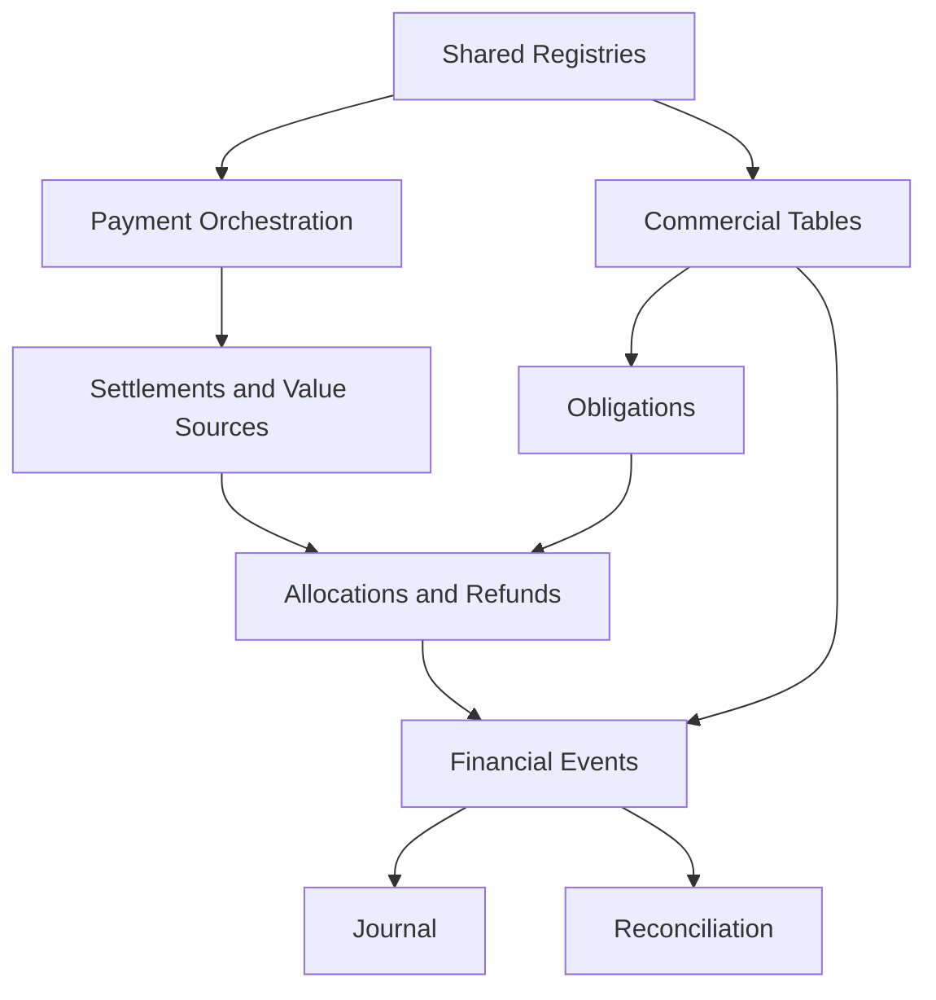

# XBOS Track B-FIN — B2 Physical Target Schema, Constraint and Index Blueprint

**Record type:** Physical data-architecture decision record
**Workstream:** Track B-FIN — Neutral Financial Spine
**Phase:** B2 — Canonical Financial Vocabulary and Target Model
**Status:** Approved architecture decision
**Date:** 5 August 2026
**Authority baseline:** `a73a474` — Canonical Financial Authority Map
**Vocabulary baseline:** `7d00249` — Canonical Financial Vocabulary and State Machines
**Logical-model baseline:** `922593c` — Logical Financial Entity Model, Relationships and Invariants
**Behavior baseline:** `track-b-b1-characterization-20260804` at `56e3b19`
**Track A reconciliation reference:** `wnd-reconciliation-r2-live-20260805`
**Branch:** `track-b/b2-canonical-financial-model`

---

## 1. Purpose

This record converts the three approved B2 architecture decisions into a migration-ready physical PostgreSQL target.

It defines:

- target tables and physical names;
- column types, nullability and defaults;
- primary, foreign, unique and check constraints;
- tenant-safe relationship enforcement;
- append-only and immutability controls;
- transaction-level and deferred invariants;
- indexes based on known command and reporting access paths;
- reconciliation continuity and revision storage;
- taxonomy, provider, accounting and industry-pack extension points;
- compatibility relationships to the live WND-era schema;
- schema-conformance and drift tests required before implementation.

This document is a blueprint, not an Alembic migration. Approval permits migration planning and DDL review. It does not permit applying schema changes, dual-writing production data or changing runtime behavior.

---

## 2. Physical decisions at a glance

| Concern | Proposed target decision for approval |
|---|---|
| PostgreSQL namespace | Keep new tables in `public` during the compatibility migration; use explicit neutral names |
| Internal keys | `BIGINT GENERATED BY DEFAULT AS IDENTITY` |
| External/public keys | `UUID NOT NULL DEFAULT gen_random_uuid()` with a unique constraint |
| Existing parent keys | Preserve current `INTEGER` types for `tenant_id`, `user_id`, `atomic_unit_id` and `taxonomy_node_id` until their owning modules migrate |
| Money | `NUMERIC(24,8)`; no floating-point storage truth |
| FX rates | `NUMERIC(30,12)` |
| Currency/asset code | Governed `VARCHAR(12)` reference, supporting fiat and configured non-fiat assets |
| Time | `TIMESTAMPTZ` for instants; `DATE` for business date |
| States | Lowercase `VARCHAR` plus named `CHECK` constraints; no PostgreSQL ENUM dependency |
| Flexible payloads | `JSONB`, limited to evidence, snapshots and optional metadata |
| Tenant integrity | Composite foreign keys `(tenant_id, parent_id)` wherever both sides are tenant-owned |
| Source polymorphism | Validated `kernel_source_records` registry, not loose type/id pairs on every table |
| Party bridge | `financial_counterparties` until the shared Party module becomes authoritative |
| Operational channels | `operational_financial_accounts`, distinct from formal `ledger_accounts` |
| Value application | Explicit `value_sources`, `payment_allocations` and append-only reversals |
| Refund safety | Confirmed refund creates value-source consumption and linked allocation reversal |
| Financial facts | Immutable `financial_events` with versioned event-type catalog |
| Accounting | Separate posting rules, journal entries, lines and event links |
| Reconciliation | Series + revisioned windows + lines + evidence + audit events |
| Deletion | No cascading hard delete of retained financial facts |
| Partitioning | No initial table partitioning; design retains later partition path |
| Tenant isolation | Composite FKs immediately; row-level security as a controlled implementation phase |

### 2.1 Target table inventory

| Family | Target tables |
|---|---|
| Shared platform | `organization_units`, `currency_assets`, `tenant_currency_policies`, `business_cycle_policies`, `kernel_source_records`, `financial_counterparties` |
| Operational accounts/providers | `operational_financial_accounts`, `payment_provider_accounts` |
| Command infrastructure | `idempotency_records`, `outbox_messages`, `document_sequences` |
| Commercial | `commercial_transactions`, `commercial_transaction_lines`, `commercial_adjustments`, two taxonomy bridges |
| Obligations | `financial_obligations`, `financial_obligation_components`, `financial_obligation_adjustments` |
| Payment orchestration | `payment_intents_v2`, `payment_intent_targets`, `payment_attempts_v2`, `provider_callback_events` |
| Settled value | `payment_settlements`, `payment_settlement_reversals`, `value_sources`, `value_source_consumptions` |
| Allocation/refund | `payment_allocations`, `payment_allocation_reversals`, `payment_refunds`, `refund_applications` |
| Financial events | `financial_event_type_versions`, `financial_events`, `financial_event_taxonomy` |
| Formal accounting | `ledger_accounts`, `accounting_periods`, `posting_rules`, `posting_rule_versions`, `journal_entries`, `journal_lines`, `journal_entry_event_links`, `journal_line_taxonomy` |
| Reconciliation | `reconciliation_series`, `reconciliation_windows`, `reconciliation_lines`, `reconciliation_evidence`, `reconciliation_audit_events` |
| Migration evidence | `canonical_backfill_runs`, `canonical_backfill_exceptions`, legacy-to-canonical mapping tables |

This is a target inventory, not a proposal to deliver every table in one migration or release.

### 2.2 Physical dependency spine



---

## 3. Evidence from the parity schema

### 3.1 Existing volumes and states

The parity database contained:

| Record | State | Count |
|---|---:|---:|
| Orders | cancelled | 534 |
| Orders | paid | 6,172 |
| Orders | pending_payment | 3 |
| Orders | receivable | 185 |
| Sales | paid | 6,172 |
| Sales | pending_payment | 187 |
| Payment intents | pending | 226 |
| Payment intents | processing | 64 |
| Payment intents | succeeded | 6,438 |
| Payment attempts | succeeded | 6,372 |
| A/R | open | 156 |
| A/R | partial | 27 |
| A/R | settled | 2 |
| Reconciliation rows | closed | 665 |

These are live compatibility obligations, not permission to copy current ambiguities into the target schema.

### 3.2 Confirmed structural gaps

The parity inspection showed:

- duplicated balance authority across `sales`, `payment_intents` and `accounts_receivable`;
- no canonical settlement or allocation tables;
- `payment_intents.payable_type/payable_id` as an unvalidated polymorphic link;
- manual intents using sentinel payable identifiers;
- globally unique attempt callback/client references rather than tenant/provider-scoped identities;
- duplicate callback-reference indexes;
- no tenant-safe composite foreign keys;
- A/R tables with weak relational linkage and timezone-naive timestamps;
- nullable treasury idempotency keys despite an idempotency index;
- mutable event metadata on idempotent replay;
- reconciliation rows without relational continuity enforcement;
- `JSON` and untyped metadata carrying financial aliases;
- current and legacy payment representations coexisting;
- no full refund workflow despite the dormant `REFUND_PAID` emitter;
- registered XafPay callback routes without an implemented gateway-webhook service method;
- webhook authentication middleware incompatible with ordinary provider callbacks.

### 3.3 Existing strengths retained

The target preserves and strengthens:

- payment intents and attempts;
- tenant and branch context;
- receipt-number uniqueness;
- attempt amount positivity;
- financial-event idempotency concept;
- taxonomy and Atomic Unit references;
- reconciliation window uniqueness;
- A/R repayment traceability;
- B1-characterized WND behavior.

---

## 4. PostgreSQL and naming standards

### 4.1 Schema namespace

New tables remain in `public` for the first canonical migration series because existing SQLAlchemy metadata, Alembic history and operational tooling assume that namespace.

Logical component boundaries are expressed by:

- explicit table names;
- repository/service ownership;
- database roles and grants;
- composite foreign keys;
- append-only triggers;
- later optional schema separation after compatibility retirement.

Moving tables into PostgreSQL schemas during the financial-authority migration would add operational risk without improving financial truth.

### 4.2 Naming

```text
table names              plural snake_case
primary key              id
public identifier        public_id
foreign key              <entity>_id
state                    <aggregate>_state or workflow_state
amount                   explicit semantic prefix/suffix
instant                  *_at
business date            business_date
optimistic version       row_version
unique constraint        uq_<table>_<meaning>
foreign key              fk_<child>_<parent>
check constraint         ck_<table>_<rule>
ordinary index           ix_<table>_<access_path>
partial unique index     ux_<table>_<access_path>
constraint trigger       ct_<table>_<rule>
immutability trigger     tr_<table>_immutable
```

Names must be deterministic and short enough for PostgreSQL's 63-byte identifier limit.

### 4.3 Reserved semantics

The following ambiguous generic names are avoided:

```text
status        # use scoped state/condition names
amount        # use requested_amount, gross_amount, allocation_amount, etc.
account       # distinguish operational_financial_account and ledger_account
reference     # use source_record_id, provider_reference or document_number
meta          # use metadata only for non-authoritative extension content
```

---

## 5. Key, identifier and relationship strategy

### 5.1 Internal identity

All new authoritative tables use:

```sql
id BIGINT GENERATED BY DEFAULT AS IDENTITY PRIMARY KEY
```

`BIGINT` avoids foreseeable exhaustion while remaining efficient for joins and indexes.

### 5.2 Public identity

Externally addressable aggregates use:

```sql
public_id UUID NOT NULL DEFAULT gen_random_uuid()
```

with:

```sql
UNIQUE (public_id)
```

Public APIs expose `public_id` after contract migration. Internal database joins use `id`.

### 5.3 Existing identities

The current `tenants`, `users`, `atomic_units` and `taxonomy_nodes` primary keys remain `INTEGER` dependencies in this blueprint. New columns referencing them use the same type.

No financial migration silently changes shared-module primary-key types.

### 5.4 Tenant-safe parent keys

Every tenant-owned target parent includes:

```sql
UNIQUE (tenant_id, id)
```

Every tenant-owned child uses a composite foreign key:

```sql
FOREIGN KEY (tenant_id, parent_id)
REFERENCES parent_table (tenant_id, id)
```

This deliberately duplicates `tenant_id` on children. The duplication is a database-enforced isolation boundary, not denormalization by accident.

### 5.5 Delete behavior

Financial authorities use:

```text
ON DELETE RESTRICT or NO ACTION
```

They do not use `ON DELETE CASCADE` from tenant, organization unit, user, source operation, transaction, intent or provider configuration.

Append-only children may use cascade only when the parent itself is a non-retained staging object. No table in this approved financial target is classified that way.

### 5.6 Actor foreign keys

Where `users` is tenant-owned, actor relationships use `(tenant_id, user_id)` and require `UNIQUE (tenant_id,id)` on `users`. If identity becomes global, a tenant-membership relation is validated instead. A bare user foreign key must never permit an actor from an unrelated tenant to approve a financial command.

---

## 6. Common physical types and columns

### 6.1 Type aliases used in this record

| Logical type | PostgreSQL type |
|---|---|
| Internal ID | `BIGINT` |
| Existing tenant/user/catalog ID | `INTEGER` |
| Public ID | `UUID` |
| Money | `NUMERIC(24,8)` |
| Quantity | `NUMERIC(24,8)` |
| FX/rate | `NUMERIC(30,12)` |
| Currency/asset code | `VARCHAR(12)` |
| State/code | `VARCHAR(32)` or sized documented variant |
| Idempotency key | `VARCHAR(200)` |
| Provider reference | `VARCHAR(255)` |
| Hash/fingerprint | `CHAR(64)` for lowercase SHA-256 hex |
| Instant | `TIMESTAMPTZ` |
| Business date | `DATE` |
| Flexible evidence | `JSONB` |

### 6.2 Standard aggregate columns

Authoritative mutable aggregate headers normally carry:

```sql
id                  BIGINT identity primary key
public_id           UUID not null default gen_random_uuid()
tenant_id           INTEGER not null
organization_unit_id BIGINT not null
created_at          TIMESTAMPTZ not null default now()
updated_at          TIMESTAMPTZ not null default now()
row_version         INTEGER not null default 1
correlation_id      UUID not null
metadata            JSONB not null default '{}'::jsonb
```

Named checks:

```sql
CHECK (row_version >= 1)
CHECK (jsonb_typeof(metadata) = 'object')
```

Append-only records omit `updated_at` and `row_version` unless a separate delivery/workflow state legitimately changes.

### 6.3 Money rules

- Authoritative money columns are non-null unless absence has real meaning.
- Positive records use `CHECK (amount > 0)`.
- Non-negative totals use `CHECK (amount >= 0)`.
- Direction is represented by type/role, never inferred only from sign.
- Rounding is performed through the versioned currency/tax policy before persistence.
- `REAL`, `DOUBLE PRECISION` and Python/JavaScript float values are not accepted as financial storage truth.

### 6.4 Time rules

- `occurred_at` is the business/economic instant.
- `recorded_at` is the server persistence instant.
- `business_date` is calculated by a versioned tenant calendar policy.
- `created_at` is audit creation time.
- All instants are `TIMESTAMPTZ`.
- Database defaults may set recording time, never economic occurrence time supplied by a trusted command.

---

## 7. Shared dependency: organization units

The financial target depends on a neutral organization hierarchy.

### 7.1 `organization_units`

```text
id                       BIGINT identity PK
public_id                UUID NOT NULL
tenant_id                INTEGER NOT NULL
parent_id                BIGINT NULL
unit_type                VARCHAR(32) NOT NULL
code                     VARCHAR(64) NOT NULL
name                     VARCHAR(160) NOT NULL
timezone_name            VARCHAR(64) NULL
business_calendar_policy_id BIGINT NULL
active                   BOOLEAN NOT NULL DEFAULT true
created_at               TIMESTAMPTZ NOT NULL DEFAULT now()
updated_at               TIMESTAMPTZ NOT NULL DEFAULT now()
row_version              INTEGER NOT NULL DEFAULT 1
```

Constraints:

```text
FK tenant_id -> tenants.id ON DELETE RESTRICT
composite self-FK (tenant_id, parent_id) -> organization_units(tenant_id, id)
nullable composite FK (tenant_id, business_calendar_policy_id) -> business_cycle_policies(tenant_id, id), added after policy table creation
UNIQUE (public_id)
UNIQUE (tenant_id, id)
UNIQUE (tenant_id, code)
CHECK code is trimmed and non-empty
CHECK parent_id is null or parent_id <> id
```

Indexes:

```text
ix_organization_units_tenant_parent (tenant_id, parent_id)
ix_organization_units_tenant_type_active (tenant_id, unit_type, active)
```

Current WND branches are backfilled as `unit_type='branch'`. Existing `branch_id` remains a compatibility field until all consumers move to `organization_unit_id`.

---

## 8. Shared registry: currency and value assets

### 8.1 `currency_assets`

```text
code                     VARCHAR(12) PK
asset_kind               VARCHAR(16) NOT NULL
display_name             VARCHAR(80) NOT NULL
minor_unit_scale         SMALLINT NOT NULL
maximum_storage_scale    SMALLINT NOT NULL DEFAULT 8
active                   BOOLEAN NOT NULL DEFAULT true
metadata                 JSONB NOT NULL DEFAULT '{}'
```

Constraints:

```text
asset_kind IN ('fiat','crypto','points','other')
code = upper(trim(code))
minor_unit_scale BETWEEN 0 AND 8
maximum_storage_scale BETWEEN minor_unit_scale AND 8
metadata is a JSON object
```

Indexes are unnecessary beyond the primary key for the initial small catalog.

### 8.2 `tenant_currency_policies`

```text
id                       BIGINT identity PK
tenant_id                INTEGER NOT NULL
currency_code            VARCHAR(12) NOT NULL
rounding_mode            VARCHAR(24) NOT NULL
cash_rounding_increment  NUMERIC(24,8) NOT NULL DEFAULT 0
active                   BOOLEAN NOT NULL DEFAULT true
effective_from           TIMESTAMPTZ NOT NULL
effective_to             TIMESTAMPTZ NULL
policy_version           INTEGER NOT NULL
```

Constraints and indexes:

```text
FK currency_code -> currency_assets.code
UNIQUE (tenant_id, currency_code, policy_version)
CHECK effective_to is null or effective_to > effective_from
CHECK cash_rounding_increment >= 0
ix_tenant_currency_policy_effective (tenant_id, currency_code, effective_from DESC)
```

### 8.3 `business_cycle_policies`

This shared policy table supplies business-day, shift and accounting-cycle boundaries without hard-coded WND times.

```text
id                       BIGINT identity PK
public_id                UUID NOT NULL
tenant_id                INTEGER NOT NULL
organization_unit_id     BIGINT NULL
policy_code              VARCHAR(64) NOT NULL
policy_version           INTEGER NOT NULL
timezone_name            VARCHAR(64) NOT NULL
cycle_type               VARCHAR(24) NOT NULL
cycle_definition         JSONB NOT NULL
effective_from           TIMESTAMPTZ NOT NULL
effective_to             TIMESTAMPTZ NULL
approved_by_user_id      INTEGER NOT NULL
approved_at              TIMESTAMPTZ NOT NULL
active                   BOOLEAN NOT NULL DEFAULT true
```

Constraints and indexes:

```text
cycle_type IN ('shift','daily','monthly','custom')
UNIQUE (public_id)
UNIQUE (tenant_id, id)
UNIQUE (tenant_id, policy_code, policy_version)
composite FK to organization unit when supplied
FK approver -> users.id ON DELETE RESTRICT
CHECK policy_version > 0
CHECK cycle_definition is a JSON object validated against the cycle-type schema
CHECK effective_to is null or effective_to > effective_from
ix_business_cycle_policy_effective (tenant_id, policy_code, effective_from DESC)
```

WND's 08:00-to-08:00 operating cycle and 18:00 classification cut-off are represented by versioned policy data and conformance tests.

---

## 9. Validated source and counterparty registries

### 9.1 `kernel_source_records`

This registry replaces unvalidated `payable_type/payable_id` and generic type/id pairs.

```text
id                       BIGINT identity PK
public_id                UUID NOT NULL
tenant_id                INTEGER NOT NULL
organization_unit_id     BIGINT NULL
source_component         VARCHAR(80) NOT NULL
aggregate_type           VARCHAR(80) NOT NULL
aggregate_external_id    VARCHAR(160) NOT NULL
aggregate_version        VARCHAR(80) NULL
source_occurred_at       TIMESTAMPTZ NULL
registered_at            TIMESTAMPTZ NOT NULL DEFAULT now()
retired_at               TIMESTAMPTZ NULL
metadata                 JSONB NOT NULL DEFAULT '{}'
```

Constraints:

```text
UNIQUE (public_id)
UNIQUE (tenant_id, id)
UNIQUE (tenant_id, source_component, aggregate_type, aggregate_external_id)
composite FK to organization_units when organization_unit_id is present
CHECK source_component and aggregate_type are lowercase, trimmed and non-empty
CHECK aggregate_external_id is trimmed and non-empty
CHECK retired_at is null or retired_at >= registered_at
```

Indexes:

```text
ix_source_records_tenant_component (tenant_id, source_component, aggregate_type)
ix_source_records_org_registered (tenant_id, organization_unit_id, registered_at DESC)
```

Pack adapters register or resolve source records through an idempotent kernel contract. A source record is never treated as proof that its pack aggregate may be mutated by finance.

### 9.2 `financial_counterparties`

This is a bridge until the shared Party model is deployed.

```text
id                       BIGINT identity PK
public_id                UUID NOT NULL
tenant_id                INTEGER NOT NULL
counterparty_kind        VARCHAR(24) NOT NULL
party_id                 BIGINT NULL
organization_unit_id     BIGINT NULL
source_record_id         BIGINT NULL
display_name_snapshot    VARCHAR(200) NOT NULL
contact_snapshot         JSONB NOT NULL DEFAULT '{}'
active                   BOOLEAN NOT NULL DEFAULT true
created_at               TIMESTAMPTZ NOT NULL DEFAULT now()
```

Constraints:

```text
counterparty_kind IN ('party','organization_unit','external','system')
UNIQUE (public_id)
UNIQUE (tenant_id, id)
composite FKs to organization_units and kernel_source_records
CHECK display_name_snapshot is non-empty
CHECK contact_snapshot is a JSON object
CHECK the reference required by counterparty_kind is present
```

Indexes:

```text
ix_counterparties_tenant_kind_active (tenant_id, counterparty_kind, active)
ix_counterparties_source (tenant_id, source_record_id) WHERE source_record_id IS NOT NULL
ix_counterparties_party (tenant_id, party_id) WHERE party_id IS NOT NULL
```

The future Party migration fills `party_id` and retains the historical display snapshot.

---

## 10. Operational financial-account registry

### 10.1 `operational_financial_accounts`

This table identifies cash drawers, mobile-money accounts, bank accounts, control accounts and commercial-settlement views. It is not the chart of accounts.

```text
id                       BIGINT identity PK
public_id                UUID NOT NULL
tenant_id                INTEGER NOT NULL
organization_unit_id     BIGINT NOT NULL
parent_account_id        BIGINT NULL
account_class            VARCHAR(32) NOT NULL
account_type             VARCHAR(32) NOT NULL
code                     VARCHAR(64) NOT NULL
display_name             VARCHAR(160) NOT NULL
currency_code            VARCHAR(12) NOT NULL
channel_code             VARCHAR(64) NULL
external_account_mask    VARCHAR(80) NULL
aggregation_role         VARCHAR(24) NOT NULL DEFAULT 'leaf'
reconciliation_enabled   BOOLEAN NOT NULL DEFAULT true
active                   BOOLEAN NOT NULL DEFAULT true
opened_at                TIMESTAMPTZ NOT NULL
closed_at                TIMESTAMPTZ NULL
metadata                 JSONB NOT NULL DEFAULT '{}'
```

Constraints:

```text
account_class IN ('treasury','control_account','commercial_settlement')
account_type IN ('cash','mobile_money','bank','card','gateway','receivable','payable','clearing','other')
aggregation_role IN ('leaf','parent_aggregate','presentation_only')
UNIQUE (public_id)
UNIQUE (tenant_id, id)
UNIQUE (tenant_id, organization_unit_id, code)
composite FK to organization_units
composite self-FK to parent account
FK currency_code -> currency_assets.code
CHECK display_name and code are non-empty
CHECK closed_at is null or closed_at >= opened_at
CHECK leaf accounts cannot have active children when counted as parent aggregate, enforced by trigger/service
```

Indexes:

```text
ix_operational_accounts_recon (tenant_id, organization_unit_id, reconciliation_enabled, active)
ix_operational_accounts_parent (tenant_id, parent_account_id)
ix_operational_accounts_class_type (tenant_id, account_class, account_type, active)
```

Named bank accounts become child accounts under a presentation/aggregate Bank parent. Reconciliation includes the parent or its leaves, never both.

---

## 11. Provider-account registry

### 11.1 `payment_provider_accounts`

```text
id                       BIGINT identity PK
public_id                UUID NOT NULL
tenant_id                INTEGER NOT NULL
organization_unit_id     BIGINT NULL
provider_code            VARCHAR(64) NOT NULL
external_account_reference VARCHAR(255) NOT NULL
credential_reference     VARCHAR(255) NOT NULL
webhook_key_reference    VARCHAR(255) NULL
environment              VARCHAR(16) NOT NULL
active                   BOOLEAN NOT NULL DEFAULT true
created_at               TIMESTAMPTZ NOT NULL DEFAULT now()
updated_at               TIMESTAMPTZ NOT NULL DEFAULT now()
row_version              INTEGER NOT NULL DEFAULT 1
metadata                 JSONB NOT NULL DEFAULT '{}'
```

Constraints:

```text
environment IN ('sandbox','production')
UNIQUE (public_id)
UNIQUE (tenant_id, id)
UNIQUE (provider_code, environment, external_account_reference)
composite FK to organization_units when supplied
CHECK credential_reference is non-empty
```

Indexes:

```text
ix_provider_accounts_tenant_provider (tenant_id, provider_code, active)
```

The globally unique provider-account identity is intentionally available for public webhook routing. Credentials remain in a secrets manager; only references are stored.

---

## 12. Command idempotency

### 12.1 `idempotency_records`

```text
id                       BIGINT identity PK
tenant_id                INTEGER NOT NULL
scope                    VARCHAR(80) NOT NULL
idempotency_key          VARCHAR(200) NOT NULL
request_fingerprint      CHAR(64) NOT NULL
processing_state         VARCHAR(24) NOT NULL
result_source_record_id  BIGINT NULL
response_code            INTEGER NULL
response_snapshot        JSONB NULL
locked_until             TIMESTAMPTZ NULL
created_at               TIMESTAMPTZ NOT NULL DEFAULT now()
completed_at             TIMESTAMPTZ NULL
expires_at               TIMESTAMPTZ NULL
```

Constraints:

```text
processing_state IN ('processing','completed','failed','expired')
UNIQUE (tenant_id, scope, idempotency_key)
CHECK request_fingerprint matches lowercase SHA-256 hex
CHECK completed_at is present when state='completed'
CHECK expires_at is null or expires_at > created_at
```

Indexes:

```text
ix_idempotency_processing_lease (processing_state, locked_until) WHERE processing_state='processing'
ix_idempotency_expiry (expires_at) WHERE expires_at IS NOT NULL
```

Same key plus same fingerprint returns the original result. Same key plus a different fingerprint is a conflict. The table supports race recovery but does not replace entity-specific provider/event uniqueness.

---

## 13. Commercial transaction tables

### 13.1 `commercial_transactions`

```text
id                       BIGINT identity PK
public_id                UUID NOT NULL
tenant_id                INTEGER NOT NULL
organization_unit_id     BIGINT NOT NULL
source_record_id         BIGINT NOT NULL
source_sequence          INTEGER NOT NULL DEFAULT 1
transaction_type         VARCHAR(32) NOT NULL
commercial_state         VARCHAR(24) NOT NULL
currency_code            VARCHAR(12) NOT NULL
gross_amount             NUMERIC(24,8) NOT NULL
tax_amount               NUMERIC(24,8) NOT NULL DEFAULT 0
discount_amount          NUMERIC(24,8) NOT NULL DEFAULT 0
complimentary_amount     NUMERIC(24,8) NOT NULL DEFAULT 0
fee_amount               NUMERIC(24,8) NOT NULL DEFAULT 0
tip_amount               NUMERIC(24,8) NOT NULL DEFAULT 0
net_amount               NUMERIC(24,8) NOT NULL
customer_counterparty_id BIGINT NULL
document_number          VARCHAR(80) NULL
occurred_at              TIMESTAMPTZ NOT NULL
recorded_at              TIMESTAMPTZ NOT NULL DEFAULT now()
business_date            DATE NOT NULL
calendar_policy_version  INTEGER NOT NULL
created_by_user_id       INTEGER NULL
confirmed_by_user_id     INTEGER NULL
confirmed_at             TIMESTAMPTZ NULL
reversed_transaction_id  BIGINT NULL
correlation_id           UUID NOT NULL
row_version              INTEGER NOT NULL DEFAULT 1
metadata                 JSONB NOT NULL DEFAULT '{}'
```

Constraints:

```text
commercial_state IN ('draft','confirmed','cancelled','reversed')
transaction_type IN ('sale','return','charge','credit_note','debit_note','other')
all header amounts >= 0 except governed return/credit semantics represented by type
UNIQUE (public_id)
UNIQUE (tenant_id, id)
UNIQUE (tenant_id, source_record_id, transaction_type, source_sequence)
partial UNIQUE (tenant_id, organization_unit_id, document_number) WHERE document_number IS NOT NULL
composite FKs to organization_units, source records, counterparty and reversed transaction
FK currency_code -> currency_assets.code
FK actor IDs -> users.id ON DELETE RESTRICT
CHECK confirmed state requires confirmed_at
CHECK reversed state requires reversed_transaction_id or linked reversal evidence
CHECK source_sequence > 0
CHECK metadata is an object
```

Indexes:

```text
ix_commercial_tx_org_business_date (tenant_id, organization_unit_id, business_date DESC, id DESC)
ix_commercial_tx_source (tenant_id, source_record_id)
ix_commercial_tx_customer_date (tenant_id, customer_counterparty_id, occurred_at DESC) WHERE customer_counterparty_id IS NOT NULL
ix_commercial_tx_state (tenant_id, organization_unit_id, commercial_state, occurred_at DESC)
```

### 13.2 `commercial_transaction_lines`

```text
id                       BIGINT identity PK
tenant_id                INTEGER NOT NULL
commercial_transaction_id BIGINT NOT NULL
line_number              INTEGER NOT NULL
atomic_unit_id           INTEGER NULL
source_record_id         BIGINT NULL
line_type                VARCHAR(24) NOT NULL
name_snapshot            VARCHAR(240) NOT NULL
description_snapshot     TEXT NULL
quantity                 NUMERIC(24,8) NOT NULL
unit_of_measure          VARCHAR(32) NOT NULL
unit_price               NUMERIC(24,8) NOT NULL
gross_line_amount        NUMERIC(24,8) NOT NULL
tax_amount               NUMERIC(24,8) NOT NULL DEFAULT 0
discount_amount          NUMERIC(24,8) NOT NULL DEFAULT 0
complimentary_amount     NUMERIC(24,8) NOT NULL DEFAULT 0
net_line_amount          NUMERIC(24,8) NOT NULL
classification_snapshot  JSONB NOT NULL DEFAULT '{}'
created_at               TIMESTAMPTZ NOT NULL DEFAULT now()
```

Constraints:

```text
line_type IN ('item','service','fee','tax','rounding','return','other')
UNIQUE (tenant_id, commercial_transaction_id, line_number)
composite FK to commercial_transactions and source records
tenant-safe composite FK (tenant_id, atomic_unit_id) -> atomic_units(tenant_id, id) ON DELETE RESTRICT
CHECK line_number > 0
CHECK quantity <> 0
CHECK non-return lines use non-negative governed amounts
CHECK classification_snapshot is an object
```

Indexes:

```text
ix_commercial_lines_transaction (tenant_id, commercial_transaction_id, line_number)
ix_commercial_lines_atomic_unit (tenant_id, atomic_unit_id) WHERE atomic_unit_id IS NOT NULL
```

### 13.3 `commercial_adjustments`

```text
id                       BIGINT identity PK
public_id                UUID NOT NULL
tenant_id                INTEGER NOT NULL
commercial_transaction_id BIGINT NOT NULL
transaction_line_id      BIGINT NULL
adjustment_type          VARCHAR(32) NOT NULL
amount                   NUMERIC(24,8) NOT NULL
currency_code            VARCHAR(12) NOT NULL
reason_code              VARCHAR(80) NOT NULL
policy_reference         VARCHAR(160) NULL
policy_version           VARCHAR(40) NULL
approved_by_user_id      INTEGER NULL
occurred_at              TIMESTAMPTZ NOT NULL
business_date            DATE NOT NULL
correlation_id           UUID NOT NULL
metadata                 JSONB NOT NULL DEFAULT '{}'
```

Constraints:

```text
adjustment_type IN ('discount','complimentary','tax','service_charge','surcharge','fee','tip_designation','rounding')
amount > 0
UNIQUE (public_id)
UNIQUE (tenant_id, id)
composite FKs to transaction and optional line
FK currency_code -> currency_assets.code
CHECK line, when supplied, belongs to the same transaction; deferred constraint trigger
```

Indexes:

```text
ix_commercial_adjustments_tx (tenant_id, commercial_transaction_id, adjustment_type)
ix_commercial_adjustments_line (tenant_id, transaction_line_id) WHERE transaction_line_id IS NOT NULL
```

---

## 14. Taxonomy bridges for commercial records

### 14.1 `commercial_line_taxonomy`

```text
tenant_id                INTEGER NOT NULL
commercial_transaction_line_id BIGINT NOT NULL
taxonomy_node_id         INTEGER NOT NULL
classification_role      VARCHAR(32) NOT NULL
classification_snapshot  JSONB NOT NULL DEFAULT '{}'
PRIMARY KEY (commercial_transaction_line_id, taxonomy_node_id, classification_role)
```

### 14.2 `commercial_adjustment_taxonomy`

```text
tenant_id                INTEGER NOT NULL
commercial_adjustment_id BIGINT NOT NULL
taxonomy_node_id         INTEGER NOT NULL
classification_role      VARCHAR(32) NOT NULL
classification_snapshot  JSONB NOT NULL DEFAULT '{}'
PRIMARY KEY (commercial_adjustment_id, taxonomy_node_id, classification_role)
```

Both tables use composite tenant-safe FKs to their financial parents and a tenant-safe taxonomy reference. If the current taxonomy or Atomic Unit table cannot yet expose `UNIQUE (tenant_id,id)`, that constraint is added in the owning module's migration before these foreign keys.

Indexes:

```text
ix_commercial_line_taxonomy_node (tenant_id, taxonomy_node_id, commercial_transaction_line_id)
ix_commercial_adjustment_taxonomy_node (tenant_id, taxonomy_node_id, commercial_adjustment_id)
```

Classification is many-to-many. A single `taxonomy_node_id` column is not sufficient for reporting, pack contribution and multiple semantic roles.

---

## 15. Obligation tables

### 15.1 `financial_obligations`

The physical name is `financial_obligations`. It is neutral between receivables and payables.

```text
id                       BIGINT identity PK
public_id                UUID NOT NULL
tenant_id                INTEGER NOT NULL
organization_unit_id     BIGINT NOT NULL
obligation_type          VARCHAR(32) NOT NULL
obligation_state         VARCHAR(32) NOT NULL
debtor_counterparty_id   BIGINT NOT NULL
creditor_counterparty_id BIGINT NOT NULL
currency_code            VARCHAR(12) NOT NULL
original_amount          NUMERIC(24,8) NOT NULL
due_date                 DATE NULL
payment_terms_code       VARCHAR(64) NULL
collection_policy_reference VARCHAR(160) NULL
source_record_id         BIGINT NOT NULL
occurred_at              TIMESTAMPTZ NOT NULL
recorded_at              TIMESTAMPTZ NOT NULL DEFAULT now()
business_date            DATE NOT NULL
calendar_policy_version  INTEGER NOT NULL
closed_at                TIMESTAMPTZ NULL
correlation_id           UUID NOT NULL
row_version              INTEGER NOT NULL DEFAULT 1
metadata                 JSONB NOT NULL DEFAULT '{}'
```

Constraints:

```text
obligation_type IN ('receivable','payable','deposit_liability','refund_payable','tax_payable','other')
obligation_state IN ('open','partially_satisfied','satisfied','cancelled','written_off')
original_amount >= 0
debtor_counterparty_id <> creditor_counterparty_id
UNIQUE (public_id)
UNIQUE (tenant_id, id)
composite FKs to organization unit, counterparties and source record
FK currency_code -> currency_assets.code
CHECK satisfied/cancelled/written_off state requires closed_at
CHECK open/partially_satisfied normally has closed_at null
```

Indexes:

```text
ix_obligations_org_state_due (tenant_id, organization_unit_id, obligation_state, due_date)
ix_obligations_debtor_state (tenant_id, debtor_counterparty_id, obligation_state, due_date)
ix_obligations_creditor_state (tenant_id, creditor_counterparty_id, obligation_state, due_date)
ix_obligations_source (tenant_id, source_record_id)
ix_obligations_business_date (tenant_id, organization_unit_id, business_date DESC)
```

No `paid_amount` or `balance_due` column is an independent authority. If cached projections are later added for performance, they are named explicitly and maintained only by the allocation service with drift checks.

### 15.2 `financial_obligation_components`

```text
id                       BIGINT identity PK
tenant_id                INTEGER NOT NULL
obligation_id            BIGINT NOT NULL
commercial_transaction_id BIGINT NULL
commercial_transaction_line_id BIGINT NULL
source_record_id         BIGINT NOT NULL
component_type           VARCHAR(32) NOT NULL
amount                   NUMERIC(24,8) NOT NULL
currency_code            VARCHAR(12) NOT NULL
effective_at             TIMESTAMPTZ NOT NULL
created_at               TIMESTAMPTZ NOT NULL DEFAULT now()
```

Constraints:

```text
component_type IN ('transaction','line','tax','fee','deposit','refund','other')
amount > 0
UNIQUE (tenant_id, obligation_id, source_record_id, component_type)
composite FKs to obligation, optional transaction/line and source record
FK currency_code -> currency_assets.code
CHECK at least one source relationship is supplied
deferred trigger validates currency equality and component sum
```

Indexes:

```text
ix_obligation_components_obligation (tenant_id, obligation_id)
ix_obligation_components_transaction (tenant_id, commercial_transaction_id) WHERE commercial_transaction_id IS NOT NULL
```

### 15.3 `financial_obligation_adjustments`

```text
id                       BIGINT identity PK
public_id                UUID NOT NULL
tenant_id                INTEGER NOT NULL
obligation_id            BIGINT NOT NULL
adjustment_type          VARCHAR(32) NOT NULL
amount                   NUMERIC(24,8) NOT NULL
currency_code            VARCHAR(12) NOT NULL
reason_code              VARCHAR(80) NOT NULL
original_adjustment_id   BIGINT NULL
approved_by_user_id      INTEGER NOT NULL
approval_reference       VARCHAR(160) NULL
effective_at             TIMESTAMPTZ NOT NULL
recorded_at              TIMESTAMPTZ NOT NULL DEFAULT now()
business_date            DATE NOT NULL
idempotency_key          VARCHAR(200) NOT NULL
correlation_id           UUID NOT NULL
causation_id             UUID NULL
metadata                 JSONB NOT NULL DEFAULT '{}'
```

Constraints:

```text
adjustment_type IN ('increase','allowance','write_off','rounding','dispute_resolution','correction')
amount > 0
UNIQUE (public_id)
UNIQUE (tenant_id, id)
UNIQUE (tenant_id, idempotency_key)
composite FKs to obligation and original adjustment
FK currency_code -> currency_assets.code
FK approved_by_user_id -> users.id ON DELETE RESTRICT
CHECK correction requires original_adjustment_id
```

Indexes:

```text
ix_obligation_adjustments_obligation (tenant_id, obligation_id, effective_at)
ix_obligation_adjustments_business_date (tenant_id, business_date, adjustment_type)
```

Obligation adjustments are append-only after commit.

---

## 16. Payment-intent tables

### 16.1 `payment_intents_v2`

The target initially uses a versioned side-by-side table name. Renaming to `payment_intents` happens only after legacy retirement.

```text
id                       BIGINT identity PK
public_id                UUID NOT NULL
tenant_id                INTEGER NOT NULL
organization_unit_id     BIGINT NOT NULL
direction                VARCHAR(16) NOT NULL
intent_state             VARCHAR(32) NOT NULL
requested_amount         NUMERIC(24,8) NOT NULL
currency_code            VARCHAR(12) NOT NULL
payer_counterparty_id    BIGINT NULL
payee_counterparty_id    BIGINT NULL
purpose_code             VARCHAR(64) NOT NULL
client_reference         VARCHAR(200) NOT NULL
request_fingerprint      CHAR(64) NOT NULL
allocation_policy_code   VARCHAR(64) NULL
expires_at               TIMESTAMPTZ NULL
created_by_user_id       INTEGER NULL
created_at               TIMESTAMPTZ NOT NULL DEFAULT now()
updated_at               TIMESTAMPTZ NOT NULL DEFAULT now()
correlation_id           UUID NOT NULL
row_version              INTEGER NOT NULL DEFAULT 1
metadata                 JSONB NOT NULL DEFAULT '{}'
```

Constraints:

```text
direction IN ('collection','disbursement')
intent_state IN ('pending','processing','partially_succeeded','succeeded','failed','cancelled','expired')
requested_amount > 0
UNIQUE (public_id)
UNIQUE (tenant_id, id)
UNIQUE (tenant_id, client_reference)
composite FKs to organization unit and counterparties
FK currency_code -> currency_assets.code
FK created_by_user_id -> users.id ON DELETE RESTRICT
CHECK expires_at is null or expires_at > created_at
CHECK payer and payee are not the same when both supplied
```

Indexes:

```text
ix_payment_intents_v2_org_created (tenant_id, organization_unit_id, created_at DESC, id DESC)
ix_payment_intents_v2_state (tenant_id, organization_unit_id, intent_state, updated_at DESC)
ix_payment_intents_v2_payer (tenant_id, payer_counterparty_id, created_at DESC) WHERE payer_counterparty_id IS NOT NULL
ix_payment_intents_v2_expiry (intent_state, expires_at) WHERE intent_state IN ('pending','processing','partially_succeeded') AND expires_at IS NOT NULL
```

Intent settlement totals are derived from settlements. Obligation satisfaction is derived from allocations. Neither is stored as an editable intent balance.

### 16.2 `payment_intent_targets`

```text
id                       BIGINT identity PK
tenant_id                INTEGER NOT NULL
payment_intent_id        BIGINT NOT NULL
obligation_id            BIGINT NOT NULL
requested_allocation_amount NUMERIC(24,8) NOT NULL
priority_sequence        INTEGER NOT NULL DEFAULT 1
created_at               TIMESTAMPTZ NOT NULL DEFAULT now()
```

Constraints:

```text
requested_allocation_amount > 0
priority_sequence > 0
UNIQUE (tenant_id, payment_intent_id, obligation_id)
UNIQUE (tenant_id, payment_intent_id, priority_sequence)
composite FKs to intent and obligation
deferred trigger validates equal currency and compatible collection/disbursement direction
```

Indexes:

```text
ix_payment_intent_targets_obligation (tenant_id, obligation_id, payment_intent_id)
```

Targets are instructions only. They do not prove that value was allocated.

---

## 17. Payment-attempt and provider-callback tables

### 17.1 `payment_attempts_v2`

```text
id                       BIGINT identity PK
public_id                UUID NOT NULL
tenant_id                INTEGER NOT NULL
organization_unit_id     BIGINT NOT NULL
payment_intent_id        BIGINT NOT NULL
provider_account_id      BIGINT NULL
attempt_state            VARCHAR(32) NOT NULL
method_code              VARCHAR(64) NOT NULL
provider_code            VARCHAR(64) NULL
requested_amount         NUMERIC(24,8) NOT NULL
currency_code            VARCHAR(12) NOT NULL
settlement_mode          VARCHAR(32) NOT NULL
client_reference         VARCHAR(200) NOT NULL
request_fingerprint      CHAR(64) NOT NULL
provider_intent_reference VARCHAR(255) NULL
provider_attempt_reference VARCHAR(255) NULL
authorization_reference  VARCHAR(255) NULL
created_by_user_id       INTEGER NULL
created_by_service       VARCHAR(120) NULL
created_at               TIMESTAMPTZ NOT NULL DEFAULT now()
updated_at               TIMESTAMPTZ NOT NULL DEFAULT now()
submitted_at             TIMESTAMPTZ NULL
completed_at             TIMESTAMPTZ NULL
expires_at               TIMESTAMPTZ NULL
correlation_id           UUID NOT NULL
row_version              INTEGER NOT NULL DEFAULT 1
provider_evidence        JSONB NOT NULL DEFAULT '{}'
metadata                 JSONB NOT NULL DEFAULT '{}'
```

Constraints:

```text
attempt_state IN ('pending','processing','requires_action','authorized','succeeded','failed','cancelled','expired')
settlement_mode IN ('immediate','provider_async','authorization_capture','manual_confirmed','ar_repayment','other')
requested_amount > 0
UNIQUE (public_id)
UNIQUE (tenant_id, id)
UNIQUE (tenant_id, client_reference)
partial UNIQUE (provider_account_id, provider_attempt_reference) WHERE provider_attempt_reference IS NOT NULL
composite FKs to intent, organization unit and provider account
FK currency_code -> currency_assets.code
CHECK provider fields are present for provider-backed methods
CHECK completed_at is present for terminal states
CHECK evidence and metadata are JSON objects
deferred trigger validates intent amount/currency/direction policy
```

Indexes:

```text
ix_payment_attempts_v2_intent_state (tenant_id, payment_intent_id, attempt_state, created_at)
ix_payment_attempts_v2_provider_intent (provider_account_id, provider_intent_reference) WHERE provider_intent_reference IS NOT NULL
ix_payment_attempts_v2_processing (attempt_state, updated_at) WHERE attempt_state IN ('processing','requires_action','authorized')
```

### 17.2 `provider_callback_events`

```text
id                       BIGINT identity PK
public_id                UUID NOT NULL
tenant_id                INTEGER NOT NULL
provider_account_id      BIGINT NOT NULL
payment_attempt_id       BIGINT NULL
provider_event_id        VARCHAR(255) NOT NULL
provider_intent_reference VARCHAR(255) NULL
provider_attempt_reference VARCHAR(255) NULL
payload_hash             CHAR(64) NOT NULL
signature_state          VARCHAR(24) NOT NULL
processing_state         VARCHAR(24) NOT NULL
raw_payload_reference    VARCHAR(500) NOT NULL
normalized_payload       JSONB NULL
received_at              TIMESTAMPTZ NOT NULL DEFAULT now()
processed_at             TIMESTAMPTZ NULL
quarantine_reason        TEXT NULL
processing_attempts      INTEGER NOT NULL DEFAULT 0
correlation_id           UUID NOT NULL
```

Constraints:

```text
signature_state IN ('verified','invalid','not_supported')
processing_state IN ('received','processing','processed','quarantined','failed')
UNIQUE (public_id)
UNIQUE (tenant_id, id)
UNIQUE (provider_account_id, provider_event_id)
composite FKs to provider account and optional payment attempt
CHECK processed state requires processed_at
CHECK quarantined state requires quarantine_reason
CHECK processing_attempts >= 0
```

Indexes:

```text
ix_provider_callbacks_work_queue (processing_state, received_at) WHERE processing_state IN ('received','failed')
ix_provider_callbacks_attempt (tenant_id, payment_attempt_id, received_at) WHERE payment_attempt_id IS NOT NULL
ix_provider_callbacks_provider_refs (provider_account_id, provider_intent_reference) WHERE provider_intent_reference IS NOT NULL
```

Public webhooks resolve `provider_account_id` from a provider-signed merchant/account reference, then establish tenant context. They do not require an employee JWT and never use a default tenant.

---

## 18. Settlement tables

### 18.1 `payment_settlements`

```text
id                       BIGINT identity PK
public_id                UUID NOT NULL
tenant_id                INTEGER NOT NULL
organization_unit_id     BIGINT NOT NULL
payment_attempt_id       BIGINT NOT NULL
operational_account_id   BIGINT NOT NULL
provider_account_id      BIGINT NULL
direction                VARCHAR(16) NOT NULL
settlement_state         VARCHAR(32) NOT NULL
gross_amount             NUMERIC(24,8) NOT NULL
fee_amount               NUMERIC(24,8) NOT NULL DEFAULT 0
fee_bearer               VARCHAR(24) NOT NULL
net_settled_amount       NUMERIC(24,8) NOT NULL
allocatable_amount       NUMERIC(24,8) NOT NULL
currency_code            VARCHAR(12) NOT NULL
provider_settlement_reference VARCHAR(255) NULL
evidence_reference       VARCHAR(500) NOT NULL
occurred_at              TIMESTAMPTZ NOT NULL
confirmed_at             TIMESTAMPTZ NULL
available_at             TIMESTAMPTZ NULL
recorded_at              TIMESTAMPTZ NOT NULL DEFAULT now()
business_date            DATE NOT NULL
calendar_policy_version  INTEGER NOT NULL
correlation_id           UUID NOT NULL
row_version              INTEGER NOT NULL DEFAULT 1
metadata                 JSONB NOT NULL DEFAULT '{}'
```

Constraints:

```text
direction IN ('inbound','outbound')
settlement_state IN ('pending','confirmed','failed','partially_reversed','reversed')
gross_amount > 0
fee_amount >= 0
fee_bearer IN ('tenant','customer','shared','not_applicable')
net_settled_amount >= 0
allocatable_amount >= 0
allocatable_amount <= gross_amount
UNIQUE (public_id)
UNIQUE (tenant_id, id)
partial UNIQUE (provider_account_id, provider_settlement_reference) WHERE provider_settlement_reference IS NOT NULL
composite FKs to attempt, organization unit, operational account and provider account
FK currency_code -> currency_assets.code
CHECK confirmed state requires confirmed_at
CHECK available_at is null or confirmed_at is not null
CHECK outbound settlement has allocatable_amount = 0
CHECK provider settlement reference implies provider_account_id
deferred trigger validates attempt/settlement direction, currency and amount policy
```

Indexes:

```text
ix_settlements_attempt (tenant_id, payment_attempt_id, occurred_at)
ix_settlements_account_business_date (tenant_id, operational_account_id, business_date, occurred_at)
ix_settlements_state_availability (settlement_state, available_at) WHERE settlement_state='confirmed'
ix_settlements_org_occurred (tenant_id, organization_unit_id, occurred_at DESC, id DESC)
```

`net_settled_amount` is the provider/channel movement after explicit fees. `allocatable_amount` is a separate customer-value policy result. Provider fees absorbed by the tenant do not silently reduce the customer's credit.

### 18.2 `payment_settlement_reversals`

```text
id                       BIGINT identity PK
public_id                UUID NOT NULL
tenant_id                INTEGER NOT NULL
original_settlement_id   BIGINT NOT NULL
reversal_type            VARCHAR(32) NOT NULL
amount                   NUMERIC(24,8) NOT NULL
currency_code            VARCHAR(12) NOT NULL
provider_callback_event_id BIGINT NULL
reason_code              VARCHAR(80) NOT NULL
approval_reference       VARCHAR(160) NULL
occurred_at              TIMESTAMPTZ NOT NULL
recorded_at              TIMESTAMPTZ NOT NULL DEFAULT now()
business_date            DATE NOT NULL
idempotency_key          VARCHAR(200) NOT NULL
correlation_id           UUID NOT NULL
causation_id             UUID NULL
metadata                 JSONB NOT NULL DEFAULT '{}'
```

Constraints:

```text
reversal_type IN ('provider_reversal','chargeback','operator_correction','void_after_confirmation','other')
amount > 0
UNIQUE (public_id)
UNIQUE (tenant_id, id)
UNIQUE (tenant_id, idempotency_key)
composite FK to original settlement and provider callback
FK currency_code -> currency_assets.code
deferred trigger validates currency and cumulative reversal <= original confirmed amount
```

Indexes:

```text
ix_settlement_reversals_original (tenant_id, original_settlement_id, occurred_at)
ix_settlement_reversals_business_date (tenant_id, business_date, reversal_type)
```

Settlement reversals are append-only. Original settlements retain their evidence; the settlement state is a derived/cached condition updated transactionally.

---

## 19. Value-source tables

### 19.1 `value_sources`

The logical Value Source becomes a physical parent table. This avoids unsafe polymorphic allocation references.

```text
id                       BIGINT identity PK
public_id                UUID NOT NULL
tenant_id                INTEGER NOT NULL
organization_unit_id     BIGINT NOT NULL
value_source_type        VARCHAR(32) NOT NULL
settlement_id            BIGINT NULL
source_record_id         BIGINT NULL
owner_counterparty_id    BIGINT NULL
original_available_amount NUMERIC(24,8) NOT NULL
currency_code            VARCHAR(12) NOT NULL
availability_state       VARCHAR(24) NOT NULL
available_at             TIMESTAMPTZ NOT NULL
expires_at               TIMESTAMPTZ NULL
created_at               TIMESTAMPTZ NOT NULL DEFAULT now()
correlation_id           UUID NOT NULL
row_version              INTEGER NOT NULL DEFAULT 1
metadata                 JSONB NOT NULL DEFAULT '{}'
```

Constraints:

```text
value_source_type IN ('settlement','credit_grant','transfer')
availability_state IN ('pending','available','blocked','exhausted','expired','reversed')
original_available_amount > 0
UNIQUE (public_id)
UNIQUE (tenant_id, id)
partial UNIQUE (tenant_id, settlement_id) WHERE settlement_id IS NOT NULL
composite FKs to organization unit, settlement, source record and counterparty
FK currency_code -> currency_assets.code
CHECK settlement type requires settlement_id and other types require source_record_id
CHECK expires_at is null or expires_at > available_at
```

Indexes:

```text
ix_value_sources_owner_available (tenant_id, owner_counterparty_id, currency_code, availability_state, available_at) WHERE owner_counterparty_id IS NOT NULL
ix_value_sources_org_available (tenant_id, organization_unit_id, currency_code, availability_state, available_at)
ix_value_sources_settlement (tenant_id, settlement_id) WHERE settlement_id IS NOT NULL
```

Available amount is derived under lock:

```text
original_available_amount
- active settlement/source reversals
- active payment allocations
- confirmed value-source consumptions
```

### 19.2 `value_source_consumptions`

```text
id                       BIGINT identity PK
public_id                UUID NOT NULL
tenant_id                INTEGER NOT NULL
value_source_id          BIGINT NOT NULL
consumption_type         VARCHAR(32) NOT NULL
amount                   NUMERIC(24,8) NOT NULL
currency_code            VARCHAR(12) NOT NULL
source_record_id         BIGINT NOT NULL
consumed_at              TIMESTAMPTZ NOT NULL
business_date            DATE NOT NULL
idempotency_key          VARCHAR(200) NOT NULL
correlation_id           UUID NOT NULL
causation_id             UUID NULL
metadata                 JSONB NOT NULL DEFAULT '{}'
```

Constraints:

```text
consumption_type IN ('confirmed_refund','withdrawal','outbound_transfer','credit_expiry')
amount > 0
UNIQUE (public_id)
UNIQUE (tenant_id, id)
UNIQUE (tenant_id, idempotency_key)
composite FKs to value source and source record
FK currency_code -> currency_assets.code
deferred trigger validates source currency and prevents negative available value
```

Indexes:

```text
ix_value_consumptions_source (tenant_id, value_source_id, consumed_at)
ix_value_consumptions_business_date (tenant_id, business_date, consumption_type)
```

Consumptions are append-only. Failed or requested refunds create no consumption.

---

## 20. Allocation tables

### 20.1 `payment_allocations`

```text
id                       BIGINT identity PK
public_id                UUID NOT NULL
tenant_id                INTEGER NOT NULL
organization_unit_id     BIGINT NOT NULL
value_source_id          BIGINT NOT NULL
obligation_id            BIGINT NOT NULL
allocation_type          VARCHAR(32) NOT NULL
allocation_amount        NUMERIC(24,8) NOT NULL
currency_code            VARCHAR(12) NOT NULL
allocated_at             TIMESTAMPTZ NOT NULL
business_date            DATE NOT NULL
created_by_user_id       INTEGER NULL
created_by_service       VARCHAR(120) NULL
idempotency_key          VARCHAR(200) NOT NULL
request_fingerprint      CHAR(64) NOT NULL
correlation_id           UUID NOT NULL
causation_id             UUID NULL
metadata                 JSONB NOT NULL DEFAULT '{}'
```

Constraints:

```text
allocation_type IN ('payment','deposit_application','customer_credit_application','transfer_application')
allocation_amount > 0
UNIQUE (public_id)
UNIQUE (tenant_id, id)
UNIQUE (tenant_id, idempotency_key)
composite FKs to organization unit, value source and obligation
FK currency_code -> currency_assets.code
FK created_by_user_id -> users.id ON DELETE RESTRICT
CHECK a creator user or service is supplied
deferred trigger validates equal tenant, organization policy and currency
deferred trigger prevents overspending source or over-satisfying obligation
```

Indexes:

```text
ix_allocations_source (tenant_id, value_source_id, allocated_at, id)
ix_allocations_obligation (tenant_id, obligation_id, allocated_at, id)
ix_allocations_business_date (tenant_id, organization_unit_id, business_date, id)
```

### 20.2 `payment_allocation_reversals`

```text
id                       BIGINT identity PK
public_id                UUID NOT NULL
tenant_id                INTEGER NOT NULL
original_allocation_id   BIGINT NOT NULL
reversal_amount          NUMERIC(24,8) NOT NULL
currency_code            VARCHAR(12) NOT NULL
reason_code              VARCHAR(80) NOT NULL
refund_application_id    BIGINT NULL
effective_at             TIMESTAMPTZ NOT NULL
business_date            DATE NOT NULL
created_by_user_id       INTEGER NULL
created_by_service       VARCHAR(120) NULL
approval_reference       VARCHAR(160) NULL
idempotency_key          VARCHAR(200) NOT NULL
correlation_id           UUID NOT NULL
causation_id             UUID NULL
metadata                 JSONB NOT NULL DEFAULT '{}'
```

Constraints:

```text
reversal_amount > 0
UNIQUE (public_id)
UNIQUE (tenant_id, id)
UNIQUE (tenant_id, idempotency_key)
composite FK to original allocation
FK currency_code -> currency_assets.code
CHECK a creator user or service is supplied
deferred trigger validates currency and cumulative reversal <= original allocation
```

The refund-application foreign key is added after `refund_applications` exists to avoid a circular DDL ordering problem.

Indexes:

```text
ix_allocation_reversals_original (tenant_id, original_allocation_id, effective_at)
ix_allocation_reversals_refund (tenant_id, refund_application_id) WHERE refund_application_id IS NOT NULL
```

Allocations and reversals are append-only. A computed active amount may be materialized only as a rebuildable projection.

### 20.3 Concurrency algorithm

Allocation commands lock rows in deterministic order:

```text
1. lock value_sources row FOR UPDATE
2. lock financial_obligations row FOR UPDATE
3. recompute source availability from authoritative children
4. recompute obligation allocatable balance
5. validate requested allocation
6. insert allocation and events/outbox
7. update compatibility projections and row versions
8. commit
```

If several sources/obligations participate, rows are locked by ascending table/id order to avoid deadlocks.

---

## 21. Refund tables

### 21.1 `payment_refunds`

```text
id                       BIGINT identity PK
public_id                UUID NOT NULL
tenant_id                INTEGER NOT NULL
organization_unit_id     BIGINT NOT NULL
refund_state             VARCHAR(24) NOT NULL
requested_amount         NUMERIC(24,8) NOT NULL
approved_amount          NUMERIC(24,8) NULL
currency_code            VARCHAR(12) NOT NULL
reason_code              VARCHAR(80) NOT NULL
requested_by_user_id     INTEGER NOT NULL
reviewed_by_user_id      INTEGER NULL
outbound_payment_intent_id BIGINT NULL
requested_at             TIMESTAMPTZ NOT NULL DEFAULT now()
reviewed_at              TIMESTAMPTZ NULL
completed_at             TIMESTAMPTZ NULL
idempotency_key          VARCHAR(200) NOT NULL
request_fingerprint      CHAR(64) NOT NULL
correlation_id           UUID NOT NULL
row_version              INTEGER NOT NULL DEFAULT 1
metadata                 JSONB NOT NULL DEFAULT '{}'
```

Constraints:

```text
refund_state IN ('requested','approved','processing','succeeded','failed','rejected','cancelled')
requested_amount > 0
approved_amount is null or (approved_amount > 0 and approved_amount <= requested_amount)
UNIQUE (public_id)
UNIQUE (tenant_id, id)
UNIQUE (tenant_id, idempotency_key)
composite FKs to organization unit and outbound intent
FK currency_code -> currency_assets.code
FK actor IDs -> users.id ON DELETE RESTRICT
CHECK approved/rejected states require reviewer and reviewed_at
CHECK succeeded state requires completed_at and approved_amount
```

Indexes:

```text
ix_refunds_org_state_requested (tenant_id, organization_unit_id, refund_state, requested_at DESC)
ix_refunds_outbound_intent (tenant_id, outbound_payment_intent_id) WHERE outbound_payment_intent_id IS NOT NULL
```

### 21.2 `refund_applications`

```text
id                       BIGINT identity PK
public_id                UUID NOT NULL
tenant_id                INTEGER NOT NULL
refund_id                BIGINT NOT NULL
original_allocation_id   BIGINT NOT NULL
application_amount       NUMERIC(24,8) NOT NULL
application_state        VARCHAR(24) NOT NULL
value_source_consumption_id BIGINT NULL
created_at               TIMESTAMPTZ NOT NULL DEFAULT now()
reserved_at              TIMESTAMPTZ NULL
consumed_at              TIMESTAMPTZ NULL
released_at              TIMESTAMPTZ NULL
```

Constraints:

```text
application_state IN ('requested','reserved','consumed','released')
application_amount > 0
UNIQUE (public_id)
UNIQUE (tenant_id, id)
UNIQUE (tenant_id, refund_id, original_allocation_id)
composite FKs to refund, original allocation and value-source consumption
CHECK consumed state requires consumption ID and consumed_at
CHECK released state requires released_at
deferred trigger caps successful plus reserved applications at refundable amount
```

Indexes:

```text
ix_refund_applications_refund (tenant_id, refund_id)
ix_refund_applications_allocation (tenant_id, original_allocation_id, application_state)
```

### 21.3 Refund commit boundary

On confirmed outbound settlement, one transaction must:

```text
lock refund and affected source/allocation/obligation rows
confirm the outbound settlement
create value_source_consumption(type='confirmed_refund')
create payment_allocation_reversal linked to refund application
create/link commercial or obligation adjustment when the underlying charge is reduced
mark refund applications consumed
derive refund and obligation conditions
emit REFUND_PAID and related events
write outbox records
refresh compatibility projections
```

The restored allocation capacity and terminal source consumption offset each other. Refunded value cannot be allocated again.

---

## 22. Financial-event catalog

### 22.1 `financial_event_type_versions`

```text
event_type_code          VARCHAR(80) NOT NULL
event_version            SMALLINT NOT NULL
display_name             VARCHAR(160) NOT NULL
definition               TEXT NOT NULL
amount_policy            VARCHAR(24) NOT NULL
default_economic_role    VARCHAR(32) NOT NULL
reconciliation_effect    VARCHAR(32) NOT NULL
account_role_policy      JSONB NOT NULL DEFAULT '{}'
posting_eligible         BOOLEAN NOT NULL DEFAULT true
effective_from           TIMESTAMPTZ NOT NULL
effective_to             TIMESTAMPTZ NULL
approved_at              TIMESTAMPTZ NOT NULL
definition_hash          CHAR(64) NOT NULL
metadata                 JSONB NOT NULL DEFAULT '{}'
PRIMARY KEY (event_type_code, event_version)
```

Constraints:

```text
amount_policy IN ('positive','nonzero','zero_allowed')
reconciliation_effect IN ('inflow','outflow','movement','control','commercial','none')
event_type_code = upper(trim(event_type_code))
CHECK effective_to is null or effective_to > effective_from
CHECK account_role_policy is a JSON object validated against the event-catalog schema
UNIQUE (definition_hash)
```

Event meaning is immutable after approval. A semantic change requires a new version.

### 22.2 `financial_events`

```text
id                       BIGINT identity PK
public_id                UUID NOT NULL
tenant_id                INTEGER NOT NULL
organization_unit_id     BIGINT NOT NULL
event_type_code          VARCHAR(80) NOT NULL
event_version            SMALLINT NOT NULL
amount                   NUMERIC(24,8) NOT NULL
currency_code            VARCHAR(12) NOT NULL
economic_role            VARCHAR(32) NOT NULL
source_operational_account_id BIGINT NULL
target_operational_account_id BIGINT NULL
source_record_id         BIGINT NOT NULL
original_event_id        BIGINT NULL
occurred_at              TIMESTAMPTZ NOT NULL
recorded_at              TIMESTAMPTZ NOT NULL DEFAULT now()
business_date            DATE NOT NULL
calendar_policy_version  INTEGER NOT NULL
actor_user_id            INTEGER NULL
actor_service            VARCHAR(120) NULL
idempotency_scope        VARCHAR(80) NOT NULL
idempotency_key          VARCHAR(200) NOT NULL
correlation_id           UUID NOT NULL
causation_id             UUID NULL
classification_snapshot  JSONB NOT NULL DEFAULT '{}'
posting_context          JSONB NOT NULL DEFAULT '{}'
evidence_hash            CHAR(64) NULL
metadata                 JSONB NOT NULL DEFAULT '{}'
```

Constraints:

```text
amount <> 0 unless event catalog allows zero
UNIQUE (public_id)
UNIQUE (tenant_id, id)
UNIQUE (tenant_id, idempotency_scope, idempotency_key)
FK (event_type_code,event_version) -> financial_event_type_versions
composite FKs to organization unit, source/target operational accounts, source record and original event
FK currency_code -> currency_assets.code
FK actor_user_id -> users.id ON DELETE RESTRICT
CHECK an actor user or service is supplied
CHECK classification_snapshot, posting_context and metadata are JSON objects
CHECK source and target account IDs differ when both are supplied
CHECK original_event_id is present for correction/reversal event types under catalog policy
catalog-driven trigger validates required source/target account roles
```

Indexes:

```text
ix_financial_events_org_occurred (tenant_id, organization_unit_id, occurred_at DESC, id DESC)
ix_financial_events_business_type (tenant_id, organization_unit_id, business_date, event_type_code)
ix_financial_events_source (tenant_id, source_record_id, occurred_at)
ix_financial_events_source_account_date (tenant_id, source_operational_account_id, business_date, id) WHERE source_operational_account_id IS NOT NULL
ix_financial_events_target_account_date (tenant_id, target_operational_account_id, business_date, id) WHERE target_operational_account_id IS NOT NULL
ix_financial_events_correlation (tenant_id, correlation_id, recorded_at)
ix_financial_events_original (tenant_id, original_event_id) WHERE original_event_id IS NOT NULL
brin_financial_events_recorded_at USING BRIN (recorded_at)
```

`financial_events` is append-only. Idempotent replay returns the existing row and cannot enrich or replace metadata.

### 22.3 `financial_event_taxonomy`

```text
tenant_id                INTEGER NOT NULL
financial_event_id       BIGINT NOT NULL
taxonomy_node_id         INTEGER NOT NULL
classification_role      VARCHAR(32) NOT NULL
classification_snapshot  JSONB NOT NULL DEFAULT '{}'
PRIMARY KEY (financial_event_id, taxonomy_node_id, classification_role)
```

Constraints and indexes:

```text
composite FK to financial event
tenant-safe FK to taxonomy node
CHECK classification_role is non-empty
ix_financial_event_taxonomy_node (tenant_id, taxonomy_node_id, financial_event_id)
```

This preserves the existing many-to-many taxonomy strength and supports several independent classifications per event.

---

## 23. Transactional outbox

### 23.1 `outbox_messages`

```text
id                       BIGINT identity PK
public_id                UUID NOT NULL
tenant_id                INTEGER NOT NULL
source_event_public_id   UUID NOT NULL
aggregate_type           VARCHAR(80) NOT NULL
aggregate_public_id      UUID NOT NULL
event_name               VARCHAR(120) NOT NULL
event_version            SMALLINT NOT NULL
payload                  JSONB NOT NULL
payload_hash             CHAR(64) NOT NULL
delivery_state           VARCHAR(24) NOT NULL DEFAULT 'pending'
available_at             TIMESTAMPTZ NOT NULL DEFAULT now()
created_at               TIMESTAMPTZ NOT NULL DEFAULT now()
published_at             TIMESTAMPTZ NULL
delivery_attempts        INTEGER NOT NULL DEFAULT 0
last_error               TEXT NULL
locked_by                VARCHAR(120) NULL
locked_until             TIMESTAMPTZ NULL
correlation_id           UUID NOT NULL
causation_id             UUID NULL
```

Constraints:

```text
delivery_state IN ('pending','published','retrying','dead_letter')
UNIQUE (public_id)
UNIQUE (tenant_id, source_event_public_id)
CHECK payload is a JSON object
CHECK delivery_attempts >= 0
CHECK published state requires published_at
```

Indexes:

```text
ix_outbox_delivery_queue (delivery_state, available_at, id) WHERE delivery_state IN ('pending','retrying')
ix_outbox_lock_expiry (locked_until) WHERE locked_until IS NOT NULL
ix_outbox_tenant_created (tenant_id, created_at DESC)
```

`source_event_public_id` is the stable identity of the domain/financial event being published. The message content and identity are immutable. Delivery fields may change. Workers claim rows with `FOR UPDATE SKIP LOCKED`.

---

## 24. Formal accounting reference tables

### 24.1 `ledger_accounts`

```text
id                       BIGINT identity PK
public_id                UUID NOT NULL
tenant_id                INTEGER NOT NULL
legal_entity_unit_id     BIGINT NOT NULL
parent_account_id        BIGINT NULL
account_code             VARCHAR(64) NOT NULL
account_name             VARCHAR(180) NOT NULL
account_type             VARCHAR(32) NOT NULL
normal_balance           VARCHAR(8) NOT NULL
currency_policy          VARCHAR(24) NOT NULL
fixed_currency_code      VARCHAR(12) NULL
active                   BOOLEAN NOT NULL DEFAULT true
effective_from           DATE NOT NULL
effective_to             DATE NULL
metadata                 JSONB NOT NULL DEFAULT '{}'
```

Constraints:

```text
account_type IN ('asset','liability','equity','income','expense','contra','statistical')
normal_balance IN ('debit','credit')
currency_policy IN ('any','base_only','fixed')
UNIQUE (public_id)
UNIQUE (tenant_id, id)
UNIQUE (tenant_id, legal_entity_unit_id, account_code)
composite FKs to legal entity unit and parent account
FK fixed_currency_code -> currency_assets.code
CHECK fixed policy requires fixed_currency_code
CHECK effective_to is null or effective_to >= effective_from
```

Indexes:

```text
ix_ledger_accounts_parent (tenant_id, parent_account_id)
ix_ledger_accounts_type_active (tenant_id, legal_entity_unit_id, account_type, active)
```

### 24.2 `accounting_periods`

```text
id                       BIGINT identity PK
tenant_id                INTEGER NOT NULL
legal_entity_unit_id     BIGINT NOT NULL
period_code              VARCHAR(32) NOT NULL
period_start             DATE NOT NULL
period_end               DATE NOT NULL
period_state             VARCHAR(16) NOT NULL
closed_by_user_id        INTEGER NULL
closed_at                TIMESTAMPTZ NULL
reopened_by_user_id      INTEGER NULL
reopened_at              TIMESTAMPTZ NULL
row_version              INTEGER NOT NULL DEFAULT 1
```

Constraints:

```text
period_state IN ('open','closed','reopened')
period_end >= period_start
UNIQUE (tenant_id, legal_entity_unit_id, period_code)
UNIQUE (tenant_id, legal_entity_unit_id, period_start, period_end)
composite FK to legal entity unit
FK actor IDs -> users.id ON DELETE RESTRICT
exclusion constraint prevents overlapping active periods for the same legal entity
```

The exclusion constraint uses `daterange(period_start, period_end, '[]')` with `btree_gist`, which must be explicitly approved as an extension dependency before migration. If the extension is not approved, a constraint trigger enforces non-overlap.

---

## 25. Posting-rule tables

### 25.1 `posting_rules`

```text
id                       BIGINT identity PK
public_id                UUID NOT NULL
tenant_id                INTEGER NULL
pack_scope               VARCHAR(120) NULL
rule_code                VARCHAR(80) NOT NULL
display_name             VARCHAR(180) NOT NULL
active                   BOOLEAN NOT NULL DEFAULT true
created_at               TIMESTAMPTZ NOT NULL DEFAULT now()
```

Constraints:

```text
UNIQUE (public_id)
UNIQUE NULLS NOT DISTINCT (tenant_id, pack_scope, rule_code)
CHECK tenant_id or pack_scope is supplied
```

### 25.2 `posting_rule_versions`

```text
id                       BIGINT identity PK
posting_rule_id          BIGINT NOT NULL
version_number           INTEGER NOT NULL
event_type_code          VARCHAR(80) NOT NULL
event_version            SMALLINT NOT NULL
classification_predicates JSONB NOT NULL DEFAULT '{}'
debit_account_expression JSONB NOT NULL
credit_account_expression JSONB NOT NULL
dimension_rules          JSONB NOT NULL DEFAULT '{}'
effective_from           TIMESTAMPTZ NOT NULL
effective_to             TIMESTAMPTZ NULL
approval_state           VARCHAR(24) NOT NULL
approved_by_user_id      INTEGER NULL
approved_at              TIMESTAMPTZ NULL
definition_hash          CHAR(64) NOT NULL
```

Constraints:

```text
approval_state IN ('draft','approved','retired')
UNIQUE (posting_rule_id, version_number)
UNIQUE (definition_hash)
FK posting_rule_id -> posting_rules.id ON DELETE RESTRICT
FK event type/version -> financial_event_type_versions
FK approved_by_user_id -> users.id ON DELETE RESTRICT
CHECK JSON rule documents are objects
CHECK approved state requires approver and approved_at
CHECK effective_to is null or effective_to > effective_from
```

Indexes:

```text
ix_posting_rule_versions_event (event_type_code, event_version, approval_state, effective_from DESC)
ix_posting_rule_versions_rule (posting_rule_id, version_number DESC)
```

Rule JSON is declarative and validated against a versioned schema. It never stores executable SQL or Python.

---

## 26. Journal tables

### 26.1 `journal_entries`

```text
id                       BIGINT identity PK
public_id                UUID NOT NULL
tenant_id                INTEGER NOT NULL
legal_entity_unit_id     BIGINT NOT NULL
accounting_period_id     BIGINT NOT NULL
journal_code             VARCHAR(32) NOT NULL
entry_number             VARCHAR(80) NOT NULL
entry_state              VARCHAR(24) NOT NULL
transaction_currency_code VARCHAR(12) NOT NULL
base_currency_code       VARCHAR(12) NOT NULL
posting_date             DATE NOT NULL
business_date            DATE NOT NULL
description              TEXT NOT NULL
posting_rule_version_id  BIGINT NULL
reversal_entry_id        BIGINT NULL
created_by_user_id       INTEGER NULL
created_by_service       VARCHAR(120) NULL
approved_by_user_id      INTEGER NULL
created_at               TIMESTAMPTZ NOT NULL DEFAULT now()
posted_at                TIMESTAMPTZ NULL
correlation_id           UUID NOT NULL
row_version              INTEGER NOT NULL DEFAULT 1
metadata                 JSONB NOT NULL DEFAULT '{}'
```

Constraints:

```text
entry_state IN ('draft','pending_approval','posted','reversed')
UNIQUE (public_id)
UNIQUE (tenant_id, id)
UNIQUE (tenant_id, legal_entity_unit_id, journal_code, entry_number)
composite FKs to legal entity, accounting period and reversal entry
FK posting rule version, currencies and actor IDs
CHECK creator user or service is supplied
CHECK posted/reversed state requires posted_at
CHECK reversed state requires reversal_entry_id or is referenced by a reversal entry under chosen direction policy
```

Indexes:

```text
ix_journal_entries_period_state (tenant_id, accounting_period_id, entry_state, posting_date, id)
ix_journal_entries_correlation (tenant_id, correlation_id)
ix_journal_entries_reversal (tenant_id, reversal_entry_id) WHERE reversal_entry_id IS NOT NULL
```

### 26.2 `journal_lines`

```text
id                       BIGINT identity PK
tenant_id                INTEGER NOT NULL
journal_entry_id         BIGINT NOT NULL
line_number              INTEGER NOT NULL
ledger_account_id        BIGINT NOT NULL
description              TEXT NULL
transaction_currency_code VARCHAR(12) NOT NULL
transaction_debit_amount NUMERIC(24,8) NOT NULL DEFAULT 0
transaction_credit_amount NUMERIC(24,8) NOT NULL DEFAULT 0
base_currency_code       VARCHAR(12) NOT NULL
base_debit_amount        NUMERIC(24,8) NOT NULL DEFAULT 0
base_credit_amount       NUMERIC(24,8) NOT NULL DEFAULT 0
fx_rate                  NUMERIC(30,12) NULL
counterparty_id          BIGINT NULL
organization_unit_id     BIGINT NULL
source_record_id         BIGINT NULL
dimension_snapshot       JSONB NOT NULL DEFAULT '{}'
```

Constraints:

```text
UNIQUE (tenant_id, journal_entry_id, line_number)
composite FKs to journal entry, ledger account, counterparty, organization unit and source record
FK currency codes -> currency_assets
CHECK line_number > 0
CHECK exactly one of transaction debit/credit is positive
CHECK exactly one of base debit/credit is positive
CHECK all debit/credit amounts >= 0
CHECK fx_rate > 0 when transaction currency differs from base currency
```

Indexes:

```text
ix_journal_lines_entry (tenant_id, journal_entry_id, line_number)
ix_journal_lines_account (tenant_id, ledger_account_id, journal_entry_id)
ix_journal_lines_counterparty (tenant_id, counterparty_id, journal_entry_id) WHERE counterparty_id IS NOT NULL
```

### 26.3 `journal_entry_event_links`

```text
tenant_id                INTEGER NOT NULL
journal_entry_id         BIGINT NOT NULL
financial_event_id       BIGINT NOT NULL
source_amount            NUMERIC(24,8) NULL
allocation_role          VARCHAR(32) NULL
PRIMARY KEY (journal_entry_id, financial_event_id)
```

Composite FKs enforce tenant agreement. The link supports one event to multiple entries and one batch entry to multiple compatible events.

Index:

```text
ix_journal_event_links_event (tenant_id, financial_event_id, journal_entry_id)
```

### 26.4 `journal_line_taxonomy`

```text
tenant_id                INTEGER NOT NULL
journal_line_id          BIGINT NOT NULL
taxonomy_node_id         INTEGER NOT NULL
classification_role      VARCHAR(32) NOT NULL
classification_snapshot  JSONB NOT NULL DEFAULT '{}'
PRIMARY KEY (journal_line_id, taxonomy_node_id, classification_role)
```

Index:

```text
ix_journal_line_taxonomy_node (tenant_id, taxonomy_node_id, journal_line_id)
```

### 26.5 Deferred journal constraints

A `DEFERRABLE INITIALLY DEFERRED` constraint trigger validates at transaction commit:

```text
posted entry has at least two lines
sum(base_debit_amount) = sum(base_credit_amount)
transaction-currency debit = credit within each represented currency policy
posting date is inside the referenced open/reopened accounting period
posted lines and header are immutable
```

Draft entries may be temporarily unbalanced. Posting cannot commit unbalanced.

---

## 27. Reconciliation account hierarchy

Reconciliation uses `operational_financial_accounts` and does not infer classes from channel names.

Examples:

```text
Cash                         treasury / leaf
MTN Mobile Money             treasury / leaf
Orange Money                 treasury / leaf
Bank                         treasury / parent_aggregate or presentation_only
  Afriland                   treasury / leaf
  Fisol                      treasury / leaf
Accounts Receivable          control_account / leaf
Accounts Payable             control_account / leaf
Commercial Settlement        commercial_settlement / leaf
```

The summary includes either an includable parent or its includable children. A validation trigger/service rejects a series configuration that double-counts both.

---

## 28. Reconciliation series

### 28.1 `reconciliation_series`

```text
id                       BIGINT identity PK
public_id                UUID NOT NULL
tenant_id                INTEGER NOT NULL
organization_unit_id     BIGINT NOT NULL
operational_account_id   BIGINT NOT NULL
reconciliation_class     VARCHAR(32) NOT NULL
series_key               VARCHAR(160) NOT NULL
shift_or_cycle_policy_id BIGINT NOT NULL
currency_code            VARCHAR(12) NOT NULL
required_frequency       VARCHAR(24) NOT NULL
aggregation_role         VARCHAR(24) NOT NULL
include_in_summary       BOOLEAN NOT NULL DEFAULT true
active_from              TIMESTAMPTZ NOT NULL
active_to                TIMESTAMPTZ NULL
series_state             VARCHAR(16) NOT NULL DEFAULT 'active'
created_at               TIMESTAMPTZ NOT NULL DEFAULT now()
row_version              INTEGER NOT NULL DEFAULT 1
metadata                 JSONB NOT NULL DEFAULT '{}'
```

Constraints:

```text
reconciliation_class IN ('treasury','control_account','commercial_settlement')
required_frequency IN ('shift','daily','monthly','custom')
aggregation_role IN ('leaf','parent_aggregate','presentation_only')
series_state IN ('active','suspended','retired')
UNIQUE (public_id)
UNIQUE (tenant_id, id)
UNIQUE (tenant_id, organization_unit_id, series_key)
composite FKs to organization unit and operational account
composite FK (tenant_id, shift_or_cycle_policy_id) -> business_cycle_policies(tenant_id, id)
FK currency_code -> currency_assets.code
CHECK account class = reconciliation class; deferred trigger
CHECK active_to is null or active_to > active_from
CHECK control/commercial series are excluded from treasury summary
```

Indexes:

```text
ix_reconciliation_series_active (tenant_id, organization_unit_id, series_state, reconciliation_class)
ix_reconciliation_series_account (tenant_id, operational_account_id, active_from)
```

The shift/cycle policy is a shared business-calendar reference. WND's 8:00-to-8:00 cycle and 18:00 classification rule are policy data, not hard-coded schema behavior.

---

## 29. Revisioned reconciliation windows

### 29.1 `reconciliation_windows`

Each row is one revision of one business window. Corrections create a new revision and supersede the prior one; they do not overwrite historical evidence.

```text
id                       BIGINT identity PK
public_id                UUID NOT NULL
tenant_id                INTEGER NOT NULL
reconciliation_series_id BIGINT NOT NULL
period_start             TIMESTAMPTZ NOT NULL
period_end               TIMESTAMPTZ NOT NULL
business_period_key      VARCHAR(120) NOT NULL
revision_number          INTEGER NOT NULL DEFAULT 0
supersedes_window_id     BIGINT NULL
superseded_at            TIMESTAMPTZ NULL
predecessor_window_id    BIGINT NULL
workflow_state           VARCHAR(24) NOT NULL
readiness_condition      VARCHAR(24) NOT NULL
variance_condition       VARCHAR(24) NOT NULL
created_by_user_id       INTEGER NOT NULL
closed_by_user_id        INTEGER NULL
approved_by_user_id      INTEGER NULL
reopened_by_user_id      INTEGER NULL
created_at               TIMESTAMPTZ NOT NULL DEFAULT now()
closed_at                TIMESTAMPTZ NULL
approved_at              TIMESTAMPTZ NULL
reopened_at              TIMESTAMPTZ NULL
row_version              INTEGER NOT NULL DEFAULT 1
correlation_id           UUID NOT NULL
metadata                 JSONB NOT NULL DEFAULT '{}'
```

Constraints:

```text
workflow_state IN ('draft','closed','approved','reopened','superseded')
readiness_condition IN ('blocked','ready_to_close')
variance_condition IN ('balanced','variance')
period_end > period_start
revision_number >= 0
UNIQUE (public_id)
UNIQUE (tenant_id, id)
UNIQUE (tenant_id, reconciliation_series_id, period_start, period_end, revision_number)
partial UNIQUE (tenant_id, reconciliation_series_id, period_start, period_end) WHERE workflow_state <> 'superseded'
composite FKs to series, predecessor and superseded revision
FK actor IDs -> users.id ON DELETE RESTRICT
CHECK revision zero has no supersedes_window_id
CHECK later revision has supersedes_window_id
CHECK superseded state requires superseded_at
CHECK closed/approved states require closed_at and confirmed actuals
CHECK approved state requires approved_by and approved_at
CHECK reopened state requires reopened_by and reopened_at
```

Indexes:

```text
ix_reconciliation_windows_series_period (tenant_id, reconciliation_series_id, period_start DESC, revision_number DESC)
ix_reconciliation_windows_predecessor (tenant_id, predecessor_window_id) WHERE predecessor_window_id IS NOT NULL
ix_reconciliation_windows_workflow (tenant_id, workflow_state, period_end)
ix_reconciliation_windows_open (tenant_id, reconciliation_series_id, period_end) WHERE workflow_state IN ('draft','reopened')
```

### 29.2 Continuity constraint trigger

Before closure, a deferrable constraint trigger validates:

```text
predecessor belongs to the same reconciliation series
predecessor is the immediately required prior period under series policy
predecessor effective revision is closed or approved
no required middle period is missing
opening equals predecessor actual closing
current window is not based on a superseded predecessor revision
```

Series start or an approved reset uses explicit reset evidence rather than a null predecessor silently appearing mid-series.

### 29.3 Correction propagation

When a prior close is corrected:

1. create a new revision for the corrected period;
2. preserve the prior revision as `superseded`;
3. preserve all later observed actual values and provenance;
4. create new revisions for affected later windows;
5. replace their opening from the corrected predecessor actual;
6. recompute expected and variance;
7. retain audit links from old to new revisions;
8. block closure while any required cascade is incomplete.

The cascade runs as one controlled workflow with deterministic ordering and idempotency. It is not a blind SQL update over historical actual counts.

---

## 30. Reconciliation lines

### 30.1 `reconciliation_lines`

```text
id                       BIGINT identity PK
tenant_id                INTEGER NOT NULL
reconciliation_window_id BIGINT NOT NULL
operational_account_id   BIGINT NOT NULL
aggregation_role         VARCHAR(24) NOT NULL
opening_balance          NUMERIC(24,8) NOT NULL
inflow_amount            NUMERIC(24,8) NOT NULL DEFAULT 0
outflow_amount           NUMERIC(24,8) NOT NULL DEFAULT 0
adjustment_amount        NUMERIC(24,8) NOT NULL DEFAULT 0
expected_closing         NUMERIC(24,8) GENERATED ALWAYS AS
                         (opening_balance + inflow_amount - outflow_amount + adjustment_amount) STORED
actual_closing           NUMERIC(24,8) NOT NULL
actual_provenance        VARCHAR(24) NOT NULL
actual_confirmed_by_user_id INTEGER NULL
actual_confirmed_by_service VARCHAR(120) NULL
actual_confirmed_at      TIMESTAMPTZ NULL
variance_amount          NUMERIC(24,8) GENERATED ALWAYS AS
                         (actual_closing - (opening_balance + inflow_amount - outflow_amount + adjustment_amount)) STORED
currency_code            VARCHAR(12) NOT NULL
source_snapshot_reference VARCHAR(500) NOT NULL
source_snapshot_hash     CHAR(64) NOT NULL
row_version              INTEGER NOT NULL DEFAULT 1
metadata                 JSONB NOT NULL DEFAULT '{}'
```

Constraints:

```text
aggregation_role IN ('leaf','parent_aggregate','presentation_only')
actual_provenance IN ('system_prefilled','operator_confirmed','external_confirmed')
UNIQUE (tenant_id, reconciliation_window_id, operational_account_id)
composite FKs to window and operational account
FK currency_code -> currency_assets.code
FK confirmer -> users.id ON DELETE RESTRICT
CHECK inflow_amount >= 0 and outflow_amount >= 0
CHECK operator_confirmed requires confirmation user and instant
CHECK external_confirmed requires confirmation user or service and instant
CHECK system_prefilled provenance has no invented confirmer
```

Indexes:

```text
ix_reconciliation_lines_window (tenant_id, reconciliation_window_id, operational_account_id)
ix_reconciliation_lines_account (tenant_id, operational_account_id, reconciliation_window_id)
```

Generated columns make arithmetic inconsistency impossible at row level. New draft initialization occurs only after final input recomputation:

```text
actual_closing = expected_closing
actual_provenance = 'system_prefilled'
variance_amount = 0
```

Zero variance does not change workflow state to closed.

---

## 31. Reconciliation evidence and audit

### 31.1 `reconciliation_evidence`

```text
id                       BIGINT identity PK
public_id                UUID NOT NULL
tenant_id                INTEGER NOT NULL
reconciliation_window_id BIGINT NOT NULL
reconciliation_line_id   BIGINT NULL
evidence_type            VARCHAR(32) NOT NULL
reason_code              VARCHAR(80) NOT NULL
note                     TEXT NULL
supporting_reference     VARCHAR(500) NULL
attachment_reference     VARCHAR(500) NULL
entered_by_user_id       INTEGER NOT NULL
entered_at               TIMESTAMPTZ NOT NULL DEFAULT now()
reviewed_by_user_id      INTEGER NULL
reviewed_at              TIMESTAMPTZ NULL
metadata                 JSONB NOT NULL DEFAULT '{}'
```

Constraints:

```text
evidence_type IN ('variance','blocking','reset','reopen','correction','approval','external_statement','count_sheet','other')
UNIQUE (public_id)
UNIQUE (tenant_id, id)
composite FKs to window and optional line
FK actor IDs -> users.id ON DELETE RESTRICT
CHECK line belongs to window when supplied; deferred trigger
CHECK meaningful note or supporting/attachment reference is present
```

Indexes:

```text
ix_reconciliation_evidence_window (tenant_id, reconciliation_window_id, entered_at)
ix_reconciliation_evidence_line (tenant_id, reconciliation_line_id) WHERE reconciliation_line_id IS NOT NULL
```

### 31.2 `reconciliation_audit_events`

```text
id                       BIGINT identity PK
public_id                UUID NOT NULL
tenant_id                INTEGER NOT NULL
reconciliation_window_id BIGINT NOT NULL
event_type               VARCHAR(40) NOT NULL
actor_user_id            INTEGER NULL
actor_service            VARCHAR(120) NULL
occurred_at              TIMESTAMPTZ NOT NULL DEFAULT now()
reason_code              VARCHAR(80) NULL
before_snapshot          JSONB NULL
after_snapshot           JSONB NULL
correlation_id           UUID NOT NULL
causation_id             UUID NULL
```

Constraints:

```text
event_type IN ('DRAFT_CREATED','ACTUAL_PREFILLED','ACTUAL_CONFIRMED','ACTUAL_UPDATED','VARIANCE_RECORDED','BLOCKED','UNBLOCKED','CLOSED','APPROVED','REOPENED','CORRECTED','SUPERSEDED','RESET')
UNIQUE (public_id)
UNIQUE (tenant_id, id)
composite FK to window
FK actor_user_id -> users.id ON DELETE RESTRICT
CHECK actor user or service is supplied
CHECK snapshots, when present, are JSON objects
```

Indexes:

```text
ix_reconciliation_audit_window (tenant_id, reconciliation_window_id, occurred_at, id)
ix_reconciliation_audit_correlation (tenant_id, correlation_id)
```

Audit events are append-only.

---

## 32. Document and sequence support

### 32.1 `document_sequences`

```text
id                       BIGINT identity PK
tenant_id                INTEGER NOT NULL
organization_unit_id     BIGINT NOT NULL
document_type            VARCHAR(40) NOT NULL
period_key               VARCHAR(40) NOT NULL
prefix                   VARCHAR(40) NOT NULL DEFAULT ''
next_value               BIGINT NOT NULL DEFAULT 1
padding_width            SMALLINT NOT NULL DEFAULT 6
row_version              INTEGER NOT NULL DEFAULT 1
updated_at               TIMESTAMPTZ NOT NULL DEFAULT now()
```

Constraints:

```text
UNIQUE (tenant_id, organization_unit_id, document_type, period_key)
next_value > 0
padding_width BETWEEN 1 AND 18
composite FK to organization unit
```

Numbers are claimed by locking the sequence row. Gaps are permitted; duplicates are not. Legal no-gap sequences, where a country pack requires them, use a separately approved fiscal sequence policy.

### 32.2 Read models

Receipts, payment history, A/R, unapplied funds, reconciliation summaries and commercial settlement are views/query projections over canonical authorities.

Initial SQL views may include:

```text
v_obligation_balances
v_payment_intent_progress
v_value_source_availability
v_refundable_allocations
v_accounts_receivable
v_accounts_payable
v_reconciliation_window_summary
v_commercial_receipts
```

Views are read-only. Materialized views are allowed only with documented refresh authority and freshness semantics.

---

## 33. Derived balance views

### 33.1 Obligation balance

```text
effective_amount = original_amount
                 + approved increases
                 - approved allowances
                 - approved write-offs

active_allocated = allocations
                 - allocation reversals

balance_due = greatest(0, effective_amount - active_allocated)
```

### 33.2 Value-source availability

```text
available_amount = original_available_amount
                 - settlement/source reversals
                 - active allocations
                 - confirmed terminal consumptions
```

### 33.3 Intent progress

```text
confirmed_total = confirmed settlements
                - settlement reversals

remaining_target = greatest(0, requested_amount - confirmed_total)
```

### 33.4 Refundability

```text
refundable_amount = original allocation amount
                  - successful refund applications
                  - other consuming reversals/chargebacks
                  - active refund reservations
```

The same economic consumption is counted once. A refund-linked allocation reversal is not subtracted again after its refund application is counted.

---

## 34. Immutable and controlled-mutation tables

### 34.1 Append-only after insertion

```text
financial_obligation_adjustments
payment_settlement_reversals
value_source_consumptions
payment_allocations
payment_allocation_reversals
financial_events
financial_event_taxonomy
reconciliation_audit_events
journal_entry_event_links after journal posting
```

Database triggers reject `UPDATE` and `DELETE` except through a separately audited migration role used only in approved maintenance windows.

### 34.2 Mutable under state machine and version lock

```text
commercial_transactions
financial_obligations
payment_intents_v2
payment_attempts_v2
payment_settlements
value_sources
payment_refunds
journal_entries before posting
reconciliation_windows
reconciliation_lines while draft/reopened
```

Updates use:

```sql
UPDATE ...
SET ..., row_version = row_version + 1
WHERE tenant_id = :tenant_id
  AND id = :id
  AND row_version = :expected_version
```

Zero updated rows means concurrency conflict or missing tenant-scoped record.

### 34.3 Delivery-state mutation only

`outbox_messages` permits updates only to delivery fields. Payload, hash, event identity, aggregate identity and correlation fields are immutable.

---

## 35. Constraint enforcement layers

Not every invariant can be expressed safely as a row-level `CHECK`. The target uses four explicit enforcement layers.

### 35.1 Declarative database constraints

Used for:

- nullability;
- positive/non-negative amounts;
- allowed state codes;
- same-row timestamp/state coherence;
- tenant-scoped uniqueness;
- composite tenant foreign keys;
- JSON-object shape;
- basic period ordering;
- exact one-of column rules.

These constraints are always active, including scripts and maintenance jobs.

### 35.2 Deferrable constraint triggers

Used where an invariant spans rows but must hold by transaction commit:

- commercial header total equals governed line/adjustment aggregation;
- obligation components reconcile to original/effective amount;
- cumulative settlement reversal does not exceed settlement;
- source allocations/consumptions do not exceed value;
- obligation allocations do not exceed allocatable balance;
- allocation reversals do not exceed allocation;
- refund reservations/consumptions do not exceed refundable value;
- posted journal entry balances;
- reconciliation predecessor continuity;
- reconciliation parent/child aggregation exclusion.

Constraint triggers raise domain-specific SQLSTATE-compatible errors. They do not silently repair data.

### 35.3 Transactional service invariants

Used for contextual rules requiring policy, permission or provider capability:

- legal state transitions;
- actor authorization;
- automatic-allocation order;
- whether succeeded attempt immediately confirms settlement;
- provider signature verification;
- fee allocation policy;
- refund approval workflow;
- business-calendar assignment;
- posting-rule selection;
- variance evidence requirements;
- reopen/correction authorization.

### 35.4 Drift and conformance audits

Scheduled and release-gate queries recompute:

- transaction totals;
- obligation balances;
- source availability;
- intent progress;
- refundable amounts;
- journal balance;
- reconciliation formulas and continuity;
- compatibility projections.

An invariant is not considered implemented merely because the UI displays the expected result.

---

## 36. Required trigger catalog

| Trigger | Timing/type | Purpose |
|---|---|---|
| `ct_commercial_tx_totals` | Deferred constraint | Reconcile confirmed header to lines/adjustments |
| `ct_obligation_components` | Deferred constraint | Reconcile components and obligation amount/currency |
| `ct_attempt_intent_policy` | Deferred constraint | Validate attempt/intent tenant, currency and direction |
| `ct_settlement_attempt_policy` | Deferred constraint | Validate settlement evidence and attempt relationship |
| `ct_settlement_reversal_cap` | Deferred constraint | Prevent over-reversal |
| `ct_value_source_capacity` | Deferred constraint | Prevent negative available value |
| `ct_allocation_capacity` | Deferred constraint | Prevent source overspend and obligation over-allocation |
| `ct_allocation_reversal_cap` | Deferred constraint | Prevent reversal beyond original allocation |
| `ct_refund_capacity` | Deferred constraint | Prevent duplicate/over refund reservations and payouts |
| `ct_journal_balanced` | Deferred constraint | Require balanced posted entries |
| `ct_journal_period_open` | Deferred constraint | Block posting into closed/out-of-range period |
| `ct_recon_predecessor` | Deferred constraint | Enforce same-series continuity and no skipped window |
| `ct_recon_aggregation` | Deferred constraint | Prevent parent-plus-child double count |
| `tr_recon_actual_provenance` | Before row write | Enforce actual confirmation actor/time/provenance coherence |
| `tr_financial_events_immutable` | Before update/delete | Protect immutable events |
| `tr_allocations_immutable` | Before update/delete | Protect allocations |
| `tr_allocation_reversals_immutable` | Before update/delete | Protect allocation reversals |
| `tr_settlement_reversals_immutable` | Before update/delete | Protect settlement reversals |
| `tr_value_consumptions_immutable` | Before update/delete | Protect consumed-value evidence |
| `tr_obligation_adjustments_immutable` | Before update/delete | Protect adjustments |
| `tr_posted_journal_immutable` | Before update/delete | Protect posted header/lines |
| `tr_recon_audit_immutable` | Before update/delete | Protect workflow evidence |
| `tr_outbox_content_immutable` | Before update | Permit delivery-field changes only |

Trigger functions use fully qualified table names, a restricted owner, fixed `search_path`, and no dynamic SQL derived from user input.

---

## 37. Index strategy

### 37.1 Rules

1. Primary/unique constraints provide their own indexes; do not duplicate them.
2. Composite tenant indexes begin with `tenant_id` unless the access path is a global worker/provider route.
3. Foreign-key columns receive indexes when parent deletion checks or child lookup would otherwise scan.
4. Equality columns precede range/sort columns.
5. Partial indexes cover active work queues instead of indexing terminal history by state.
6. `JSONB` receives GIN only for a proven query contract.
7. Time-series append tables may receive BRIN in addition to B-tree access paths.
8. Indexes are justified by commands/reports and verified with `EXPLAIN (ANALYZE, BUFFERS)` on parity-scale and synthetic growth data.

### 37.2 Explicit non-decisions

The blueprint does not add:

- GIN indexes on every metadata column;
- individual indexes for every foreign-key component when a covering composite index exists;
- separate state indexes for low-cardinality terminal data;
- indexes based only on guessed frontend filtering;
- duplicate callback-reference indexes;
- a global unscoped provider-reference index unless provider routing requires it.

### 37.3 Global worker indexes

The only intentionally tenant-independent leading columns are controlled worker paths:

```text
provider callback processing queue
outbox delivery queue
intent/attempt expiration queue
idempotency processing lease
```

Workers still load records and establish tenant context before domain mutation.

### 37.4 Index review gate

Before any migration is approved:

- list indexes produced by constraints;
- remove redundant prefix indexes;
- verify foreign-key lookup coverage;
- estimate write amplification on events/allocations;
- test top 20 access paths;
- document any index larger than its table at parity scale.

---

## 38. Row-level security and database roles

### 38.1 Defense-in-depth target

Composite foreign keys prevent cross-tenant relationships. PostgreSQL row-level security additionally prevents cross-tenant reads/writes when application code omits a filter.

Tenant-owned tables are designed for policies equivalent to:

```sql
USING (tenant_id = current_setting('app.tenant_id', true)::integer)
WITH CHECK (tenant_id = current_setting('app.tenant_id', true)::integer)
```

The application sets tenant context with `SET LOCAL` inside every transaction.

### 38.2 Roles

```text
xbos_app_tenant       ordinary tenant commands under RLS
xbos_webhook_router   provider-account resolution only; no broad financial writes
xbos_worker           outbox/expiry queue claim plus tenant-scoped command execution
xbos_reporting        read-only governed views
xbos_migration        Alembic DDL and approved backfill only
xbos_audit            read-only retained evidence
```

### 38.3 Webhook routing

The webhook router may resolve only:

```text
provider_code + environment + external_account_reference
```

to one active `payment_provider_accounts` row. It then starts a tenant-scoped transaction to process the event.

No public webhook role can scan arbitrary customer, obligation, journal or reconciliation data.

### 38.4 Controlled rollout

RLS is not switched on until:

- connection-pool reset behavior is tested;
- every request and worker transaction sets context;
- background jobs are covered;
- migrations and support tooling use explicit roles;
- negative cross-tenant tests pass.

Composite tenant constraints are not delayed by the RLS rollout.

---

## 39. Transaction and isolation patterns

### 39.1 Default isolation

Normal commands use PostgreSQL `READ COMMITTED` plus explicit row locks and optimistic versions.

`SERIALIZABLE` may be used for narrowly scoped workflows after retry behavior is implemented and measured. It is not a substitute for deterministic locking and idempotency.

### 39.2 Lock ordering

Cross-aggregate commands use this order:

```text
idempotency record
commercial transaction
obligation(s), ascending ID
payment intent
payment attempt
settlement/value source(s), ascending ID
allocation(s)
refund
reconciliation window/series
```

Only rows participating in the command are locked.

### 39.3 Immediate payment

One local transaction inserts or updates:

```text
idempotency record
intent
attempt
confirmed settlement
value source
allocation(s)
financial events
compatibility projections
outbox messages
```

Inventory/pack finalization joins the same transaction only through an approved local command boundary. Otherwise an idempotent outbox workflow coordinates it.

### 39.4 Provider callback

One callback transaction:

```text
deduplicates provider event
locks attempt/intent
validates evidence
updates attempt state
creates settlement/value source exactly once
performs configured allocations
emits events/outbox
marks callback processed
```

Unknown/mismatched callbacks are quarantined without inventing financial facts.

### 39.5 Reconciliation close

One close transaction locks:

```text
series
effective predecessor window
current window and lines
```

It recomputes expected values from an immutable source snapshot, verifies actual confirmation/evidence and commits workflow/audit/outbox together.

---

## 40. Partitioning, retention and archival

### 40.1 Initial decision

No target table is partitioned in the first migration series.

Reasons:

- current volumes do not justify partitioning complexity;
- global/tenant idempotency constraints are simpler on ordinary tables;
- foreign-key behavior and Alembic operations remain clearer;
- premature partitions can make corrections and uniqueness harder.

### 40.2 Future candidates

```text
financial_events
provider_callback_events
outbox_messages
reconciliation_audit_events
journal_entries and lines at very large volume
```

Partitioning evaluation begins only after measured growth, query plans and maintenance windows justify it.

### 40.3 Retention

- Financial events, settlements, allocations, refunds and posted journals follow legal/tenant retention policy.
- Raw provider payloads may have shorter encrypted-object retention than normalized evidence.
- Outbox messages may archive after published retention while business events remain.
- Personal details are pseudonymized through controlled Party/counterparty policy, not cascade deletion.
- Expired idempotency records may be purged only after the maximum replay/chargeback/offline window for their scope.

### 40.4 Archival invariant

Archiving must preserve:

- public identity;
- tenant and organization scope;
- amount/currency;
- event meaning/version;
- occurrence/business dates;
- correlation/causation;
- original/reversal chains;
- journal/reconciliation traceability.

---

## 41. Compatibility with existing tables

| Existing structure | Target relationship | Compatibility disposition |
|---|---|---|
| `orders` | Industry-pack domain operation | Keep operational; stop treating status as payment authority |
| `order_items` | Pack operation lines | Keep; repair Atomic Unit FK in pack-owned migration |
| `sales` | Legacy commercial snapshot | Link to `commercial_transactions`; retain receipt/API projection |
| `sale_items` | Legacy commercial lines | Link/backfill to transaction lines |
| `payment_intents` | Legacy intent/projection | Continue B1 behavior while `payment_intents_v2` is introduced side-by-side |
| `payment_attempts` | Legacy attempt plus implied settlement | Link to v2 attempt/settlement during backfill |
| `payments` | Duplicate legacy payment | Freeze new writes after canonical cutover; compatibility read only |
| `accounts_receivable` | A/R projection | Link one row to canonical obligation; cease independent balance authority |
| `accounts_receivable_repayments` | Repayment history | Link to canonical attempt, settlement and allocation |
| `treasury_logs` | Legacy financial event store | Preserve; map/link to versioned `financial_events` |
| `recon_sheets` | Legacy row snapshot | Map closed rows to reconciliation series/window revision zero/lines |
| `sales.payment_method` | Tender summary | Derived compatibility field |
| `sales.payment_summary` | Untyped read payload | Replace with typed projection |
| `sales.unpaid_amount` | Obligation balance cache | Drift-checked compatibility projection |
| `payment_intents.total_paid` | Intent/allocation cache | Drift-checked compatibility projection |
| `payment_intents.balance_due` | Obligation balance cache | Drift-checked compatibility projection |
| `payment_intents.meta` totals | Legacy aliases | Stop adding after API/read migration |

### 41.1 Compatibility links

During migration, additive nullable link columns or dedicated mapping tables connect legacy and canonical IDs. Dedicated mapping tables are preferred when a legacy row may map to several canonical records or when altering a hot table would be risky.

Recommended mapping tables:

```text
legacy_commercial_transaction_map
legacy_payment_intent_map
legacy_payment_attempt_map
legacy_ar_obligation_map
legacy_ar_repayment_allocation_map
legacy_treasury_event_map
legacy_reconciliation_map
```

Each map records:

```text
tenant_id
legacy_table
legacy_id
canonical_table
canonical_id
mapping_rule_version
backfill_run_id
provenance_state
exception_code
created_at
```

Canonical table names in mapping rows are controlled constants used for migration traceability, not runtime foreign-key authority.

### 41.2 No destructive cutover

No legacy column/table is dropped in the additive migration. Removal requires:

- reader inventory;
- contract deprecation;
- parity results;
- rollback and retention approval;
- a later migration record.

---

## 42. Backfill provenance and exception handling

### 42.1 `canonical_backfill_runs`

```text
id                       BIGINT identity PK
public_id                UUID NOT NULL
run_type                 VARCHAR(64) NOT NULL
mapping_rule_version     VARCHAR(40) NOT NULL
source_checkpoint        VARCHAR(160) NOT NULL
started_at               TIMESTAMPTZ NOT NULL
completed_at             TIMESTAMPTZ NULL
run_state                VARCHAR(24) NOT NULL
started_by_user_id       INTEGER NOT NULL
summary                  JSONB NOT NULL DEFAULT '{}'
```

### 42.2 `canonical_backfill_exceptions`

```text
id                       BIGINT identity PK
backfill_run_id          BIGINT NOT NULL
tenant_id                INTEGER NOT NULL
legacy_table             VARCHAR(80) NOT NULL
legacy_id                BIGINT NOT NULL
exception_code           VARCHAR(80) NOT NULL
severity                 VARCHAR(16) NOT NULL
evidence                 JSONB NOT NULL
resolution_state         VARCHAR(24) NOT NULL
resolution_note          TEXT NULL
resolved_by_user_id      INTEGER NULL
resolved_at              TIMESTAMPTZ NULL
```

Backfill exceptions are never resolved by silently choosing the largest duplicated balance. Rules are deterministic and versioned; ambiguous rows are quarantined for controlled resolution.

Typical exception codes:

```text
INTENT_ATTEMPT_TOTAL_MISMATCH
AR_INTENT_BALANCE_MISMATCH
MISSING_SETTLEMENT_EVIDENCE
DUPLICATE_PROVIDER_REFERENCE
UNRESOLVED_PAYABLE_REFERENCE
CURRENCY_MISMATCH
CROSS_TENANT_REFERENCE
RECONCILIATION_CONTINUITY_GAP
TREASURY_EVENT_IDEMPOTENCY_MISSING
```

Backfill implementation belongs to a later approved migration plan, but its evidence tables are part of the physical target.

---

## 43. Projection and drift checks

### 43.1 Required checks

```text
commercial header vs lines/adjustments
obligation effective amount vs components/adjustments
obligation state vs calculated balance
intent state/progress vs settlements
value-source availability vs allocations/reversals/consumptions
refund state vs outbound settlement/application consumption
financial event uniqueness and immutable hash
journal header state vs lines/period/balance
reconciliation formulas, provenance, aggregation and predecessor
legacy projection vs canonical calculation
```

### 43.2 Drift result schema

Every check returns:

```text
tenant_id
check_code
canonical_record_type
canonical_record_id
expected_value
stored_or_projected_value
difference
severity
evidence
detected_at
```

### 43.3 Release rule

Unexplained critical drift blocks:

- canonical write expansion;
- read cutover;
- legacy writer freeze;
- B2/B3 exit approval.

Known legacy exceptions require approved exception records and cannot be hidden by tolerance configuration.

---

## 44. DDL dependency order

The migration designer should create objects in this dependency order:

1. required extensions and shared unique keys;
2. `organization_units` and branch mappings;
3. `currency_assets`, tenant currency policies and business-cycle policies;
4. add the nullable organization-unit default-policy foreign key, then create source records and counterparties;
5. operational financial accounts and provider accounts;
6. idempotency and document sequences;
7. commercial transactions, lines, adjustments and taxonomy bridges;
8. obligations, components and adjustments;
9. v2 intents, targets, attempts and callbacks;
10. settlements and settlement reversals;
11. value sources and consumptions;
12. allocations and reversals;
13. refunds and applications;
14. add circular refund-reversal foreign key;
15. financial-event catalog, events and taxonomy bridge;
16. outbox;
17. ledger accounts and accounting periods;
18. posting rules and versions;
19. journal entries, lines, links and taxonomy;
20. reconciliation series, windows, lines, evidence and audit;
21. mapping/backfill evidence tables;
22. constraint triggers and immutability triggers;
23. read views and drift checks;
24. RLS policies only after application-context readiness.

Every Alembic revision has a downgrade strategy appropriate to additive empty structures. Once retained canonical data exists, destructive downgrade is replaced by forward remediation and explicit operational procedure.

---

## 45. SQLAlchemy model rules

Target models must:

- map `Numeric` to Python `Decimal`;
- use timezone-aware SQLAlchemy `DateTime(timezone=True)`;
- expose scoped state enums in Python while storing constrained strings;
- use explicit relationship join conditions including tenant where practical;
- avoid cascade delete on retained financial relationships;
- use `version_id_col` or explicit row-version compare for mutable aggregates;
- use `MutableDict` only where intentional metadata mutation is allowed;
- never mutate financial-event JSON on idempotent replay;
- avoid model-level defaults that disagree with server defaults;
- name every constraint and index through the project convention;
- keep direct constructors inside owning service/repository boundaries.

Bulk ORM operations that bypass version checks, events or triggers are forbidden for operational commands.

---

## 46. Alembic authority rules

1. Alembic remains the sole authoritative schema history.
2. `Base.metadata.create_all()` is not used as production migration authority.
3. Migration prechecks inspect data before adding validated constraints.
4. Large indexes use `CREATE INDEX CONCURRENTLY` in separate non-transactional revisions where required.
5. New non-null columns on populated tables use add-null/backfill/validate/set-not-null sequencing.
6. Foreign keys may be created `NOT VALID`, backfilled, then validated to reduce lock risk.
7. Trigger functions and policies are version-controlled in migration files or referenced SQL assets with checksums.
8. Upgrade and downgrade paths are tested on empty and parity-clone databases.
9. Offline migration rehearsals capture lock duration, table rewrite risk and disk growth.
10. No migration executes against WND production until Track A stability and rollout approval are explicit.

---

## 47. Required schema-conformance tests

### 47.1 Tenant isolation

- Cross-tenant composite FK insertion fails for every target relationship.
- Same numeric child ID in another tenant cannot be linked accidentally.
- RLS tenant role cannot read/write another tenant after rollout.
- Webhook router can resolve provider account but not browse financial data.

### 47.2 Money and state constraints

- Zero/negative forbidden amounts fail.
- Invalid state codes fail.
- Currency mismatch fails at commit.
- Float-to-decimal boundary tests preserve exact values.
- XAF zero-minor-unit rounding and USDT precision policy are deterministic.

### 47.3 Idempotency and concurrency

- Same key/fingerprint returns one result.
- Same key/different fingerprint conflicts.
- Concurrent allocations cannot overspend one source.
- Concurrent allocations cannot over-satisfy one obligation.
- Concurrent refunds cannot exceed refundable capacity.
- Duplicate provider callbacks create one financial outcome.
- Outbox worker claims do not double-publish a message identity.

### 47.4 Settlement and allocation

- Immediate cash creates confirmed settlement/value/allocation atomically.
- Asynchronous attempt success without settlement creates no funds.
- Split tender creates multiple settlements allocated to one obligation.
- Deposit settles without an obligation and allocates later.
- Overpayment remains unapplied rather than making obligation negative.
- Settlement reversal cannot exceed original confirmed amount.

### 47.5 Refunds

- Full and partial refunds reference original allocations.
- Multiple partial refunds are capped.
- Failed refund payout creates no consumption or allocation reversal.
- Confirmed refund creates exactly one terminal consumption and reversal.
- Restored allocation capacity is offset so refunded value is not reusable.
- Charge-reducing refund links the required commercial/obligation adjustment.

### 47.6 Events and journals

- Financial-event replay never mutates evidence.
- Event correction creates a new linked event.
- Unbalanced posted journal fails at commit.
- Draft journal may be temporarily unbalanced.
- Posted journal header/lines reject update/delete.
- Posting into closed period fails.
- Event-to-journal trace remains complete through reversal.

### 47.7 Reconciliation R2

- New actual equals final expected and provenance is `system_prefilled`.
- Zero variance remains draft until explicit close.
- Unconfirmed actual blocks close.
- A/R/A/P and commercial settlement are excluded from treasury totals.
- Bank parent and children cannot both be counted.
- Missing or unclosed predecessor blocks close.
- Shift/cycle isolation prevents cross-shift leakage.
- Prior correction cascades opening/expected/variance without losing later actuals.
- Revision history and audit evidence remain immutable.

### 47.8 Compatibility

- All 18 B1 characterization tests remain green before and after additive empty schema.
- Legacy API responses remain unchanged until a versioned cutover.
- Legacy totals equal canonical projections for accepted backfilled rows.
- Every mismatch produces an exception, not a silent overwrite.

---

## 48. Performance and capacity tests

Synthetic data profiles must cover at least:

```text
10 tenants / 100 organization units
10 million financial events
5 million allocations
1 million obligations
2 million payment attempts/callbacks
10 years of daily/shift reconciliation windows
large hotel folios with many transaction components
high-volume retail split payments
offline replay bursts
```

Critical queries:

- recent payments by tenant/unit;
- obligation aging by counterparty;
- receipt composition by public transaction ID;
- available unapplied funds by owner/currency;
- provider callback lookup and work queue;
- financial events by account/business date;
- journal trial balance and event trace;
- reconciliation window and predecessor lookup;
- outbox claim;
- drift scans by tenant/date range.

Targets are set during implementation using production hardware assumptions. Correctness is never weakened to meet a latency target.

---

## 49. Observability requirements

Metrics:

```text
financial_command_conflicts_total
idempotency_replays_total
idempotency_fingerprint_conflicts_total
provider_callbacks_quarantined_total
allocation_capacity_rejections_total
refund_capacity_rejections_total
outbox_oldest_pending_seconds
outbox_dead_letter_total
financial_drift_critical_total
journal_posting_failures_total
reconciliation_blocked_windows_total
reconciliation_cascade_pending_total
```

Structured logs include tenant, organization unit, public aggregate ID, correlation ID and command type. They exclude secrets, full provider payloads, PINs and unnecessary personal information.

Alerts distinguish operational retries from financial-integrity failures.

---

## 50. Security and privacy controls

- Provider credentials and webhook secrets are references to a secrets manager.
- Raw callback payloads are encrypted/object-stored under restricted retention.
- Contact snapshots minimize personal information and follow Party-module policy.
- Financial metadata is not a dumping ground for credentials or card/mobile-money secrets.
- RBAC controls refund approval, write-off, journal posting, reconciliation close/reopen and backfill resolution.
- Actor/service identity is recorded on material commands.
- Support tooling uses public IDs and tenant scope.
- Database audit records DDL, privileged trigger bypass and migration-role access.
- SQL functions use safe `search_path` and least privilege.

---

## 51. Implementation slices after approval

Approval of this record would permit planning these slices, not executing them automatically.

### Slice 1 — Structural foundation

```text
organization/source/counterparty/account registries
currency policies
idempotency/outbox foundations
empty canonical schema
constraint and tenant-isolation tests
```

### Slice 2 — Obligation, settlement and allocation

```text
financial obligations/components/adjustments
v2 intents/attempts
settlements/value sources
allocations/reversals
canonical balance views
```

### Slice 3 — Events and compatibility projections

```text
event catalog and immutable events
transactional emitters
legacy projection writers
drift checks
```

### Slice 4 — Refund workflow

```text
refund requests/approval
outbound attempts/settlements
consumption and allocation reversal
API/RBAC/read models
```

### Slice 5 — Reconciliation target

```text
operational account hierarchy
series/revisioned windows/lines/evidence/audit
R2 continuity and cascade
bank child accounts
```

### Slice 6 — Formal journal

```text
ledger accounts/periods
posting rules
journal entries/lines/event links
posting and reversal workflows
```

### Slice 7 — Backfill and read migration

```text
mapping/provenance/exceptions
controlled dual comparison
typed API/read models
legacy writer freeze and later retirement
```

Each slice has a separate change plan, test gate, rollback boundary and approval.

---

## 52. Risks and controls

| Risk | Control |
|---|---|
| Too many simultaneous tables | Implement in gated slices; preserve one approved target model |
| Dual-write drift | Same transaction, typed compatibility projector, continuous drift checks |
| Cross-tenant linkage | Composite FKs, scoped uniqueness, later RLS |
| Allocation race | Deterministic row locks plus deferred capacity constraints |
| Refund double spend | Reservation, terminal consumption and allocation reversal under one lock boundary |
| Provider callback ambiguity | Provider-account routing and scoped unique event identities |
| Event meaning drift | Event type/version catalog and immutability |
| Journal imbalance | Deferred commit-time balance trigger |
| Reconciliation false truth | R2 formulas, provenance, separate axes and continuity trigger |
| Correction destroys later counts | Revision/cascade model preserves observed actuals |
| Taxonomy becomes one-dimensional | Explicit many-to-many bridges and snapshots |
| JSON becomes alternate schema | Core facts as columns; JSON limited and shape-checked |
| Index write amplification | Access-path justification and parity/synthetic plan review |
| Premature partitioning | Ordinary tables first; measured threshold later |
| Destructive rollback | Additive migrations and forward remediation after retained data |
| Platform add-ons require redesign | Stable obligation, source, allocation, event and posting interfaces |

---

## 53. Decisions intentionally deferred beyond this record

This physical blueprint does not yet finalize:

1. Exact API resource names and version cutover.
2. Exact Alembic revision boundaries and deployment sequence.
3. Historical backfill rules for every exception class.
4. Whether the first implementation exposes UUID or legacy integer IDs to each API.
5. Country-specific tax tables and fiscal-document sequence requirements.
6. Full FX conversion tables and realized/unrealized gain/loss rules.
7. Payroll, fixed-asset and subscription module tables.
8. Shared Party schema ownership and migration date.
9. Exact chart-of-accounts template for any tenant/country pack.
10. Data-retention durations by jurisdiction.
11. RLS activation release.
12. Volume threshold for partitioning.

These are additive decisions. None requires reopening the core authority, obligation/allocation structure or tenant-safe relationship strategy.

---

## 54. Acceptance criteria

This physical blueprint is approved on the basis that:

- every approved logical entity has a concrete physical home or documented shared dependency;
- table and column names do not encode Restaurant/WND semantics;
- tenant-owned relationships are enforceable with composite foreign keys;
- monetary types, currency and time semantics are explicit;
- no target balance has two independent write authorities;
- standalone payment and deposits work without a sale or obligation at settlement time;
- partial/split payments require only multiple settlements/allocations;
- A/R and A/P are obligation projections;
- refund payout, value consumption and allocation reversal cannot diverge silently;
- immutable financial events are versioned and posting remains separate;
- taxonomy remains many-to-many and snapshot-capable;
- journals cannot post unbalanced or into closed periods;
- WND Reconciliation R2 formulas, classes, provenance, hierarchy and continuity are enforceable;
- correction revisions preserve later actual observations;
- indexes correspond to named access paths and avoid known parity duplication;
- RLS can be added without changing table relationships;
- existing WND contracts can remain operational during additive migration;
- ambiguous legacy rows have provenance/exception handling;
- the blueprint can be implemented through Alembic without inventing new authority decisions;
- approval still does not apply any schema or runtime change.

Approval authorizes the next B2 record:

> **Canonical Financial Event Catalog, Posting Semantics and Migration-Slice Plan**

It does not authorize an Alembic migration, dual-write deployment, backfill or production rollout.

---

## 55. Approval record

| Field | Value |
|---|---|
| Record | B2 Physical Target Schema, Constraint and Index Blueprint |
| Version | 1.0 |
| Prepared | 5 August 2026 |
| Authority baseline | `a73a474` |
| Vocabulary baseline | `7d00249` |
| Logical-model baseline | `922593c` |
| Production changes authorized | No |
| Schema changes authorized | No |
| Migration execution authorized | No |
| Review status | Approved |
| Approver | XBOS project owner |
| Approval date | 5 August 2026 |
| Notes | Authorizes the next B2 design record only; no migration, backfill, dual write or runtime deployment is authorized. |
